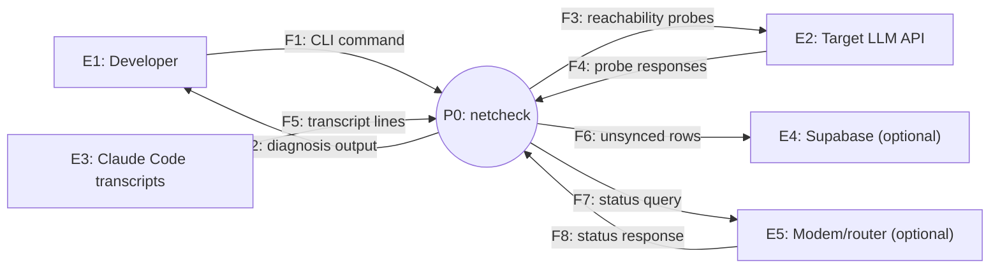
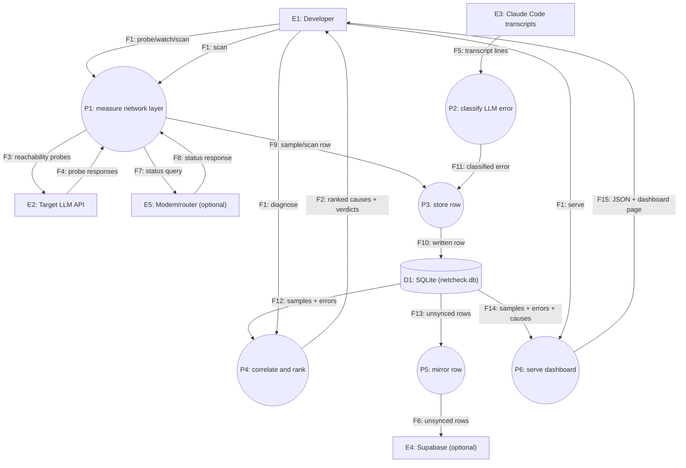
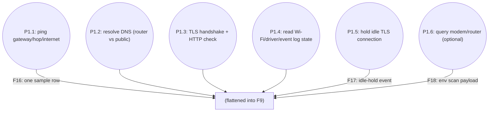
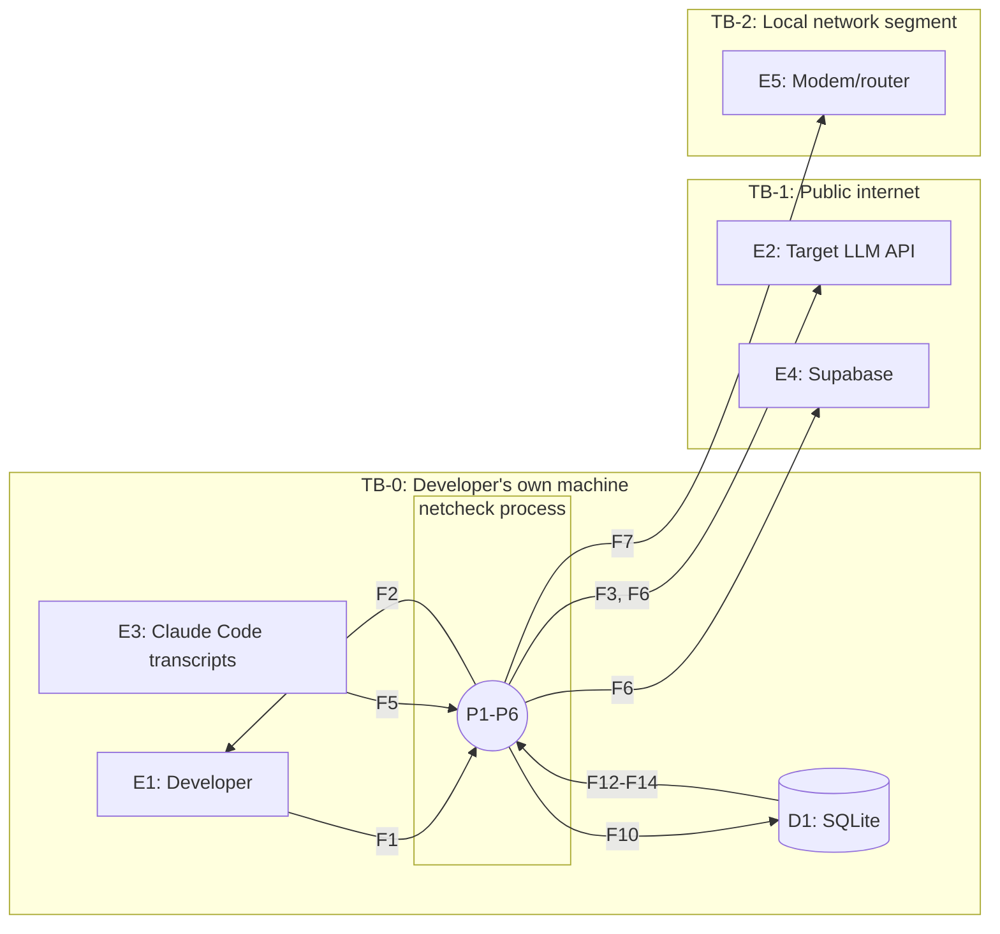

# netcheck Data Flow Diagram

> **What this document answers:** where every piece of data comes from, where it goes, where it rests, and which boundaries it crosses.
>
> **Notation:** classic structured-analysis DFD, drawn in Mermaid.
> - **External entity** (`E`): a person or system outside our control.
> - **Process** (`P`): something that transforms data. Named `verb + object`.
> - **Data store** (`D`): somewhere data rests.
> - **Data flow** (`F`): a labeled, directed movement of named data.

---

## 1. Level 0: context diagram

## 2. Level 1: main processes

## 3. Level 2: decomposition of P1 (measure network layer)

`P1` is complex enough — seven independent measurement types, two source modules — to warrant one more level.

## 4. Element register

### 4.1 External entities

| ID | Name | Who or what it is | Inside our trust boundary? | Traces to |
|---|---|---|---|---|
| E1 | Developer | The person running the CLI on their own machine | Yes (same machine) | U-001 |
| E2 | Target LLM API | The service being diagnosed (default `api.anthropic.com`) | No | EXT-001 |
| E3 | Claude Code transcripts | JSONL files written by another program on the same machine | Yes (same machine, but not netcheck's own data) | DR-002 |
| E4 | Supabase | Optional remote Postgres project the user owns | No (but user-controlled) | EXT-002 |
| E5 | Modem/router | Local network hardware, optionally queried | No (separate device on the LAN) | EXT-003, EXT-004 |

### 4.2 Processes

| ID | Name | What it does (one sentence) | Implemented in | Traces to |
|---|---|---|---|---|
| P1 | Measure network layer | Runs one tick's worth of probes and flattens them into one row | `probes.py`, `environ.py` (C-002) | FR-001 |
| P2 | Classify LLM error | Decides whether a transcript line is a real API error and what kind | `llmlog.py` (C-003) | FR-002 |
| P3 | Store row | Writes a sample/event/error/scan row, ignoring exact replays | `store.py` (C-005) | FR-001, FR-002 |
| P4 | Correlate and rank | Joins errors to samples, ranks causes across all samples | `diagnose.py` (C-003) | FR-003, FR-009, FR-010 |
| P5 | Mirror row | Pushes unsynced rows to the optional Supabase project | `store.mirror()` (C-005) | FR-011 |
| P6 | Serve dashboard | Builds the dashboard's JSON payload and serves the static page | `server.py` (C-006) | FR-007 |

### 4.3 Data stores

| ID | Name | Technology | What it holds | Classification | Retention | Encrypted at rest | Traces to |
|---|---|---|---|---|---|---|---|
| D1 | `netcheck.db` | SQLite (local file, `~/.netcheck/`) | Samples, events, LLM errors, environment scans, host identity, transcript scan offsets | confidential (Wi-Fi SSID/BSSID, LAN topology) | Unbounded, user-controlled | No (relies on OS-level disk encryption, if any) | DR-001, DR-002, DR-003 |
| D2 | Supabase project (mirror) | Postgres + PostgREST | A copy of D1's `samples`/`events`/`llm_errors`/`env_scans` | confidential | Governed by the user's own Supabase project | Yes (Supabase-managed at rest) | DR-005 |

### 4.4 Data flows

| ID | From | To | Data carried | Classification | Transport | Encrypted in transit | Crosses trust boundary | Traces to |
|---|---|---|---|---|---|---|---|---|
| F1 | E1 | P1/P2/P4/P6 | CLI command + arguments | internal | Local process invocation | N/A (local) | No | UC-001 to UC-004 |
| F2 | P4 | E1 | Ranked causes, evidence, fix text | internal | stdout | N/A (local) | No | FR-009 |
| F3 | P1 | E2 | Reachability probe (ping, DNS query, TLS handshake, HTTP GET) | internal | ICMP/UDP/TCP+TLS/HTTPS | Yes (TLS/HTTPS legs) | Yes (TB-1) | FR-001 |
| F4 | E2 | P1 | Probe response (latency, resolved address, cipher, HTTP status) | internal | Same as F3 | Yes | Yes (TB-1) | FR-001 |
| F5 | E3 | P2 | Raw JSONL transcript lines | internal (may reflect prompt/response timing) | Local file read | N/A (local) | No | FR-002 |
| F6 | P5 | E4 | Unsynced sample/event/error/scan rows | confidential | HTTPS/PostgREST | Yes | Yes (TB-1) | FR-011 |
| F7 | P1 | E5 | Status/credential query | secret (credentials), confidential (query) | HTTP, local segment | No (plaintext HTTP, accepted risk) | Yes (TB-2) | EXT-003, EXT-004 |
| F8 | E5 | P1 | Device status response | confidential | HTTP, local segment | No | Yes (TB-2) | EXT-003, EXT-004 |
| F9 | P1 | P3 | One flattened sample/scan row | confidential | In-process function call | N/A | No | FR-001 |
| F10 | P3 | D1 | Written row | confidential | `sqlite3` local write | N/A (local disk) | No | DR-001 |
| F11 | P2 | P3 | Classified error record | internal | In-process function call | N/A | No | FR-002 |
| F12 | D1 | P4 | Samples + errors for correlation | confidential | `sqlite3` local read | N/A | No | FR-003 |
| F13 | D1 | P5 | Unsynced rows | confidential | `sqlite3` local read | N/A | No | FR-011 |
| F14 | D1 | P6 | Samples + errors + computed causes | confidential | `sqlite3` local read | N/A | No | FR-007 |
| F15 | P6 | E1 | JSON payload + dashboard HTML | confidential | HTTP, loopback only | No (loopback, no external exposure) | No (E1 and P6 both on the same trusted machine) | FR-007 |

## 5. Trust boundaries

| ID | Boundary | Flows crossing | Control applied | Verified by |
|---|---|---|---|---|
| TB-1 | Developer's machine -> public internet | F3, F4, F6 | Real, verifying TLS (`ssl.create_default_context()`, never a disabled-verification context in production code paths); Supabase's RLS restricts what the publishable key alone could do, though netcheck itself only ever uses the service-role key from the user's own `.env` | SR-007 (mirror), `probes.tls_connect`'s default context |
| TB-2 | Developer's machine -> local network segment | F7, F8 | Credentials required (`unavailable` without them); plaintext HTTP is an accepted risk scoped to the local segment only, never routed | NFR-004, the accepted-risk GitHub issue |

No boundary exists between E1 and the netcheck process, or between the process and D1: both live on the same machine under the same user, which is the entire trust model this tool assumes (CON-003's "single machine" framing).

## 6. Threat notes per boundary crossing

| Boundary | Spoofing | Tampering | Repudiation | Information disclosure | Denial of service | Elevation of privilege |
|---|---|---|---|---|---|---|
| TB-1 | Mitigated by TLS certificate verification (default `SSLContext`, never disabled outside tests) | Mitigated by TLS integrity; a compromised far side could return false data, which is why `unavailable` is never inferred from a `fail` — a probe result is trusted only as far as "this is what came back" | Not applicable — no write access is granted to E2; Supabase writes use the service-role key the user alone holds, so no cross-user repudiation concern exists | Mirrored rows include Wi-Fi/LAN details; scoped by the user's own Supabase RLS and key custody, not by netcheck | A hung probe cannot block `watch`'s loop indefinitely — every network call carries a timeout (NFR-002) | Not applicable — no privilege boundary crossed; the tool runs as the user's own account |
| TB-2 | Not mitigated — plaintext HTTP has no way to authenticate the device beyond "answered on the expected LAN IP"; accepted because the segment itself is the trust boundary | Not mitigated in transit (plaintext); accepted for the same reason | Not applicable — read-only queries in the current codebase (no device-write code remains after the fix-application removal) | Credentials sent as Basic Auth are visible to anything on the same LAN segment; accepted risk, documented | Device timeouts bound how long a hung modem/router query can block (NFR-002) | Not applicable — no privileged action exists past a status read |

## 7. Data lifecycle

| Data item | Created by | Stored in | Read by | Shared with | Deleted by | Deletion trigger | Traces to |
|---|---|---|---|---|---|---|---|
| Sample row | P1 | D1 | P4, P6 | E4 (optional mirror) | User, manually | User deletes `~/.netcheck/netcheck.db` or the specific row; no automated deletion | DR-001 |
| LLM error record | P2 | D1 | P4, P6 | E4 (optional mirror) | User, manually | Same as above | DR-002 |
| Environment scan payload | P1 | D1 | P4 (via `diagnose.rank`'s driver check), P6 | E4 (optional mirror) | User, manually | Same as above | DR-003 |
| Modem/router credentials | User (typed into `.env`) | `.env` file only — never D1 | P1 (read once per query, held in memory) | Not shared | User, manually | User edits or deletes `.env` | DR-004 |

## 8. Change log

| Date | Version | Change | Reason | Affected IDs |
|---|---|---|---|---|
| 2026-08-07 | 1.0.0 | Initial data flow diagram, written against the already-shipped architecture. | Adopting SDD documentation. | All |

---

## Appendix A: DFD self-check (GATE-DFD)

- [x] Every element in every diagram has a register row, and every register row appears in a diagram.
- [x] No flow is unlabeled.
- [x] No data store connects directly to another data store (P5 sits between D1 and E4/D2).
- [x] Every process has at least one input flow and one output flow.
- [x] Every flow's classification matches the data classification recorded in this document and the system requirements.
- [x] Every boundary crossing has a named control and a verifying `SR-` or accepted-risk record.
- [x] Every STRIDE cell is filled (a written "not applicable because..." counts).
- [x] No PII item lacks a deletion trigger — the closest analog (confidential Wi-Fi/LAN data) has a stated manual-deletion trigger.
- [x] All Mermaid blocks render.
- [x] No unfilled `<placeholder>` remains.
