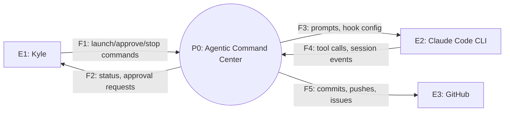
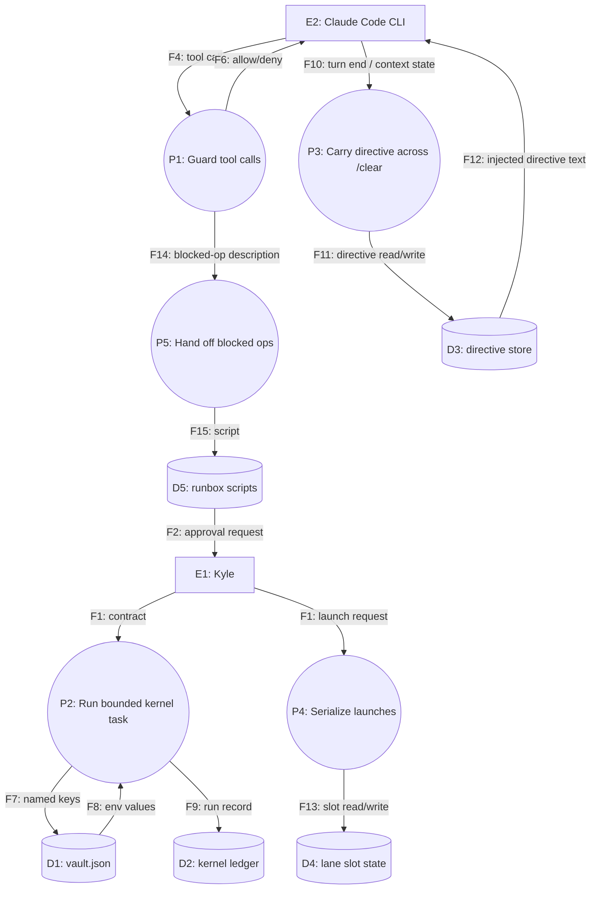
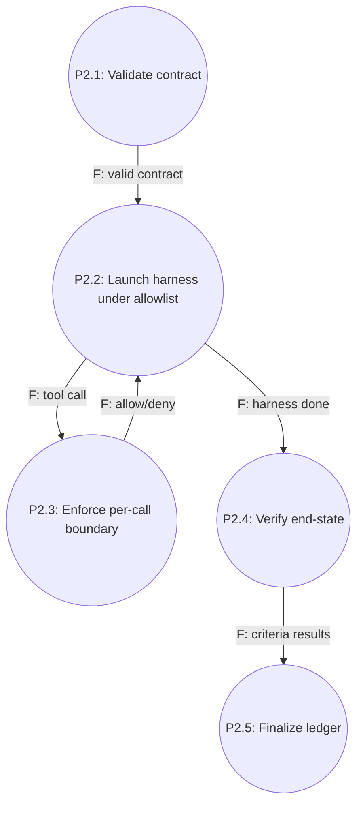
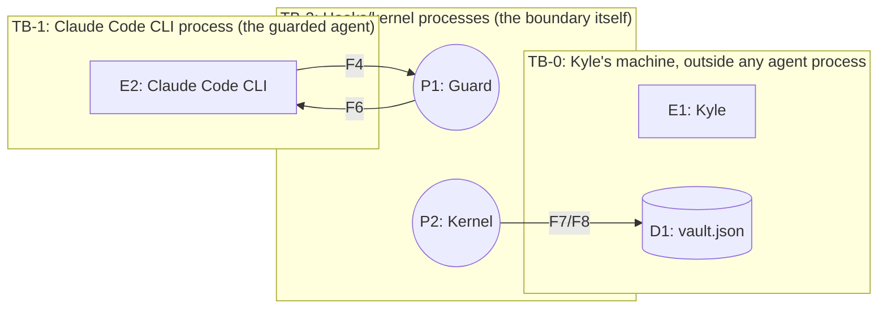

# Agentic Command Center Data Flow Diagram

> **What this document answers:** where every piece of data comes from, where it goes, where it rests, and which boundaries it crosses.

---

## 1. Level 0: context diagram

## 2. Level 1: main processes

<!--OPTIONAL:level-2-->
## 3. Level 2: decomposition of P2 (Run bounded kernel task)

<!--/OPTIONAL:level-2-->

## 4. Element register

### 4.1 External entities

| ID | Name | Who or what it is | Inside our trust boundary? | Traces to |
|---|---|---|---|---|
| E1 | Kyle | The operator | Yes | U-001 |
| E2 | Claude Code CLI | The AI agent process ACC wraps | No — treated as untrusted until verified | U-002, U-003 |
| E3 | GitHub | Where guarded repos and issues live | No | EXT-002 |

### 4.2 Processes

| ID | Name | What it does (one sentence) | Implemented in | Traces to |
|---|---|---|---|---|
| P1 | Guard tool calls | Allow or deny an Edit/Write/Read/Bash call against secrets, protected paths, cell ownership | `hooks/guard.mjs`, `kernel/guardhook.mjs` | FR-001, FR-002 |
| P2 | Run bounded kernel task | Execute one contract under a deny-by-default boundary and verify the result | `kernel/run.mjs` | FR-006, FR-007, FR-008 |
| P3 | Carry a directive across fresh contexts | Bind, inject, and resume a directive across headless runs | `hooks/directive.mjs`, `runner/runner.mjs` | FR-004, FR-005 |
| P4 | Serialize launches | Grant/refuse the one automated launch-lane slot | `hooks/lane.mjs` | FR-003 |
| P5 | Hand off blocked operations | Turn a guard-denied or elevated operation into a self-contained script that a human explicitly runs (`/approve` or the web Run button) | `AGENTS.md`, `hooks/engine.mjs` | FR-010 |

### 4.3 Data stores

| ID | Name | Technology | What it holds | Classification | Retention | Encrypted at rest | Traces to |
|---|---|---|---|---|---|---|---|
| D1 | Vault | `vault.json`, plain JSON file | Named API keys/secrets | secret | Until removed | no | DR-001 |
| D2 | Kernel ledger | `runner/ledger/*.jsonl` | Run records | internal | indefinite | no | DR-002 |
| D3 | Directive store | `runner/directives/*.json` | Active/done directive state + logs | internal | until archived, then indefinite | no | DR-003 |
| D4 | Lane slot state | `os.tmpdir()/acc-lane` | Owner pid + ttl per slot | internal | transient (until release/reap) | no | FR-003 |
| D5 | Runbox | `runbox/`, `<project>/.guards/runbox` | Pending/handled human-approval scripts | internal | until archived to `.trash/` | no | FR-010 |

### 4.4 Data flows

| ID | From | To | Data carried | Classification | Transport | Encrypted in transit | Crosses trust boundary | Traces to |
|---|---|---|---|---|---|---|---|---|
| F4 | E2 | P1 | Tool name + tool input | internal (may reference secret paths) | in-process hook payload (stdin) | no (localhost) | yes (TB-1) | FR-001 |
| F7/F8 | P2 | D1 / P2 | Vault key names out, values back | secret | in-process | no (localhost) | no (D1 is inside the trust boundary) | DR-001 |
| F9 | P2 | D2 | Run outcome + criteria results | internal | file append | no | no | DR-002 |
| F12 | D3 | E2 | Injected directive text | internal | SessionStart hook payload | no | yes (TB-1) | FR-004 |

## 5. Trust boundaries

| ID | Boundary | Flows crossing | Control applied | Verified by |
|---|---|---|---|---|
| TB-1 | Claude Code CLI process -> hooks/kernel | F4, F6, F12 | Fail-closed guard decision on every fire; no ambient trust in what the CLI process claims | `kernel/guard.test.mjs`, `hooks/guard.mjs` tests |
| TB-2 | Hooks/kernel -> vault | F7, F8 | Keys requested by name only; values never logged, never written to the ledger, never echoed back to the CLI process's transcript | `kernel/credentials.mjs` design (fail-closed on any vault-read error) |

## 6. Threat notes per boundary crossing

| Boundary | Spoofing | Tampering | Repudiation | Information disclosure | Denial of service | Elevation of privilege |
|---|---|---|---|---|---|---|
| TB-1 | Not applicable — single local process, no remote identity to spoof | Guard denies a write outside allowed roots; guard itself is a convention enforcer, not an OS sandbox (CON-003) | Every kernel run is ledgered; hook decisions are not separately logged beyond the ledger (accepted gap) | Guard blocks reads of secrets-glob files; kernel readRoots scope what's visible | Wall-clock/token/tool-call ceilings bound a stuck or runaway run | A runbox script can reach protected machinery only after an explicit human action (CON-004) |
| TB-2 | Not applicable | Vault file is local-disk plaintext; tampering would require local machine access, already inside Kyle's own trust boundary | No separate runbox execution log; this remains a single-operator local boundary | Values never leave the child process env — not printed, not re-read | n/a | n/a |

## 7. Data lifecycle

| Data item | Created by | Stored in | Read by | Shared with | Deleted by | Deletion trigger | Traces to |
|---|---|---|---|---|---|---|---|
| Vault key | Kyle (GUI upload) | D1 | `kernel/credentials.mjs` (by name) | The child process env of a run whose contract lists that key name | Kyle | Manual removal in the GUI | DR-001 |
| Kernel run record | `kernel/run.mjs` | D2 | `kernel/ledger.mjs query` | Nobody outside this machine | Nobody — indefinite retention (audit trail) | Never (accepted, single-machine tool) | DR-002 |
| Directive | `hooks/directive.mjs new` | D3 | SessionStart hook, runner, GUI | Nobody outside this machine | explicit `done`/`blocked` or a human action in the GUI | Directive completed, blocked, or manually closed | DR-003 |

## 8. Change log

| Date | Version | Change | Reason | Affected IDs |
|---|---|---|---|---|
| 2026-08-07 | 1.0.0 | Initial DFD, written retroactively. | SDD rearchitecture | All |
