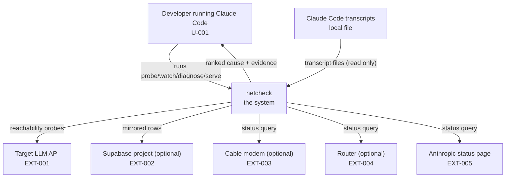
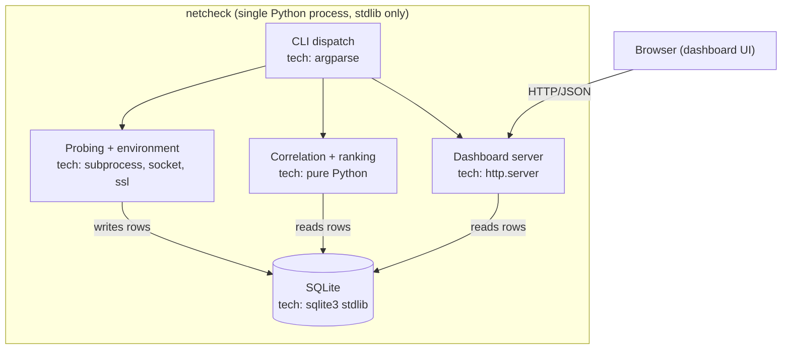

# netcheck System Requirements

> **Relationship to the PRD.** The PRD says *what the product does and why*. This document says *what the system must be so the PRD is achievable*. Every `SR-` here derives from at least one `FR-`/`NFR-`/`DR-`/`CON-`.
>
> Component structure follows the C4 model (context, container, component). Verification methods follow standard practice: Test, Analysis, Inspection, Demonstration.

---

## 1. System context (C4 Level 1)

| Element | Type | Responsibility | Traces to |
|---|---|---|---|
| Developer | person | Runs the CLI, reads diagnosis output | U-001 |
| netcheck | system | Measures, stores, correlates, ranks | - |
| Target LLM API | external service | The far side being diagnosed | EXT-001 |
| Supabase project | external service | Optional cross-machine mirror | EXT-002 |
| Cable modem | external service | Optional DOCSIS status source | EXT-003 |
| Router | external service | Optional DPI/firmware status source | EXT-004 |
| Anthropic status page | external service | Public far-side incident data | EXT-005 |
| Claude Code transcripts | local file | Source of real API error records | DR-002 |

## 2. Containers (C4 Level 2)

netcheck is a single Python process per invocation — there is no server/client split beyond the optional local dashboard's browser tab. "Container" here means "separately runnable entry point."

| ID | Container | Technology | Responsibility (one sentence) | Runs where | Traces to |
|---|---|---|---|---|---|
| C-001 | CLI dispatch (`__main__.py`) | Python 3, `argparse` | Parses `sys.argv` and dispatches to one command | User's machine | FR-001 through FR-007 |
| C-002 | Probing + environment (`probes.py`, `resolver.py`, `route.py`, `dualstack.py`, `environ.py`, `remote.py`, `wlan_probes.py`, `docsis.py`) | Python 3 stdlib (`subprocess`, `socket`, `ssl`, `urllib`) | Measures every network layer and gathers device, OS, WAN, and provider state | User's machine | FR-001, FR-004, FR-005, FR-006 |
| C-003 | Correlation + ranking (`diagnose.py`, `rank.py`, `llmlog.py`) | Pure Python 3 | Classifies errors, joins them to samples, ranks causes from both the sample history and the environment scan | User's machine | FR-002, FR-003, FR-006, FR-009, FR-010 |
| C-005 | Store (`store.py`, `schema.sql`) | `sqlite3` stdlib, PostgREST over `urllib` | Local source of truth; optional Supabase mirror | User's machine (SQLite); Supabase cloud (mirror) | FR-011, NFR-003 |
| C-006 | Dashboard server (`server.py`, `ui.html`) | `http.server` stdlib, Alpine.js (vendored, no CDN) | Serves JSON + the dashboard page | User's machine | FR-007 |

**Rule:** a new container is a major complexity purchase. netcheck deliberately stays at one process — the dashboard is a thread inside the same interpreter, not a separate deployable service, because splitting it would add a network boundary with nothing on the other side to justify it (CON-001, CON-002).

## 3. Components (C4 Level 3, only where non-obvious)

| ID | Component | Inside container | Responsibility | Traces to |
|---|---|---|---|---|
| CMP-001 | `diagnose.culprit()` | C-003 | Reads one sample row, names the outermost broken layer, or `None` | FR-009 |
| CMP-002 | `diagnose.correlate()` | C-003 | Joins each LLM error to its nearest sample within a 120s window | FR-003 |
| CMP-003 | `llmlog.parse_line()` | C-003 | Decides whether one transcript JSONL line is a real API error | FR-002 |
| CMP-004 | `store._migrate()` | C-005 | Adds any column present in `schema.sql` but missing from an existing on-disk table, so old databases upgrade in place | NFR-003 |

## 4. System requirements

| ID | Requirement | Derived from | Verification method | Verified by | Status |
|---|---|---|---|---|---|
| SR-001 | C-002 must return `state: unavailable`, never raise, when a required binary or credential is missing. | FR-008 | Test | `test_probes.py`, `test_environ.py` | done |
| SR-002 | C-003 must classify a transcript line as an error using the `isApiErrorMessage` flag and `type: system` objects, never a substring match on raw text. | FR-002 | Test | `test_llmlog.py` (adversarial cases) | done |
| SR-003 | C-003 must join an error to the sample with the smallest absolute time difference, and only accept it if that difference is ≤120 seconds. | FR-003 | Test | `test_diagnose.py::CorrelateTest` | done |
| SR-004 | C-002 must re-resolve the default gateway on every `watch` tick, and only re-run the more expensive first-hop traceroute when the gateway actually changed. | FR-004 | Test | `test_main.py`, `test_probes.py::ParseIpconfigGatewayTest` | done |
| SR-005 | C-003 must derive a cause from a scan section only when that section's state is `ok`, so neither an unmeasured section nor a failed query can produce a fault. | FR-006, FR-008 | Test | `test_rank.py::ScanCauseTest` | done |
| SR-006 | C-006 must build its `/api/data` response from a live query against C-005, never from a hardcoded or fabricated payload. | FR-007 | Inspection | `netcheck/server.py::payload()` read directly; `test_server.py` | done |
| SR-007 | C-005's `mirror()` must mark a row synced only after a successful push, and must never block local writes on the mirror's availability. | FR-011, NFR-003 | Test | `test_store.py::MirrorTest` | done |
| SR-008 | No subprocess/PowerShell call in C-002 may interpolate a caller-supplied value into the command text. | NFR-005 | Test | `test_environ.py::PowerShellArgumentSafetyTest` | done |
| SR-009 | The full test suite must run with zero live network calls, zero sleeps beyond a probe's own timing, and zero skips — a test that does not run on the machine running the suite is not coverage. | NFR-006 | Test | `python -m unittest discover -s tests -t .` reports `OK` with no `skipped` count | done |
| SR-010 | No module in `netcheck/` may import a package outside the Python 3 standard library. | NFR-001 | Inspection | `code-quality.yml` import scan | done |
| SR-012 | C-002 must resolve a device host and confirm **every** returned address is private before sending credentials, so a name answering with both a LAN and a public address is refused. | FR-014, NFR-004 | Test | `test_remote.py::CredentialDestinationTest` | done |
| SR-011 | C-002 must open its own socket on the requested address family rather than calling `socket.create_connection`, which re-resolves the hostname and may return the other family. | FR-013 | Test | `test_dualstack.py::test_each_family_is_connected_on_a_socket_of_that_family` | done |

**Verification methods (pick exactly one per row):**

| Method | Use when | Evidence produced |
|---|---|---|
| Test | Behavior can be exercised automatically | Passing test id |
| Analysis | Proven by calculation or model, not execution | The calculation, written down |
| Inspection | Proven by reading code, config, or schema | The file and line |
| Demonstration | Proven by a human performing steps | Recorded checklist run |

## 5. Interfaces

### 5.1 Internal APIs

| ID | Method + path | Purpose | Request | Response | Errors | Auth | Traces to |
|---|---|---|---|---|---|---|---|
| API-001 | `GET /api/data` | Everything the dashboard renders, in one round trip | Query params: `limit` (optional int) | `200 {...}` JSON: samples, events, errors, causes | `400` malformed `limit` | None — loopback only | FR-007 |
| API-002 | `GET /` | Serves `ui.html` and vendored Alpine.js | none | `200` HTML/JS | `404` unknown static path | None — loopback only | FR-007 |

Rules: no endpoint exists without an `FR-`; the dashboard server binds to `127.0.0.1` only, never a public interface, so no auth scheme is required for a single-user local tool.

### 5.2 Events / messages

None. netcheck has no message queue or pub/sub; every interaction is a direct function call within one process, or a request/response HTTP call to an external service.

### 5.3 External integrations

| ID | Service | Auth method | Secret storage | Timeout | Retry policy | Behavior when unavailable | Cost model |
|---|---|---|---|---|---|---|---|
| EXT-001 | Target LLM API | None (reachability probe only; a 401 counts as reachable) | N/A | 8-10s per probe | 1 bounded retry on DNS only | `state: fail` with reason | Free (no auth, no billed calls) |
| EXT-002 | Supabase (PostgREST) | Service-role key | `.env`, gitignored | Per-request default | None; unsynced rows retry on next `mirror()` call | Local capture continues; rows stay unsynced | User's Supabase plan (free tier by default) |
| EXT-003 | Cable modem | Vendor-specific (device login) | `.env`, gitignored | 15s subprocess/HTTP timeout | None | `state: unavailable` | Free (local segment) |
| EXT-004 | Router | ASUS token-auth flow | `.env`, gitignored | 15s | None | `state: unavailable` | Free (local segment) |
| EXT-005 | Anthropic status page | None (public) | N/A | 10s | None | `state: unavailable` | Free |

## 6. Data model

Summary only. `netcheck/schema.sql` is authoritative for exact types.

| Table | Purpose | Key columns | Row growth | Retention | Traces to |
|---|---|---|---|---|---|
| `hosts` | One row per machine running netcheck | `id`, `name` (unique), `os` | ~1 per machine, essentially static | Unbounded | DR-001 |
| `samples` | One row per tick: every layer's state | `id`, `host_id`, `ts` (unique per host), `culprit` | 1 per tick (default every 20s under `watch`) | Unbounded locally | DR-001 |
| `events` | Point-in-time occurrences (idle-hold results) | `id`, `host_id`, `ts`, `kind` | 1 per `--idle-every` tick | Unbounded locally | DR-001 |
| `llm_errors` | Classified real API errors from transcripts | `id`, `host_id`, `ts`, `source`, `kind`, `verdict` | Only as real errors occur | Unbounded locally | DR-002 |
| `scan_offsets` | Where the transcript scan left off, per file | `path` (pk), `offset` | 1 per transcript file seen | Unbounded (small, bounded by file count) | - |
| `env_scans` | Full environment snapshot payloads | `id`, `host_id`, `ts`, `payload` (JSON) | 1 per `scan`/`watch` startup | Unbounded locally | DR-003 |

**Invariants that the database enforces itself** (cheaper than tests, per `rules/00-CORE.md` principle 1):

| ID | Invariant | Enforced by |
|---|---|---|
| INV-001 | A sample/event/error/scan row is never duplicated for the same host and timestamp (and kind, where applicable). | `UNIQUE (host_id, ts[, kind])` + `INSERT OR IGNORE` |
| INV-002 | Every sample/event/error/scan row belongs to a real, existing host. | `FOREIGN KEY (host_id) REFERENCES hosts(id)` |
| INV-003 | Writing an unknown column name fails loudly instead of silently dropping data. | `store._insert()`'s explicit column check against `PRAGMA table_info` |

## 7. Security requirements

| Topic | Requirement | Traces to |
|---|---|---|
| Authentication | None for the local dashboard (loopback-only bind); modem/router auth uses each device's own vendor scheme | NFR-004 |
| Authorization | Not applicable — single-user local tool, no multi-tenant concept | - |
| Row-level security | Applies to the Supabase mirror only: RLS is on with no policies, so the publishable key deliberately cannot write — only the service-role key (never distributed) can | DR-005 |
| Secrets | `.env`, gitignored; no `.env.example` ships (a template one careless edit away from holding a live key is worse than no template) | DR-004, NFR-004 |
| Transport | Target API and Supabase mirror: real TLS, verifying `SSLContext` by default. Modem/router: plaintext HTTP, accepted risk (local segment only, devices offer no HTTPS) — see GitHub issue "Basic auth over plaintext HTTP to modem/router" | NFR-004 |
| Data at rest | Not encrypted — SQLite file on the user's own disk, matching the OS's own disk-encryption posture | DR-001 |
| Input validation | Dashboard's `limit` query parameter is guarded and returns `400` rather than crashing on a non-integer value | SR-006 |
| Rate limiting | Not applicable — loopback-only dashboard, no multi-client concern | - |
| Audit logging | Not applicable — no privileged actions exist to audit (no automated device writes remain in the codebase) | - |
| Dependency policy | Not applicable — zero third-party runtime dependencies (NFR-001) means no dependency vulnerability surface to patch | NFR-001 |

## 8. Operations

| Topic | Requirement |
|---|---|
| Environments | One: the user's own machine. A Docker image exists for containerized runs (`Dockerfile`); no staging/production split, since this is a personal diagnostic tool, not a hosted service. |
| Deployment | `git clone` and run; the Docker image is built and smoke-tested by `release.yml` on a `v*` tag push. |
| Rollback | `git checkout` a previous commit/tag; the SQLite database is forward-compatible only (see Migrations below), so a rollback does not need a database downgrade path in normal use. |
| Migrations | Forward-only: `store._migrate()` adds any new column from `schema.sql` to an existing on-disk database via `ALTER TABLE ... ADD COLUMN`, always nullable so it never fails against existing rows. |
| Backups | The user's own responsibility — `~/.netcheck/netcheck.db` is a plain file; the Supabase mirror is an optional off-machine copy. |
| Restore drill | Not applicable at this scale; a lost local database only loses diagnostic history, not the tool's ability to function going forward. |
| Monitoring | The tool itself doesn't monitor its own health beyond CI on every push; there is no production instance to page on. |
| Alerting | None — the user runs `watch` in the foreground or a terminal multiplexer and reads its own output. |
| Logging | `watch`/`diagnose`/etc. print human-readable status to stdout; no structured log file beyond the SQLite database itself, which is the durable record. |
| Runbook | `netcheck diagnose` itself: every ranked cause carries its evidence and its fix. |

## 9. Technology decisions

| Decision | Chosen | Alternatives rejected | Why | Reversal cost | Lock-in risk |
|---|---|---|---|---|---|
| Language/runtime | Python 3 standard library only | Any framework requiring `pip`/`npm` | Must remain runnable on a machine mid-network-outage, when a package registry may be unreachable; also the simplest cross-platform choice already present on most dev machines | High (a full rewrite) | None — stdlib is not going away |
| Local storage | SQLite | Flat JSON/CSV files, an embedded key-value store | A cloud database cannot record an outage while it's happening; SQLite gives real queries and a durable file with zero setup | Medium (schema migration) | None — stdlib `sqlite3` |
| Remote mirror | Supabase (Postgres + PostgREST) | Self-hosted Postgres, a custom API | Free tier, RLS built in, PostgREST means no server code to write for simple reads | Low (mirror is optional and additive) | Low — plain Postgres underneath |
| Dashboard UI | Single HTML file + vendored Alpine.js | A full frontend framework + build step | Consistent with the no-build-step constraint (CON-001); Alpine is small enough to vendor directly, no CDN dependency | Low | None — vendored copy, not a live dependency |
| Test runner | `unittest` (stdlib) | `pytest` | Matches the no-dependency constraint. CI runs the same stdlib command, so there is no environment where a package is required. | Low | None |

**Required for each row:** maturity, migration cost, and lock-in risk are stated in the table above; none of these choices carry meaningful lock-in given the standard-library-first constraint.

## 10. Capacity and limits

| Dimension | Current | Designed ceiling | What happens at the ceiling | Next step past it |
|---|---|---|---|---|
| Samples per machine | Grows ~1 row per 20s of `watch` uptime, unbounded | No enforced ceiling | SQLite file grows; query performance degrades gradually, not at a cliff | Add a `samples(limit)` default and/or a pruning command if this becomes a real problem |
| Concurrent dashboard clients | 1 (the user's own browser tab) | Not designed for more; `http.server` is single-process | Multiple tabs still work (stateless reads) but were never a design target | Not planned; out of scope (OOS-002-adjacent) |
| Cost / month | $0 (stdlib only, free-tier Supabase) | $0 required | N/A | N/A |

## 11. Explicitly not built

Mirrors the PRD's non-goals at the system level.

| Thing | Why not | Revisit when |
|---|---|---|
| Automated device-fix apply/verify/monitor pipeline (`fix_engine.py`, `fix_application.py`, `verification_engine.py`, `monitoring_engine.py`) | Built once, fully tested, never wired to a real command — removed as dead code 2026-08-07 rather than left as an unreachable library | A specific command is designed and reviewed for it (PRD Q-001) |
| Historical-confidence/decision-tree engine (`diagnostic_engine.py`) | 39 functions imported into `diagnose.py`, zero of them called beyond the import line — removed as dead code 2026-08-07 | A specific classifier is wired directly into `diagnose.rank()`'s live path with a test proving it affects a real verdict |
| Multi-machine fleet controller | Each machine's network path is independent; the Supabase mirror already covers cross-machine history reads | A user asks for centralized fleet monitoring |

## 12. Change log

| Date | Version | Change | Reason | Affected IDs |
|---|---|---|---|---|
| 2026-08-07 | 1.0.0 | Initial system requirements, written against the already-shipped architecture, alongside the PRD and the removal of `diagnostic_engine.py`/`fix_engine.py`/`fix_application.py`/`monitoring_engine.py`/`verification_engine.py`. | Adopting SDD documentation and a lean-code cleanup pass. | All |

---

## Appendix A: System Requirements self-check (GATE-SYSREQ)

- [x] Every `SR-` derives from a PRD ID that exists.
- [x] Every PRD `NFR-` is addressed by at least one `SR-` or explicitly deferred with a reason.
- [x] Every `SR-` has exactly one verification method and a named evidence artifact.
- [x] Every container justifies why it is not merged into another (section 2's Rule).
- [x] Every external integration states its behavior when the service is down.
- [x] No table carries PII beyond what's already covered (Wi-Fi SSID/BSSID in `env_scans.payload`) — covered under DR-003's `confidential` classification; no separate RLS policy needed since it never leaves the local machine except via the user's own optional Supabase mirror, which is theirs.
- [x] Every technology decision names maturity cost, migration cost, and lock-in.
- [x] Both Mermaid diagrams render.
- [x] No unfilled `<placeholder>` remains.
