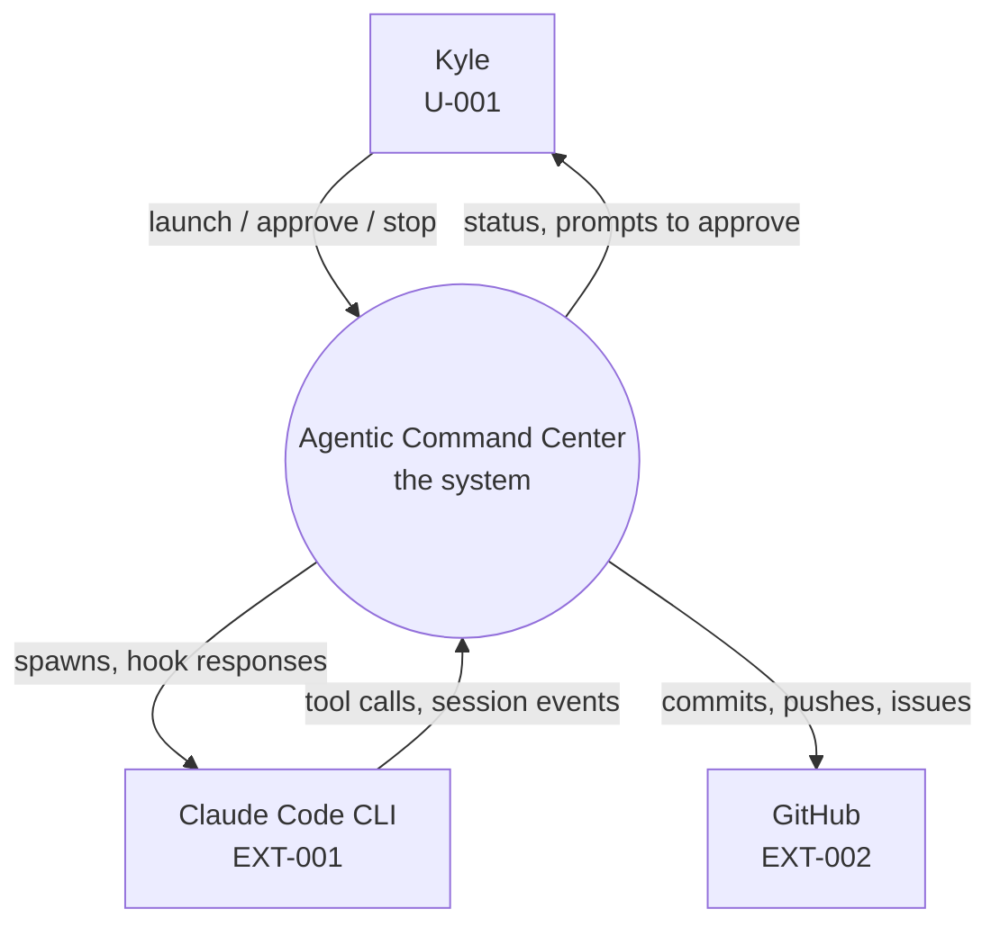
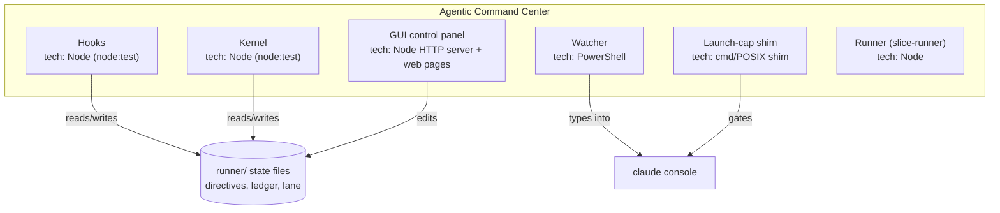

# Agentic Command Center System Requirements

> **Scope.** This document records implemented system requirements. It was written retroactively against the existing implementation; `Status: done` means "already true," not "planned."

---

## 1. System context (C4 Level 1)

| Element | Type | Responsibility | Traces to |
|---|---|---|---|
| Kyle | person | Operates the harness, approves risky ops, makes accepted-risk calls | U-001 |
| Claude Code CLI | external system | The AI coding agent process ACC wraps and constrains | EXT-001 |
| GitHub | external system | Where guarded repos and their issues live | EXT-002 |

## 2. Containers (C4 Level 2)

| ID | Container | Technology | Responsibility (one sentence) | Runs where | Traces to |
|---|---|---|---|---|---|
| C-001 | Hooks | Node 22, `node:test`, no runtime deps | Guard, budget, directive, usage, lane, route-service, and coverage logic | Any OS (CI: Linux + Windows) | FR-001, FR-003, FR-004, FR-005 |
| C-002 | Kernel | Node 22, `node:test` | Headless bounded task runner: contract validation, guardhook enforcement, supervisor, ledger, verification | Any OS | FR-006, FR-007, FR-008 |
| C-003 | GUI | Node HTTP server (`gui/server.mjs`) serving `gui/guards.html`/`gui/kernel.html` | Human control panel: start work (directive create + headless launch), guards, vault, runbox, spending, kernel policy | Any (loopback web) | FR-010, FR-012, UC-001 |
| C-004 | Watcher | PowerShell | Launch-cap alerting only (`claude-cap-watch.ps1`); the keystroke/liveness watcher was deleted (ADR-0005) | Windows | NFR-007 |
| C-005 | Shim | `.cmd` / POSIX shell | PATH-level gate in front of the real `claude.exe`, alert-only on cap breach, fails open | Windows | UC-001 (launch cap) |
| C-006 | Runner | Node 22 | `claude -p` slice-runner CLI: install a schedule, run a job, report status | Any OS | — |

**Rule:** a new container is a major complexity purchase. All six above already exist; none is a candidate to split further today. C-004 shrank to the cap-watch alerter when the keystroke stack was deleted (ADR-0005); C-004/C-005 remain merge candidates if cap-watch ever folds into the shim.

## 3. Components (C4 Level 3, only where non-obvious)

| ID | Component | Inside container | Responsibility | Traces to |
|---|---|---|---|---|
| CMP-001 | `kernel/guard.mjs` | Kernel | Pure, no-I/O decision function: is this path/command/host inside what the contract + policy allow | FR-006 |
| CMP-002 | `kernel/guardhook.mjs` | Kernel | Registered on every tool the run's allowlist grants; calls `guard.mjs`, enforces the live tool-call ceiling under a cross-process lock | FR-006, NFR-003 |
| CMP-003 | `kernel/ledger.mjs` | Kernel | Append-only JSONL writer with `withLock`-protected idempotent appends | FR-008, NFR-003 |
| CMP-004 | `kernel/verifier.mjs` | Kernel | Runs each acceptance criterion's `verify.method` against real end-state, never trusting the harness's claim | FR-007 |
| CMP-005 | `kernel/adapters/claude-code.mjs` | Kernel | The one harness adapter today; the file naming a harness by name, per `kernel/adapter.mjs`'s swap contract | FR-006 |
| CMP-006 | `hooks/lane.mjs` | Hooks | Machine-wide launch-lane semaphore (`withLaunchSlot`) with paced starts and transport-only retry | FR-003 |
| CMP-007 | `hooks/directive.mjs` | Hooks | Directive CRUD, console-PID binding, dead-directive reaping, pending-kick decision | FR-004, FR-005 |
| CMP-008 | `hooks/route.mjs` | Hooks | Scores task text against `ROUTING.md`, decides the narrowest folder, decides block-vs-advise | FR-009 |

## 4. System requirements

| ID | Requirement | Derived from | Verification method | Verified by | Status |
|---|---|---|---|---|---|
| SR-001 | The guard hook must deny an Edit/Write/Read whose target path matches a `secrets` glob, before the underlying tool runs. | FR-001 | Test | `hooks/guard.mjs` tests | done |
| SR-002 | The kernel guard must resolve `.`/`..` path segments before comparing against allowed roots. | FR-001 (bypass class closed 2026-08-04) | Test | `kernel/guard.test.mjs` | done |
| SR-003 | The launch lane must serialize every automated `claude` spawn through one machine-wide slot semaphore stored outside any sandboxable root. | FR-003 | Test | `hooks/lane.test.mjs` | done |
| SR-004 | A directive must bind to a console PID, not a session id, so it survives the session id changing across `/clear`. | FR-004 | Test | `hooks/directive.test.mjs` | done |
| SR-005 | The kernel must validate a contract's `acceptanceCriteria` and `allowedActions` shapes before any harness process is spawned. | FR-006 | Test | `kernel/contract.test.mjs` | done |
| SR-006 | Ledger appends for the same `(runId, event)` must be idempotent under concurrent writers via a cross-process file lock. | FR-008 | Test | `kernel/ledger.test.mjs` (20 concurrent writers, no duplicates) | done |
| SR-007 | A supervisor tick fault (e.g. `readState()` throwing) must produce a `supervisor-fault` abort outcome, never an uncaught process exit. | NFR-002 | Test | `kernel/run.test.mjs` | done |
| SR-008 | Every CHANGED library file must pass lines 100% / functions 100% / branches 90% coverage, with documented per-file overrides only where node's coverage merge under-reports. | NFR-004 | Test | `node hooks/covgate.mjs` | done |

**Verification methods used:** Test only. Every SR above is exercised automatically; none needed Analysis/Inspection/Demonstration.

## 5. Interfaces

### 5.1 Internal APIs

Not applicable in the traditional sense — ACC has no HTTP API surface except the local-only kernel GUI server.

| ID | Method + path | Purpose | Request | Response | Errors | Auth | Traces to |
|---|---|---|---|---|---|---|---|
| API-001 | `GET /` (`gui/server.mjs`, localhost only) | Serve the kernel GUI's static HTML/JS | none | HTML | 404 unknown path | none — localhost-bound process, not exposed | FR-010 |

### 5.2 Events / messages

| ID | Event name | Producer | Consumers | Payload | Delivery guarantee | Ordering |
|---|---|---|---|---|---|---|
| EVT-001 | Claude Code hook events (`SessionStart`, `PreToolUse`, `PostToolUse`, `Stop`) | Claude Code CLI | `hooks/*.mjs` | Tool name, tool input, session id | At-most-once per real hook fire; hooks are advisory except guard/guardhook, which block | Per-process, no cross-session ordering guarantee |

### 5.3 External integrations

| ID | Service | Auth method | Secret storage | Timeout | Retry policy | Behavior when unavailable | Cost model |
|---|---|---|---|---|---|---|---|
| EXT-001 | Claude Code CLI / Anthropic API | Claude Code's own auth (outside ACC's control) | n/a — ACC never holds the API credential itself | Bounded by contract/policy wall-clock ceilings | Transport-only exponential backoff with full jitter (`retryTransport`), never retries a logic failure | Launch refused/queued by the lane; a hang is bounded by wall-clock ceiling, not left open | Per-token, tracked via `hooks/usage.mjs` against `policy.json` rate table |
| EXT-002 | GitHub | git over HTTPS/SSH, or the GitHub MCP server in this session | n/a | Default git/API timeouts | Default git retry behavior | Push/PR fails visibly to the operator | Standard GitHub limits |

## 6. Data model

| Table/store | Purpose | Key columns | Row growth | Retention | Traces to |
|---|---|---|---|---|---|
| `runner/ledger/*.jsonl` | Kernel run records | `runId`, `event` (started/finalized), `outcome`, `criteria` | One line per run event | Indefinite | DR-002 |
| `runner/directives/*.json` + `<id>.log.md` | Directive state and its progress log | `id`, `sessionId`, `status` | One file per active directive, archived on completion | Until archived to `runner/directives/done/`, then indefinite | DR-003 |
| `vault.json` | Named secrets | `KEY` -> value | Grows with keys Kyle adds | Until Kyle removes a key | DR-001 |

**Invariants enforced by the storage layer itself, not a test:**

| ID | Invariant | Enforced by |
|---|---|---|
| INV-001 | A ledger line for a given `(runId, event)` is written at most once. | `kernel/ledger.mjs`'s `withLock`-protected `appendOnce`, not a database constraint (there is no database) |
| INV-002 | A secrets-glob file is never readable by an agent tool call, regardless of hook ordering. | `hooks/guard.mjs`'s fail-closed default (unreadable config also denies) |

## 7. Security requirements

| Topic | Requirement | Traces to |
|---|---|---|
| Authentication | None — single local operator; the guard trusts the local Claude Code process, not a remote identity | CON-001 |
| Authorization | Cell ownership (`config.json` `repos.*.cells`) gates which paths an agent may write, checked by target-path prefix match | FR-002 |
| Secrets | `vault.json`, gitignored, plaintext on disk, read-blocked for agent tools; consumed by name only via `kernel/credentials.mjs`, never printed or re-read after `apply` | DR-001, CON-004 |
| Transport | Local process spawns and stdin/stdout only; no network transport ACC controls beyond the CLI's own HTTPS to Anthropic and git's own to GitHub | EXT-001, EXT-002 |
| Data at rest | Nothing is encrypted at rest (single-operator machine, not a shared or cloud store); this is an accepted, documented posture, not an oversight | CON-004 |
| Input validation | `kernel/contract.mjs`'s `validateContract` is the schema gate for every kernel-run input | FR-006 |
| Rate limiting | Launch lane serializes to 1 concurrent automated spawn by default (`policy.json lane.slots`) | FR-003 |
| Audit logging | Kernel ledger records every bounded kernel run. Runbox execution requires an explicit human action. | DR-002, DR-004 |
| Dependency policy | Zero runtime dependencies by design; the one devDependency (`@playwright/test`) is pinned in `package.json`, bumped manually | CON-002 |

## 8. Operations

| Topic | Requirement |
|---|---|
| Environments | One: Kyle's Windows machine. CI (GitHub Actions) runs the Linux-portable subset for regression safety, not as a second real environment. |
| Deployment | None — this is a machine-resident tool, not a deployed service. Changes take effect on the next hook fire / next GUI restart. |
| Rollback | `git revert` / checkout a prior commit. No migration or data rollback exists because there is no database. |
| Migrations | Not applicable — no schema, JSONL append-only stores. |
| Backups | Git is the backup for code; ledger/directive/vault files are local-disk only, not separately backed up today (accepted gap, single-machine tool). |
| Monitoring | Runner liveness via `runner/state/<job>.pid` (the Command Center list's running badge), `runner/logs/` + `runner/alerts/`, `hooks/usage.mjs week` token tier. |
| Alerting | Statusline warnings only (no external paging) — consistent with a single-operator tool. |
| Logging | Kernel ledger and directive logs; no centralized log aggregation. |
| Runbook | `AGENTS.md` is the operational runbook for this repo. |

## 9. Technology decisions

| Decision | Chosen | Alternatives rejected | Why | Reversal cost | Lock-in risk |
|---|---|---|---|---|---|
| Test runner | `node:test` (zero deps) | Jest, Vitest, Mocha | Zero runtime/devDependency surface for a security-adjacent tool; native to the pinned Node floor | low | none — standard library |
| GUI stack | Web (Node HTTP server + plain HTML/JS), migrated incrementally from PowerShell WinForms + C# ConPTY host (ADR-0002) | Electron, WinForms (former choice) | Cross-platform-capable, no vendored terminal assets; already migrated once from a heavier plan (former OI-022) | low — plain HTML/JS, no framework lock-in | none — standard web stack (ADR-0006 moves the UI to its own repo) |
| Kernel harness | Claude Code CLI via `kernel/adapters/claude-code.mjs` | Direct API calls | Reuses the CLI's own tool implementations and auth; swappable by design (one config value + one adapter file) | low (that's the documented swap procedure) | low |

## 10. Capacity and limits

| Dimension | Current | Designed ceiling | What happens at the ceiling | Next step past it |
|---|---|---|---|---|
| Concurrent automated `claude` spawns | 1 (serialized) | `policy.json lane.total` (cap 3, real exe path) | Launch cap watcher alerts; lane refuses a second automated slot | Raise `lane.slots`/`lane.total` deliberately, only if transport can take it |
| Concurrent kernel runs | 1 | 1 (launch lane) | A second kernel run queues behind the lane | Out of scope (OOS-002) |
| Weekly token spend | tracked | `policy.json week.redTokens` (1.8B) | All directive resumes held | Kyle raises the ceiling or reduces usage |

## 11. Explicitly not built

ACC does not include a remote multi-user service, a shared identity boundary, or a database. Product expansion is tracked through GitHub Issues.

## 12. Change log

| Date | Version | Change | Reason | Affected IDs |
|---|---|---|---|---|
| 2026-08-11 | 1.0.1 | Removed references to retired unattended runbox execution and the retired planning document. | Documentation cleanup | DR-004 |
| 2026-08-07 | 1.0.0 | Initial system requirements, written retroactively. | SDD rearchitecture | All |
