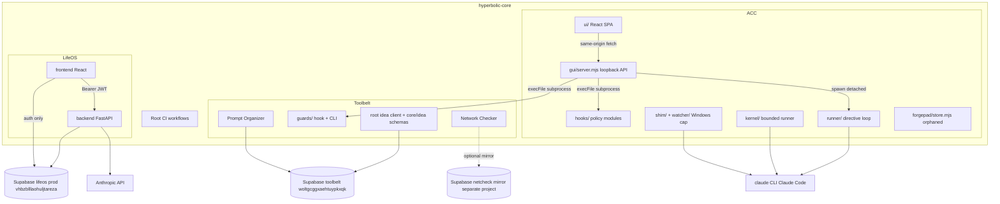

# 01. Inventory and Ground Truth

Evidence date: 2026-08-12. Base: `hyperbolic-core` branch `claude/agentic-engineering-restructure-bujav1` (equal to `origin/main` plus the Phase 0 charter). Canonical names per `00-canonical-names.md`. Labels: `[VERIFIED: <path or command>]`, `[INFERRED: <reasoning>]`, `[UNKNOWN]`.

## 1. Repository map

One monorepo, three imported apps, zero application code at the repo root [VERIFIED: root listing: AGENTS.md, CLAUDE.md, LICENSE, README.md, TEMPLATES/, TEST_LEDGER.md, apps/, docs/, project.yaml, standard.lock, .github/, .gitignore].

| Component | Path | Runtime | Framework | Purpose (documented and confirmed implemented) |
| --- | --- | --- | --- | --- |
| hyperbolic-core (root) | `/` | CI only | none | Umbrella monorepo: docs, templates, CI for Toolbelt and ACC [VERIFIED: README.md; project.yaml] |
| ACC | `apps/agentic-command-center/` | Node >= 22, zero runtime npm deps at root [VERIFIED: package.json:5-7; lockfile root-only] | none (hand-rolled); UI: React 19 + Vite 8 + Tailwind 4 [VERIFIED: ui/package.json] | Local coding-agent guard rail, control panel, bounded task runner [VERIFIED: AGENTS.md] |
| Toolbelt (root) | `apps/toolbelt/` | Node >= 22 for tests, Python http.server for UI; no package.json anywhere in the tree [VERIFIED: file scan] | none by design [VERIFIED: README.md "no package manifest"] | Shared `core`/`idea` Supabase schemas plus a read-only idea-backlog HTML client [VERIFIED: AGENTS.md; web/index.html] |
| Guards | `apps/toolbelt/guards/` | Node (hook subprocess) | none | Claude Code PreToolUse hook: secret-glob blocks, protected paths, cell ownership; plus config CLI [VERIFIED: guard.mjs; cli.mjs] |
| Prompt Organizer | `apps/toolbelt/apps/prompt-organizer/` | Static HTML/ES modules + Supabase PostgREST | none (vanilla) | Prompt storage, variable rendering, versioning, copy [VERIFIED: web/index.html; migrations] |
| Network Checker | `apps/toolbelt/apps/network-checker/` | Python 3.12 stdlib only [VERIFIED: AGENTS.md; no requirements file] | none (unittest, hand-written frontend) | Local-first layered network diagnostics with SQLite store and loopback dashboard [VERIFIED: netcheck/ module map] |
| LifeOS backend | `apps/lifeos/backend/` | Python >= 3.12 (deployed on 3.14-slim) [VERIFIED: pyproject.toml; Dockerfile] | FastAPI + psycopg3 + Pydantic 2 | Typed entity graph + append-only event log kernel with 9 life domains [VERIFIED: pyproject description; src/ layout] |
| LifeOS frontend | `apps/lifeos/frontend/` | Node (Vite 8 build) | React 19.2, react-router 8, TanStack Query 5, Tailwind 4, supabase-js 2 [VERIFIED: package.json] | Production UI for LifeOS [VERIFIED: AGENTS.md] |
| The Brain | none | n/a | n/a | Does not exist anywhere [VERIFIED: repo-wide grep, 00-canonical-names.md] |
| Shell | none | n/a | n/a | Does not exist; no unified UI today [VERIFIED: root listing] |

Subtree provenance [VERIFIED: git log]: toolbelt merge `8af33c8` (2026-08-11), lifeos merge `a740c6e` (2026-08-11), ACC merge `e265cc2` (2026-08-12). Pre-merge per-file history is squashed behind the subtree merges; earlier dates are [UNKNOWN] from this repo. The standalone `agentic-command-center` GitHub repo no longer resolves via the API [VERIFIED: list_issues error, 2026-08-12]; `apps/agentic-command-center/` is canonical.

## 2. Dependency graph

Key edges with evidence:

- ACC UI to server: same-origin fetch only; server binds 127.0.0.1 [VERIFIED: gui/server.mjs:576; ui/src/api.ts:33,50].
- ACC server to subsystems: `execFile(process.execPath, [script, ...args])`, never a shell; secrets on stdin only; 120 s timeout [VERIFIED: gui/server.mjs:144-152]. Verb allowlists: `GUARDS_VERBS` (toggle, secret-add/rm, protected-add/rm), `ENGINE_VERBS` (projects-add/rm, run, trash, restore, flush) [VERIFIED: gui/server.mjs:203-217].
- ACC to Guards: subprocess boundary only, `../../toolbelt/guards/cli.mjs` with `GUARDS_CONFIG` injected; no code import in either direction [VERIFIED: gui/server.mjs:153-163; hooks/engine.mjs:8-11].
- ACC in-process imports: server imports only `kernel/policy.mjs` and `hooks/directive.mjs` [VERIFIED: gui/server.mjs:19-20]; runner imports lane/cmdline/directive/directive-spend/receipt [VERIFIED: runner/runner.mjs:14-18]; kernel adapter imports lane.acquireSlot, runner.killTree, cmdline.spawnSpec [VERIFIED: kernel/adapters/claude-code.mjs:14-16]. No circular dependencies observed [INFERRED: from the full import edge list gathered by grep; kernel -> runner -> hooks is one-directional].
- The `claude` CLI is ACC's only AI surface; ACC makes zero direct LLM API calls [VERIFIED: repo grep for api.anthropic, ANTHROPIC_API_KEY, openai in ACC runtime code: zero hits; spawn sites runner/runner.mjs:142, kernel/adapters/claude-code.mjs:25-27,65].
- Toolbelt root and Prompt Organizer share one Supabase project and one committed anon key [VERIFIED: config.mjs:3-5; prompt-organizer/web/index.html:47-49]. Network Checker mirrors to a different, uncommitted Supabase project [VERIFIED: store.py:154-174; topology note].
- LifeOS frontend calls only the FastAPI backend for data (plus Supabase Auth for session) [VERIFIED: frontend/AGENTS.md rule; src/api/client.ts]. Backend uses plain psycopg to Supabase-hosted Postgres and the Anthropic SDK directly [VERIFIED: pyproject deps; src/api/chat.py; src/domains/bills/extract.py].
- Cross-app runtime dependencies between ACC, Toolbelt, and LifeOS: exactly one, the ACC-to-Guards subprocess default path [VERIFIED: gui/server.mjs:157-158]. Otherwise the three apps share nothing at runtime.

## 3. External services

| Service | Consumer | Purpose | Evidence |
| --- | --- | --- | --- |
| Supabase project `woltgcggxaehtuypkxqk` (toolbelt) | Toolbelt root, Prompt Organizer | Postgres + PostgREST + Auth for `core`, `idea`, `prompt` schemas | [VERIFIED: config.mjs; migrations] |
| Supabase project `vhbzblllaohuljtareza` (lifeos prod) and `yueddwuhxflzbjehqufw` (test) | LifeOS | Hosted Postgres (psycopg) + Supabase Auth (ES256 JWKS) | [VERIFIED: runbook lines 7-8; src/api/auth.py] |
| Supabase project for netcheck mirror | Network Checker (optional) | Row mirror of samples/events/llm_errors/env_scans | [VERIFIED: store.py; credentials env-only, project id not committed] |
| Anthropic API | LifeOS backend only | Chat SSE, bill extraction, priorities import; default model `claude-opus-5` | [VERIFIED: chat.py:111-112; runbook line 25] |
| Claude Code CLI (`claude`) | ACC runner, kernel, shim | The orchestrated coding harness | [VERIFIED: spawn sites above] |
| Tailscale | LifeOS deploy/ops/backup CI + VPS serving | Tailnet-only exposure of prod; CI runners join via OAuth tag | [VERIFIED: ci.yml:175-180; compose.yaml tailscale serve note] |
| Infisical | LifeOS CI (standalone repo) | Secret injection via GitHub OIDC, env `prod` | [VERIFIED: ci.yml:162-168] |
| GitHub | all | Actions CI, ghcr.io image registry (lifeos), Issues as work system, encrypted backup artifacts | [VERIFIED: workflows; project.yaml] |
| SimpleFIN Bridge | LifeOS money domain | Bank transaction ingestion; access URL is itself the credential | [VERIFIED: simplefin_client.py; runbook line 29] |
| SleepHQ | LifeOS cpap domain | CPAP data, OAuth2 client credentials | [VERIFIED: sleephq_client.py] |
| ICS calendar feeds | LifeOS calendar domain | Daily ingestion | [VERIFIED: calendar/ingest.py; LIFEOS_ICS_URLS] |
| Health Connect webhook | LifeOS | Inbound Android health data, shared-secret header | [VERIFIED: main.py:210-231] |
| ipapi.co | Network Checker | WAN geolocation | [VERIFIED: geoip.py:1-3] |
| age encryption | LifeOS backups | Backup encryption with public key in repo var | [VERIFIED: backup.yml:60-103] |

## 4. Secrets inventory

| Secret class | Where it lives | Loading mechanism | Committed? |
| --- | --- | --- | --- |
| ACC vault values | plaintext JSON `<ACC_ROOT>/vault.json`, gitignored | `vault-import` on stdin only; kernel injects to child env via `credentials.mjs`; names-only in contracts and web responses | No [VERIFIED: engine.mjs:49; credentials.mjs:25-32; .gitignore] |
| LifeOS runtime secrets (DATABASE_URL, ANTHROPIC_API_KEY, TS_OAUTH_*, SimpleFIN URL, SleepHQ creds) | Infisical (CI, OIDC) and rendered `.env` on the VPS | deploy job renders `.env`, scp to host | No [VERIFIED: ci.yml:162-188; secrets sweep clean] |
| GitHub Actions secrets | standalone lifeos repo: GITHUB_TOKEN, SMOKE_EMAIL, SMOKE_PASSWORD only | workflow `secrets.*` | n/a [VERIFIED: grep across 4 workflows] |
| Supabase anon key (toolbelt) | committed in exactly 2 files | public-by-design client key | Yes, deliberately [VERIFIED: config.mjs:3-5; prompt-organizer web/index.html:47-49] |
| Supabase publishable key (lifeos) | runbook + repo vars; VITE_ values public by design | Vite build-time vars | Yes, labeled public [VERIFIED: runbook:362; frontend/AGENTS.md] |
| Netcheck mirror service-role key | local gitignored `.env` only | `__main__.py` env loading | No [VERIFIED: configure.ps1:12-15; .gitignore] |
| Test fixture passwords | `apps/toolbelt/tests/helpers.mjs:8-9` | fixture accounts, documented as such | Yes, fixtures only [VERIFIED] |
| Committed non-secret operator data | `apps/toolbelt/guards/config.json`: real machine paths and lifeos cell map | tracked deliberately as live config | Yes, deliberate [VERIFIED: guards/README.md:22-24] |

Sweep results: no service-role keys, no `sk-`/`ghp_` tokens, no real JWTs committed anywhere [VERIFIED: repo-wide pattern sweeps by all three inventory passes; the single `eyJ` hit is a package-lock integrity hash].

Key isolation today: LifeOS's Anthropic key is the only LLM API key in the system, held in Infisical/VPS env. ACC holds no API key at all (it rides the operator's Claude Code subscription session). There is no Brain key yet [VERIFIED: consolidated inventory].

## 5. Deployment topology (today)

| Component | Deployed where | How | Exposure |
| --- | --- | --- | --- |
| LifeOS backend | one VPS, single `api` container (uvicorn, non-root, 127.0.0.1:8000) | standalone-repo CI: docker save over ssh, compose up; image ghcr.io/kgsmith19/lifeos | Tailnet-only via `tailscale serve` HTTPS at `lifeos-prod.taile48c9b.ts.net` [VERIFIED: compose.yaml; ci.yml deploy jobs] |
| LifeOS frontend | same VPS, static dist | scp + atomic swap | same tailnet host, port 8443 [VERIFIED: ci.yml:238-244; smoke config] |
| LifeOS Postgres | Supabase-hosted | `supabase db push` in deploy | Supabase cloud [VERIFIED: ci.yml:174] |
| ACC | operator's Windows machine only | manual: npm gui, shim on PATH, scheduled watcher task | loopback only; nothing deployed [VERIFIED: server bind; shim/watcher installers] |
| Toolbelt clients | not deployed; run locally via `python3 -m http.server` 8811/8812 | manual | localhost only [VERIFIED: AGENTS.md commands] |
| Network Checker | local CLI/dashboard; optional Docker image built by release workflow, never pushed to a registry | manual; draft-release artifact | localhost 8787 [VERIFIED: Dockerfile; release workflow] |
| Backups | LifeOS: nightly pg_dump + blobs tar, age-encrypted, stored as GitHub Actions artifacts, 90-day retention | backup.yml (standalone repo) | GitHub artifacts [VERIFIED: backup.yml] |

Deployable units today: 1 (LifeOS VPS stack). Distinct runtimes: Node 22, Python 3.12/3.14, browsers, PowerShell 5.1. Databases: 2 live Supabase projects (toolbelt, lifeos) + 1 optional mirror project + SQLite (netcheck) + JSON-file stores (ACC). Auth flows: 3 disjoint (LifeOS Supabase Auth single-owner JWT; Toolbelt/PO password-grant fixture pattern with anon key; ACC none, loopback trust) [VERIFIED: consolidated inventory].

## 6. CI/CD inventory

| Workflow | Repo | Trigger | Gates | Passing? |
| --- | --- | --- | --- | --- |
| `.github/workflows/toolbelt-ci.yml` "Toolbelt PR Gate" | hyperbolic-core | PR paths `apps/toolbelt/**`, merge_group | root suite (live Supabase), guards suite, PO node suite (live), Playwright e2e (live), netcheck check.sh | Yes [VERIFIED: PR #4 run success 2026-08-12T15:58Z, 6m14s] |
| `.github/workflows/acc-ci.yml` "ACC PR Gate" | hyperbolic-core | PR paths `apps/agentic-command-center/**` + `apps/toolbelt/guards/**`, merge_group | portable (npm test + covgate), windows-integration (+3 PowerShell suites), ui (build + contract e2e), pr-gate | Yes [VERIFIED: PR #3 merge 2026-08-12] |
| `.github/workflows/toolbelt-network-checker-release.yml` | hyperbolic-core | manual dispatch | check.sh, image build + smoke, draft release with CHANGELOG extract | not exercised since migration [UNKNOWN: no dispatch runs observed] |
| `apps/lifeos/.github/workflows/{ci,ops,backup,release-smoke}.yml` | inert here; live in standalone `kgsmith19/lifeos` | PR/push/schedule/dispatch (there) | PR Gate; deploys gated by `vars.DEPLOY_ENABLED`; `build-backend` ungated on push to main (the documented hazard) | [UNKNOWN from this repo; root AGENTS.md documents the inert rule] |
| nested `apps/agentic-command-center/.github/workflows/` | none exists; only issue/PR templates | n/a | n/a | [VERIFIED: directory listing; project.yaml's `ci:` pointer is stale] |

Local suite results run in this sandbox 2026-08-12 [VERIFIED by execution]:

| Suite | Result |
| --- | --- |
| Network Checker `tools/check.sh` + `unittest discover` | all pass; 298 tests |
| Network Checker live capability probes (`probe`, `scan`, `diagnose`) | run cleanly; sandbox-limited probes report `unavailable` by design, no crashes |
| Toolbelt root `node --test` | 15/15 pass (live Supabase) |
| Guards `node --test` | 35/35 pass |
| Prompt Organizer `node --test` | 60/60 pass (live Supabase) |
| ACC `npm test` | 551 tests: 549 pass, 0 fail, 2 skipped (Windows-only CIM tests) |
| LifeOS backend/frontend suites | not run here; they require an isolated Postgres and erase its contents [VERIFIED: apps/lifeos/AGENTS.md warning]. CI state in the standalone repo: [UNKNOWN] |

## 7. Per-component vitals

| Component | Entry points | Test coverage | Dead code / drift | Last meaningful commit |
| --- | --- | --- | --- | --- |
| ACC | npm scripts (test, covgate, gui); 12 hook/CLI binaries; kernel run.mjs; runner.mjs; shim; watcher task | 27-file suite, 549 passing; covgate floors per policy.json; kernel/gui/forgepad outside covgate scope [VERIFIED: covgate.mjs:14-16] | forgepad orphaned (store + unreachable HTML, test not in suite); README advertises nonexistent `npm run e2e:gui` and purged docs; policy.json cites deleted ADR; runner/README stale paths and guard.mjs refs; project.yaml stale ci pointer; hook registration lives outside repo [UNKNOWN] | 2026-08-12 (migration + fixes; earlier squashed) |
| Guards | `guard.mjs` (hook), `cli.mjs` (config CLI) | 35 tests (27 guard + 8 cli) | none observed; config.json committed real machine data is deliberate | 2026-08-12 (extraction commit, single) |
| Toolbelt root | web client (8811), node test suite | 7 live-API suites; root web UI untested in browser | no registry/launcher; `apps/idea-intake/` documented but absent; 32/33 ideas at status `idea`; core spine has 2 writers | 2026-08-12 |
| Prompt Organizer | web client (8812), migrations, node + Playwright suites | 14 node suites + 1 e2e; performance suite asserts 100 ms-class read budgets | no edit-title/body UI despite grant; single shared fixture account for e2e | 2026-08-12 (e2e stabilization) |
| Network Checker | `python -m netcheck {watch,probe,scan,diagnose,serve,sync,experiment,export}` | 298 tests; every module tested except `watch.py`; frontend JS untested | `synthesis.py` unwired stub (issue #93); Dockerfile label and README clone URL point at defunct repos | 2026-08-12 docs only; code unchanged since merge |
| LifeOS | uvicorn api, 4 cron CLIs, MCP server, Vite frontend | backend pytest + frontend vitest/Playwright (run in standalone CI); 19 ADRs, 10 invariants, 11 domain constitutions | none surveyed in this pass (deep audit deferred to Phase 2 registers) | 2026-08-11 subtree (earlier squashed) |

## 8. Canonical naming table

Resolved in `00-canonical-names.md`. Summary: hyperbolic-core is the umbrella and the Shell does not exist yet; Prompt Organizer is the one prompt component ("prompt-layer" has zero occurrences); Agentic Command Center / ACC is canonical ("Agent Command Center" has zero occurrences); The Brain is defined as the ACC meta-harness and exists nowhere today; Guards is the standalone PreToolUse hook module at `apps/toolbelt/guards/` [VERIFIED: 00-canonical-names.md evidence trail].

## Gate questions (batched, non-blocking)

1. LifeOS standalone-repo CI status and repository-variable values (DEPLOY_ENABLED, BACKUP_ENABLED) are [UNKNOWN] from this tree. Confirmation would firm up the Phase 10 delta table but does not block planning.
2. Whether the Guards hook and ACC budget/statusline hooks are actually registered in the operator's live `~/.claude/settings.json` is machine-local [UNKNOWN]. Phase 5-g assumes registration matches guards/README.md instructions.
3. The netcheck mirror Supabase project's existence and contents are [UNKNOWN]; Phase 6 treats it as out of the shared-schema design and leaves it untouched.
4. How the weekly release-smoke workflow reaches the tailnet-only host without joining the tailnet is [UNKNOWN] (possibly Tailscale Funnel); relevant to ADR-06.

## Self-check (Section 10)

- Every factual claim labeled: PASS
- No implementation code produced: PASS
- Canonical names used exclusively: PASS
- Maturity/migration/lock-in/ecosystem costs: N/A (no technology recommendations in this artifact)
- Machine-verifiable acceptance criteria: N/A (inventory artifact)
- LOC delta: adds two documentation files; no code
- Deletion list: none in this phase (deletions are proposed from Phase 2 onward)
- Latency budgets: N/A (no new paths)
- Questions batched at the gate: PASS (4 above, all non-blocking)
- Zero em dashes: PASS
- Complexity budget breaches: none introduced; current-state counts recorded in Section 5 for the Phase 4 budget baseline
