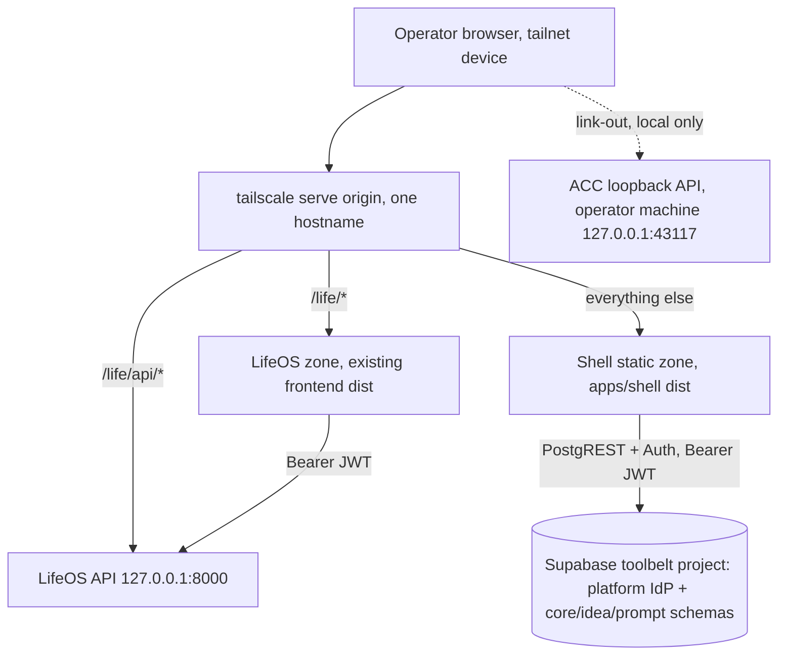

# 05-a. hyperbolic-core: the Shell and Global Services

Scope: the Shell (the to-be-built unified web front end of hyperbolic-core) and the global services it owns. Composition, topology, auth, and secrets decisions are inherited from `04-adrs.md` (ADR-01, ADR-02, ADR-03, ADR-05, ADR-06, ADR-07); this artifact turns them into an implementable plan realizing SH-1 through SH-5 from `03-v1-definition.md`. Names per `00-canonical-names.md`. Labels: `[VERIFIED: <path or command>]`, `[INFERRED: <reasoning>]`, `[UNKNOWN]`.

## 1. Current state summary

- No Shell exists. The repo root contains docs, templates, and CI only; zero application code [VERIFIED: 01-inventory.md section 1 root listing].
- Three disjoint UI surfaces today: LifeOS React app deployed to the tailnet, the Agentic Command Center (ACC) React app on operator-machine loopback, three vanilla HTML tool clients on local ports [VERIFIED: 01-inventory.md sections 1 and 5].
- Three disjoint auth flows (LifeOS Supabase Auth JWT, Toolbelt anon-key plus fixture accounts, ACC loopback trust) [VERIFIED: 01-inventory.md section 5].
- The only production deployment is the LifeOS VPS stack behind `tailscale serve` [VERIFIED: 01-inventory.md section 5].

## 2. V1 target state

Per ADR-01 (topology), ADR-02 (multi-zone, one origin), ADR-03 (Supabase Auth as platform IdP, single session), ADR-07 (`tailscale serve` as origin router):

- New app `apps/shell/`: React 19 + Vite 8 + Tailwind 4, matching both existing React apps [VERIFIED: apps/lifeos/frontend/package.json; apps/agentic-command-center/ui/package.json].
- New workspace packages: `packages/platform-client` (session + authed fetch), `packages/ui` (design tokens + chrome components). First workspace tooling in the repo, roughly 30 lines of root config [VERIFIED: ADR-01 cost statement].
- One tailnet origin path-routes `/life/*` to the deployed LifeOS frontend and everything else to the Shell static bundle. Two React bundles, one origin, one session.
- Deployable-unit accounting: the Shell is a static zone added to the existing VPS `tailscale serve` config, consuming one of the two remaining units in the complexity budget (Shell/gateway serving) [VERIFIED: 04-adrs.md complexity budget table].



## 3. Ownership boundary: Shell vs sub-apps

| Concern | Owner | Notes |
| --- | --- | --- |
| Navigation chrome (top nav, zone switcher) | Shell (component exported from `packages/ui`, rendered by both zones) | LifeOS zone renders the same component to avoid drift, per ADR-02 |
| Login flow and session lifecycle | Shell, via `packages/platform-client` | zones consume the session; zones never render a login form (retires the LifeOS-local login page, counted in `05-e` per ADR-03) |
| Command palette | Shell | navigation-only in V1 (Section 5) |
| Notification surface | Shell | contract in Section 7 |
| Settings page | Shell | scope in Section 8 |
| Route registry (path prefixes) | Shell | Section 4; tool entries come from the Toolbelt registry, not hardcoded lists (TB-2, `05-c`) |
| Page content, data fetching, domain UI | Sub-apps | LifeOS pages stay in the LifeOS zone; ACC pages stay on the operator machine until absorbed (`05-b` section 6); tool UIs per `05-c`/`05-d`/`05-h` |
| Domain APIs and databases | Sub-apps | the Shell holds zero domain logic and zero domain schema knowledge |
| Design tokens, base components | `packages/ui` | consumed by Shell and LifeOS zone |

Rule: the Shell may render a sub-app's summary card (health, counts, links) using only that app's published API contract; it may never import a sub-app's internals.

## 4. Cross-app navigation model

Route map (one origin, path prefixes):

| Prefix | Served by | Content | Session behavior |
| --- | --- | --- | --- |
| `/` | Shell | home: launcher cards, health summary, notification inbox | login gate |
| `/life/*` | LifeOS zone (separate bundle, `tailscale serve` route) | existing LifeOS pages | reads the same session, same origin |
| `/acc/*` | Shell | V1: ACC status card and link-out to the operator-local ACC UI (`http://127.0.0.1:43117`); post-absorption: ported ACC pages (`05-b` section 6) | login gate for the Shell page; ACC loopback API keeps its own credential (ACC-5) |
| `/tools/*` | Shell | tool discovery rendered from the Toolbelt registry (`05-c`); Network Checker remains a link-out (operator-local) | login gate |
| `/prompts/*` | Shell | Prompt Organizer surface per `05-d` | login gate |
| `/ideas/*` | Shell | Idea Intake per `05-h` | login gate |

Mechanics:

- LifeOS zone requires base-path awareness: Vite `base: '/life/'`, router basename, and FastAPI `root_path` for `/life/api/*`. Both knobs exist in the current stacks [VERIFIED: Vite and react-router support base paths; FastAPI supports root_path] and the change is config-level [INFERRED: no code path in the LifeOS frontend hardcodes an absolute origin except generated `types.gen.ts`, which is read-only generated output per apps/lifeos/frontend/AGENTS.md].
- Cross-zone navigation is a full document load (two bundles); in-zone navigation is client-side routing.
- Deep links: every route above is directly addressable; unauthenticated deep links land on the login gate and return to the requested path after login (SH-2, SH-3).

## 5. Command palette (Shell-owned)

- V1 scope: navigation only. Entries: the six route prefixes plus tool entries enumerated from the Toolbelt registry. Trigger: Ctrl+K / Cmd+K.
- Explicit non-goals for V1: cross-app actions, search over app data, LLM anything. Each would require per-app action contracts that do not exist yet.
- Value: single muscle-memory entry point across six surfaces. Cost: roughly 200 LOC. Lowest-ranked functional change (Section 11); cuttable without affecting SH-1..SH-5.

## 6. Session handling contract (`packages/platform-client`)

Type signatures only (binding interface, no implementation here):

```ts
export type Unsubscribe = () => void;

export interface PlatformClientConfig {
  supabaseUrl: string;        // platform IdP project (ADR-03)
  publishableKey: string;     // public by design
}

export interface PlatformSession {
  readonly accessToken: string;   // Supabase Auth JWT, ES256
  readonly expiresAt: number;     // epoch seconds
  readonly userId: string;        // must equal the owner UUID; anything else is a bug
}

export interface PlatformAuth {
  signInWithPassword(email: string, password: string): Promise<PlatformSession>;
  getSession(): Promise<PlatformSession | null>;   // refreshes if expired, else null
  onAuthStateChange(handler: (session: PlatformSession | null) => void): Unsubscribe;
  signOut(): Promise<void>;
}

// Attaches Authorization: Bearer <accessToken>; rejects (never sends) when no session.
export type AuthedFetch = (input: RequestInfo | URL, init?: RequestInit) => Promise<Response>;

export interface PlatformClient {
  auth: PlatformAuth;
  fetch: AuthedFetch;
}

export declare function createPlatformClient(config: PlatformClientConfig): PlatformClient;
```

Contract rules:

- Exactly one login surface: the Shell. Zones import `createPlatformClient` and call `getSession`; a zone calling `signInWithPassword` is a contract violation (enforced by the LO-2 grep criterion in `03-v1-definition.md`).
- Storage: the Supabase client's default same-origin storage; one origin (ADR-02) means both zones see one session [INFERRED: same-origin localStorage is shared across documents on that origin; this is the mechanism LifeOS already uses per lifeos-root-report frontend section].
- Failure mode: IdP unreachable fails closed; the documented break-glass is LifeOS-local only (ADR-03) and is not a Shell feature.

## 7. Layout and notification surface contract

Layout: `packages/ui` exports the chrome as a component with a props contract (signature only):

```ts
export interface ChromeProps {
  activeZone: "home" | "life" | "acc" | "tools" | "prompts" | "ideas";
  session: PlatformSession | null;
  onSignOut: () => void;
}
```

The nav element carries `data-testid="platform-nav"`; SH-1 verification asserts on that test id in every zone.

Notification surface (Shell-owned inbox plus transient toasts):

```ts
export type NotificationLevel = "info" | "success" | "warning" | "error";

export interface PlatformNotification {
  id: string;
  level: NotificationLevel;
  title: string;
  body?: string;
  source: "shell" | "lifeos" | "acc" | "toolbelt" | "brain";
  createdAt: string;          // ISO 8601
  href?: string;              // same-origin deep link
}

export interface NotificationSurface {
  publish(n: Omit<PlatformNotification, "id" | "createdAt">): string;  // returns id
  dismiss(id: string): void;
  list(): PlatformNotification[];
  subscribe(handler: (all: PlatformNotification[]) => void): Unsubscribe;
}
```

Transport: within a document, in-memory; across zones (LifeOS bundle to Shell bundle), `BroadcastChannel("platform-notifications")` carrying `PlatformNotification` JSON, available because both zones share one origin [INFERRED: BroadcastChannel is same-origin scoped, which ADR-02 guarantees]. Persistence: none in V1; notifications are session-ephemeral. The Brain's run-progress stream (BR-4, `07`) publishes into this surface through the same contract.

## 8. Settings page scope

| In scope (V1) | Out of scope (V1) |
| --- | --- |
| Theme (light/dark/system), persisted locally | user management (single principal, ADR-03) |
| Session card: signed-in email, expiry, sign out | secret values of any kind (ADR-05: Infisical only) |
| Unit health: one row per deployable unit calling its health route | feature flags |
| Version/build info per zone | per-app settings (each app keeps its own, linked from here) |
| Link to the break-glass runbook section | notification history persistence |

## 9. Interface contracts between Shell and zones

| # | Contract | Consumer obligation |
| --- | --- | --- |
| C-1 | Path-prefix table (Section 4) is the routing source of truth; changes land in this file and the serve config in the same change | zones never assume the bare origin root |
| C-2 | Session: `packages/platform-client` only; no zone-local login | LO-2 grep enforces for LifeOS |
| C-3 | Chrome: zones render the `packages/ui` chrome component; visual drift between zones is a defect (ADR-02 reversal trigger) | LifeOS zone adds the component; Shell zone gets it natively |
| C-4 | Notifications: publish only through `NotificationSurface`; cross-zone via the named BroadcastChannel | no zone renders its own toast stack for platform-level events |
| C-5 | Server-side auth: every `/api/*` upstream verifies the platform JWT itself (SH-4); the origin router does zero auth (ADR-07) | LifeOS keeps its verifier, re-pointed to the platform JWKS (ADR-03) |
| C-6 | Tool discovery: the Shell renders `/tools/*` from the registry contract in `05-c`, never from a hardcoded list (TB-2) | tools ship manifests |

## 10. Latency budgets

Measured from a tailnet browser at the gateway (per `03-v1-definition.md` gate question 1); p95 unless stated.

| Path | Budget | Verification |
| --- | --- | --- |
| Initial Shell load, cold cache, to interactive | 2.0 s | Playwright trace timing in `apps/shell/e2e/perf.spec.ts` |
| In-zone route transition (client-side) | 200 ms | same spec |
| Cross-zone navigation (Shell to `/life/*`, full load) | 2.0 s | same spec |
| Authenticated API call through origin, excluding upstream compute | 300 ms | `curl -w '%{time_total}'` sampled 50x in the perf spec |
| Unauthenticated `/api/*` rejection | 401 within 50 ms | SH-4 command below |
| Command palette open-to-interactive | 100 ms | palette spec |

## 11. Functional changes ranked by ROI

| Rank | Change | Value | Cost (est. LOC added) | Realizes |
| --- | --- | --- | --- | --- |
| 1 | One origin: `tailscale serve` path routes for Shell zone + `/life/*` | collapses port sprawl; precondition for everything else | ~20 config lines + runbook rows | SH-1 |
| 2 | `packages/platform-client` + Shell login gate | one session everywhere; retires two of three auth flows | ~350 (client 250, gate 100) | SH-2, SH-3, SH-4 (client side) |
| 3 | Shell scaffold: routes, chrome, home page, `packages/ui` tokens + chrome component | the product finally has one front door | ~900 (scaffold 200, nav/chrome 300, home 200, tokens 200) | SH-1 |
| 4 | LifeOS zone integration: base path config + chrome + shared session | LifeOS joins the platform without touching its deploy pipeline | ~120 config/wiring in the standalone repo (counted in `05-e`) | SH-1, SH-3 |
| 5 | Settings page | health visibility per unit; sign-out surface | ~150 | SH-1, observability definition |
| 6 | Notification surface | one inbox for Brain/ACC/app events; needed by BR-4 later | ~200 | platform contract C-4 |
| 7 | Command palette (navigation only) | convenience; cuttable | ~200 | none directly |
| n/a | One-command build/deploy job for the Shell zone (pattern copied from LifeOS ci.yml per ADR-04) | repeatable deploys | ~80 workflow lines (owned by `10-cicd-deployment.md`) | SH-5 |

## 12. EARS acceptance criteria (realizing SH-1..SH-5)

`<origin>` is the tailnet hostname from the serve config; commands run from a tailnet device.

| # | Criterion (EARS) | Verification command |
| --- | --- | --- |
| SH-1a | When an authenticated operator requests `/`, `/acc`, `/tools`, `/prompts`, or `/ideas`, the Shell shall render the shared chrome (`data-testid="platform-nav"`). | `cd apps/shell && npx playwright test e2e/chrome.spec.ts` |
| SH-1b | When an authenticated operator requests `/life/`, the LifeOS zone shall render the same chrome component with the same test id. | same spec, `/life/` case |
| SH-2a | When an unauthenticated browser requests any prefix in the Section 4 route map, the Shell (or zone) shall present the login flow and shall render zero data nodes. | `npx playwright test e2e/auth-gate.spec.ts` (fresh context per route, asserts login form present and `[data-app-data]` absent) |
| SH-2b | When login succeeds from a gated deep link, the Shell shall navigate to the originally requested path. | same spec, deep-link case |
| SH-3 | When the operator authenticates once at the Shell, one authenticated API call per composed app (LifeOS `/life/api/*`, platform PostgREST for tools/prompts/ideas) shall return 200 without a second login. | `npx playwright test e2e/single-session.spec.ts` |
| SH-4 | If a request reaches any `/api/*` upstream without a valid platform JWT, then that upstream shall respond 401 within 50 ms excluding network RTT. | `curl -s -o /dev/null -w '%{http_code} %{time_total}\n' https://<origin>/life/api/entities/x` (repeat per API base; expect `401` and total under 0.05 plus measured RTT) |
| SH-5 | When the single deploy command defined in `10-cicd-deployment.md` runs, it shall exit 0 and the deployed Shell health route shall return 200. | `<deploy-command> && curl -s -o /dev/null -w '%{http_code}' https://<origin>/healthz` returns `200` |
| SH-6 | While the IdP is unreachable, the Shell shall fail closed: no cached page shall issue an authenticated API call with an expired token. | `npx playwright test e2e/idp-down.spec.ts` (network-block the IdP host, assert redirect to login) |

## 13. Deletions

None in this artifact. The Shell is additive; no existing file moves (ADR-01 migration plan). Related deletions owned elsewhere: the LifeOS-local login page (`05-e`, per ADR-03) and ACC UI pages after absorption (`05-b` section 6).

## 14. LOC estimate

| Bucket | Added | Deleted |
| --- | --- | --- |
| `apps/shell/` (scaffold, routes, home, settings, notifications, palette, login gate) | ~1,750 | 0 |
| `apps/shell/e2e/` (chrome, auth-gate, single-session, perf, idp-down specs) | ~400 | 0 |
| `packages/platform-client` | ~250 | 0 |
| `packages/ui` (tokens + chrome) | ~250 | 0 |
| Root workspace config | ~30 | 0 |
| Serve config + deploy workflow (owned by `10`) | ~100 | 0 |
| Total | ~2,780 | 0 |

A small SPA, in line with the two existing React apps (the entire ACC UI is 4 pages totaling 465 LOC plus a 66-line client [VERIFIED: wc -l apps/agentic-command-center/ui/src/pages/*.tsx, ui/src/api.ts]).

## Gate questions (batched, non-blocking)

1. Command palette is the lowest-ROI item and cuttable; confirm keep or cut before Phase 11 issues.
2. `/life/*` requires base-path config in the standalone LifeOS repo (Vite `base`, router basename, FastAPI `root_path`) and changes the smoke-test URLs; confirm the operator accepts touching the standalone repo for this, since the alternative (LifeOS at the origin root, Shell under a prefix) inverts the product hierarchy.
3. Notification persistence is deliberately absent in V1 (session-ephemeral); confirm this is acceptable until the Brain's run history (07) provides durable state.

## Self-check (Section 10)

- Every factual claim labeled: PASS
- No implementation code produced: PASS (type signatures, config names, route tables, Mermaid only)
- Canonical names used exclusively: PASS
- Maturity/migration/lock-in/ecosystem costs: PASS (stack inherited from ADR-02 where they are scored; LifeOS base-path migration cost stated in Section 4 and gate question 2)
- Machine-verifiable acceptance criteria: PASS (Section 12, one command per row)
- LOC delta reported: PASS (Section 14, added and deleted)
- Deletion list present: PASS (Section 13, explicitly none, with pointers to owning artifacts)
- Latency budgets stated for new paths: PASS (Section 10)
- Questions batched: PASS (3, non-blocking)
- Zero em dashes: PASS
- Complexity budget breaches: none (Shell rides the existing VPS and serve config; one budgeted unit consumed, per Section 2)
