# 05-f. Network Checker V1 Plan

Component: Network Checker (`network-checker`, CLI name `netcheck`) at `apps/toolbelt/apps/network-checker/`. Names per `00-canonical-names.md`. Evidence base: `01-inventory.md`, `02-health-audit.md` section 6, and direct source reads cited inline. Planning only: schemas, CLI usage specs, and test specs are contracts, not code.

Governing philosophy this plan designs against, taken directly from the brief: troubleshoot holistically at any flow point across data, hardware, and software; know every property and configuration of the network; modify configuration only with concrete testing and explicit user sign-off.

One product invariant must be amended to realize that philosophy. Today the app declares "Automated device configuration writes are outside the product's scope" [VERIFIED: apps/toolbelt/apps/network-checker/AGENTS.md, Product invariants]. The change lifecycle in section 4 keeps the spirit (no unattended configuration writes, ever) while replacing the blanket exclusion with a consent-gated lifecycle: every write requires a recorded dry run and an explicit interactive approval, and the only automatic write permitted is the pre-recorded rollback of a change that just failed verification. The AGENTS.md invariant text is updated in the same PR that ships the lifecycle.

## 1. Current state summary

From the Phase 2 deep dive [VERIFIED: docs/planning/02-health-audit.md section 6] and direct execution [VERIFIED: 01-inventory.md section 6, run 2026-08-12]:

- All 298 hermetic tests pass; `tools/check.sh` (tests + complexity + security scanner + doc checks + shell syntax) passes clean.
- The three-state contract (`ok` / `fail` / `unavailable`) is honored everywhere exercised; degradation is explicit, and `unavailable` is never treated as fault evidence [VERIFIED: AGENTS.md invariants; sandbox probe/scan output].
- Parser and test discipline is strong: parsers are pure functions over captured fixtures; every module has a dedicated `test_<module>.py` except `watch.py` (defect D-03) and the frontend JS (defect D-04) [VERIFIED: tests/ listing; scratchpad toolbelt report].
- The diagnostic model is data-driven: `rank._SCAN_RULES` is a tuple of (cause, scan section, confidence, evidence lambda) entries and `rank._FIXES` maps every cause to actionable prose; `test_rank.py` cross-checks `_SCRIPTS` entries against the filesystem in both directions [VERIFIED: netcheck/rank.py:89-94,140-192].
- The lifecycle gap: measurement and diagnosis are mature, but "know every property" exists only as deep-tier scans (topology, exposure, remote, snmp, ssdp) with no persistent device or configuration inventory, and remediation exists only as three human-run shell scripts with no propose / dry-run / approve / verify / rollback structure [VERIFIED: 02-health-audit.md section 6 closing paragraph; tools/fix_*.sh].
- Deployment posture: operator-local only (CLI + loopback dashboard on 127.0.0.1:8787); this plan keeps it there per the ADR deployment table [VERIFIED: docs/archived/2026-08-16/planning-04-adrs.md ADR-06, "netcheck dashboard (stays operator-local)"].
- Scan tiers and budgets: quick 10 s, standard 60 s, deep 120 s, enforced by a bounded child process [VERIFIED: netcheck/__main__.py:28,94-104].

## 2. Flow-point coverage matrix

Column key: Covered (a module measures it today), Partial (measured indirectly or only on some platforms/paths), Not covered. Every citation is a module under `netcheck/` unless noted.

| Flow point | Status | Evidence |
| --- | --- | --- |
| Physical layer (cabling, PHY, coax plant) | Partial | Only two windows into it: Wi-Fi signal strength parsed from platform output [VERIFIED: wlan_probes.py:45 `signal_pct`; schema.sql `wifi_signal`] and DOCSIS uncorrectable-codeword counts as coax-plant evidence [VERIFIED: docsis.py; rank.py:41-44 `modem_signal`]. No ethernet PHY, no cable diagnostics. |
| Link: Wi-Fi RF | Covered | Signal, channel, band, rx/tx rates, BSSID per tick [VERIFIED: wlan_probes.py; schema.sql samples columns]; congestion and DFS rules [VERIFIED: rank.py:160-166]; radio power-cycle events from the Windows event log [VERIFIED: environ.py:130; rank.py:157-159]; pinned-mode detection [VERIFIED: rank.py:185-189]. Windows/macOS parsers; Linux `unavailable` by design [VERIFIED: AGENTS.md stack note; 02-health-audit.md scan row]. |
| Link: ethernet | Not covered | No probe measures link speed, duplex, or errors on a wired interface. `fix_adapter_power.sh` can act on an ethernet adapter but nothing measures one [VERIFIED: tools/fix_adapter_power.sh find_adapter fallback; grep for ethernet probes in netcheck/: none]. |
| Network: IP addressing and routing | Covered | Default gateway and first ISP hop resolved per tick, re-resolved so a network move is not misread as an outage [VERIFIED: route.py; watch.py:30-35]; gateway/hop/internet ICMP stages [VERIFIED: probes.py; schema.sql gw/hop/inet columns]. Beyond the first hop the path is unmeasured (no full traceroute), hence not marked deeper than "first hop plus wider internet". |
| Network: NAT | Partial | Double-NAT (RFC 1918 WAN address) and CGNAT (100.64.0.0/10) detection exist [VERIFIED: remote.py:26,183-184; rank.py:144-149]. No NAT table, port-mapping, or UPnP lease inspection. |
| Transport: TCP | Partial | TLS/HTTP timings exercise TCP implicitly; idle-hold measures long-lived connection survival [VERIFIED: probes.py sample and idle_hold; schema.sql events]; receive-window autotuning checked on Windows [VERIFIED: rank.py:128-133,184]. No retransmit/RTT/windowing measurement. |
| Transport: UDP | Partial | Only as DNS-over-UDP transport [VERIFIED: resolver.py, AGENTS.md layout row]. No generic UDP loss/jitter probe. |
| Application: TLS | Covered | Per-tick TLS handshake timing and state to the target [VERIFIED: probes.py; schema.sql tls_state/tls_ms]; DPI/interception named as a ranked cause [VERIFIED: rank.py:23-26,45-48]. |
| Application: HTTP | Covered | Per-tick HTTP timing, status code [VERIFIED: schema.sql http_state/http_ms/http_code]; provider status page correlated [VERIFIED: rank.py:141-143 `anthropic_incident`]. |
| DNS | Covered | Router resolver vs public resolver measured separately as a control pair [VERIFIED: schema.sql dns_router/dns_public columns]; `router_dns` vs `dns` causes distinguish local from upstream failure [VERIFIED: rank.py:19-22]. |
| DHCP | Not covered | `grep -ri dhcp netcheck/` finds exactly one hit: the Windows event-log channel match includes `Microsoft-Windows-Dhcp-Client` events in the environment scan [VERIFIED: environ.py:130]. No lease inspection, no renewal monitoring, no server identification. DHCP-renewal effects are known to matter here (a renewal historically caused a stale-gateway misread) [VERIFIED: CHANGELOG.md:348; tests/test_route.py:61]. |
| Routing (beyond first hop) | Partial | Three fixed path points (gateway, ISP first hop, wider internet) [VERIFIED: probes.py; schema.sql]; MTU discovery exists [VERIFIED: rank.py:170-172 `low_mtu`]; no per-hop path enumeration. |
| Wi-Fi RF (standing conditions) | Covered | See Link: Wi-Fi RF row; additionally dual-stack v4/v6 divergence detection [VERIFIED: dualstack.py; rank.py:176-183]. |
| ISP boundary | Covered | First-hop probing [VERIFIED: route.py], modem DOCSIS status and codeword counts [VERIFIED: docsis.py; remote.py], WAN address classification [VERIFIED: remote.py:183-184], provider incident status [VERIFIED: rank.py:141-143], geolocation of the WAN egress [VERIFIED: geoip.py]. |
| LAN device population | Partial | Neighbor-table enumeration (arp / ip neigh) with SSDP gateway naming [VERIFIED: topology.py:1-11]; exposure checks for open management ports and default credentials at deep tier [VERIFIED: exposure.py; rank.py:190-191]; SNMP scalar reads [VERIFIED: snmp.py]. Ephemeral: results live inside `env_scans` JSON payloads, not as queryable device rows. Section 3 fixes this. |

Honest summary: the app is strongest exactly where the operator's historical pain was (Wi-Fi, DNS, ISP, long-lived TLS). The gaps are ethernet link metrics, DHCP, deep transport metrics, and persistence of device/config knowledge. V1 closes the persistence gap (section 3) and the consent-gated change gap (section 4); DHCP and ethernet stay in the candidate queue (section 7).

## 3. Device and configuration inventory model

The "know every property" foundation. Today every device fact is trapped inside `env_scans.payload` JSON blobs [VERIFIED: schema.sql:71-78]; nothing can answer "what devices exist, what changed on the router since last week". The inventory model promotes those facts to first-class, append-only rows fed by the modules that already collect them: `topology.py` (neighbor table), `ssdp.py` (gateway identity), `snmp.py` (modem scalars), `remote.py` (modem/router/WAN status), `environ.py` (this host's own adapter properties).

SQLite DDL extending `netcheck/schema.sql` (mirrored to `supabase/migrations/` for the optional mirror, same `synced` discipline as existing tables [VERIFIED: store.py mirror contract; 01-inventory.md section 2]):

```sql
-- One row per distinct device ever seen on the LAN (or this host itself).
CREATE TABLE IF NOT EXISTS device (
  id         INTEGER PRIMARY KEY,
  host_id    INTEGER NOT NULL REFERENCES hosts(id),
  mac        TEXT,                -- NULL allowed: FR-017 devices are never dropped
  ip         TEXT,
  kind       TEXT NOT NULL DEFAULT 'unknown',  -- gateway | modem | ap | client | self | unknown
  name       TEXT,                -- SSDP friendly name, SNMP sysName, or NULL
  vendor     TEXT,                -- OUI-derived when mac is present, else NULL
  first_seen TEXT NOT NULL,
  last_seen  TEXT NOT NULL,
  synced     INTEGER NOT NULL DEFAULT 0,
  UNIQUE (host_id, mac, ip)
);

-- Interfaces observed on a device (this host's own adapters at minimum;
-- router LAN/WAN sides where remote.py can see them).
CREATE TABLE IF NOT EXISTS interface (
  id          INTEGER PRIMARY KEY,
  device_id   INTEGER NOT NULL REFERENCES device(id),
  name        TEXT NOT NULL,      -- adapter or port name as reported
  medium      TEXT,               -- wifi | ethernet | coax | virtual | unknown
  speed_mbps  REAL,
  observed_at TEXT NOT NULL,
  synced      INTEGER NOT NULL DEFAULT 0,
  UNIQUE (device_id, name, observed_at)
);

-- Append-only configuration observations: one row per (device, key) per
-- observation. History is the point; the view below answers "current".
CREATE TABLE IF NOT EXISTS config_item (
  id          INTEGER PRIMARY KEY,
  device_id   INTEGER NOT NULL REFERENCES device(id),
  key         TEXT NOT NULL,      -- e.g. 'dns.servers', 'wifi.channel', 'wireless_mode', 'aiprotection_enabled', 'docsis.snr_db'
  value       TEXT,               -- canonical string/JSON encoding
  observed_at TEXT NOT NULL,
  source      TEXT NOT NULL,      -- module that measured it: topology | ssdp | snmp | remote | environ | change_apply
  synced      INTEGER NOT NULL DEFAULT 0,
  UNIQUE (device_id, key, observed_at)
);

CREATE INDEX IF NOT EXISTS config_item_device_key ON config_item (device_id, key, observed_at);

-- Latest value per (device, key): the "know every property" query surface.
CREATE VIEW IF NOT EXISTS config_current AS
  SELECT c.device_id, c.key, c.value, c.observed_at, c.source
  FROM config_item c
  WHERE c.observed_at = (SELECT MAX(c2.observed_at) FROM config_item c2
                         WHERE c2.device_id = c.device_id AND c2.key = c.key);
```

Population contract: the standard and deep scan tiers upsert `device` rows and append `config_item` rows as part of the existing scan flow, inside the existing tier budgets (section 8). A new `netcheck inventory` subcommand renders the tables (device list, per-device current config, config diff between two timestamps). No new collectors are written for V1; the inventory persists exactly what existing modules already measure. Type signature of the one new seam:

```python
def record_inventory(conn, host_id: int, scan_payload: dict, ts: str) -> dict:
    """Map an environ.scan()/topology/exposure payload into device,
    interface, and config_item rows. Returns counts per table. Pure
    mapping over an already-collected payload; no network calls."""
```

CLI usage spec:

```
python -m netcheck inventory                 # device table, name/kind/ip/mac/last_seen
python -m netcheck inventory --device <id>   # current config for one device
python -m netcheck inventory --diff <ts>     # config_item changes since <ts>
```

## 4. Change lifecycle (realizes NC-4)

Design goal: no configuration write without concrete testing and explicit
operator sign-off; no writer is enabled until its exact pre-state, inverse,
forward proof, and restoration proof are all implementable and tested. The
lifecycle is present, but the production template registry is intentionally
empty. Current/future flow:

```mermaid
stateDiagram-v2
    [*] --> proposed : change propose
    proposed --> tested : change test (dry run recorded)
    tested --> approved : change approve (interactive sign-off)
    tested --> rejected : change reject
    approved --> applying : change apply (TTY capability + atomic claim)
    applying --> verified : command succeeds; forward probe passes
    applying --> apply_failed : command exits nonzero
    applying --> rolled_back : forward probe fails; inverse and restoration prove success
    applying --> rollback_failed : inverse or restoration proof fails
    applying --> [*] : interrupted; manual reconciliation required
    verified --> [*]
    rolled_back --> [*]
    apply_failed --> [*]
    rollback_failed --> [*]
```



### 4.1 change_request record (SQLite DDL)

```sql
CREATE TABLE IF NOT EXISTS change_request (
  id             INTEGER PRIMARY KEY,
  created_at     TEXT NOT NULL,
  host_id        INTEGER REFERENCES hosts(id),
  device_id      INTEGER REFERENCES device(id),  -- NULL means this host itself
  cause          TEXT,                -- rank cause that motivated it, if any
  title          TEXT NOT NULL,
  change_cmd     TEXT NOT NULL,       -- exact command that applies the change
  inverse_cmd    TEXT NOT NULL,       -- exact command that reverses it; REQUIRED at propose time
  verify_probe   TEXT NOT NULL,       -- netcheck probe expression that must pass post-apply
  dry_run_output TEXT,                -- captured evidence from change test
  dry_run_at     TEXT,
  approval_token TEXT,                -- SHA-256 digest of the raw HMAC capability
  approved_at    TEXT,
  approved_by    TEXT,
  applied_at     TEXT,
  apply_output   TEXT,
  verified_at    TEXT,
  rolled_back_at TEXT,
  status         TEXT NOT NULL DEFAULT 'proposed'
    CHECK (status IN ('proposed','tested','approved','applying','applied',
                      'verified','rolled_back','apply_failed',
                      'rollback_failed','rejected')),
  synced         INTEGER NOT NULL DEFAULT 0
);
```

Invariants enforced by the implementation (and by tests):

1. Production proposals are host-scoped and must exactly match an enabled,
   import-time-frozen template. The registry is empty, so no production write
   is currently proposable.
2. A row cannot reach `approved` without non-null read-only dry-run evidence.
3. Approval emits one raw HMAC capability; SQLite stores only its SHA-256
   digest. Length-framed material binds row, host, device, cause, title,
   command, inverse, verifier, evidence digest, approval time, and approver.
4. Apply validates both the HMAC and stored digest, then atomically claims
   `approved -> applying`. Concurrent or interrupted applies cannot replay it.
5. The executor is shell-free, fixed-directory, and argv-allow-listed. Its
   current allowlist contains only `python -m netcheck --version`, a
   non-mutating operation.
6. Terminal status reports the real outcome: `verified`, `apply_failed`,
   `rolled_back`, or `rollback_failed`; an interrupted `applying` row requires
   manual reconciliation.

### 4.2 CLI flow (usage spec)

```
python -m netcheck change propose --title <t> --cause <cause> \
    --cmd <change_cmd> --inverse <inverse_cmd> --verify <probe-expr> [--device <id>]
python -m netcheck change test <id>       # runs the dry-run form, records output + timestamp
python -m netcheck change show <id>       # full record: commands, dry-run evidence, status
python -m netcheck change approve <id>    # INTERACTIVE ONLY, see 4.3
python -m netcheck change apply <id>      # reads the capability from a TTY without echo
python -m netcheck change verify <id>     # re-runs verify_probe on demand
python -m netcheck change list [--status <s>]
```

`change test` measures the supported `verify_probe` once, records the current
state and the exact forward/inverse commands as read-only evidence, and never
runs either command. It cannot invoke any legacy fix script.

### 4.3 Sign-off token mechanism

- `change approve` refuses to run when stdin is not a TTY (exit non-zero). Approval is never scriptable, never automatic, never granted by an agent. This is the explicit-consent boundary and it is deliberately inconvenient.
- The command prints: title, cause, exact `change_cmd`, exact `inverse_cmd`, `verify_probe`, and the full dry-run evidence, then requires the operator to type the change id back to confirm.
- On confirmation it records `approved_at` and `approved_by`, creates a keyed
  HMAC-SHA256 capability over length-framed typed fields, prints the raw
  capability once, and stores only its SHA-256 digest. The HMAC key is a
  separate owner-only file, not the SQLite database.
- `change apply` also requires a TTY and reads the raw capability without echo;
  argv and environment input are not accepted. Any bound-field drift, wrong
  capability, or concurrent claim refuses before execution.

### 4.4 Rollback contract

Every row carries an inverse and verification expression from birth. A nonzero
forward exit lands `apply_failed` and does not run the inverse. A successful
forward command gets at most three verification attempts within one monotonic
90-second budget. Only a failed forward proof after a zero exit may run the
approved inverse; a failed inverse or failed restoration check lands
`rollback_failed`, never a false `rolled_back`. Separate `config_item` audit
rows preserve forward and rollback outcomes.

No production template is enabled today, so this automatic-write branch is not
reachable from a host-scoped proposal. Before enabling one, the template model
must be extended to carry and prove exact captured pre-state and a distinct
restoration condition; the current single forward expression is not sufficient
evidence for a real device writer.

### 4.5 Legacy fix scripts stay disabled

`tools/fix_dns.sh`, `tools/fix_wifi_mode.sh`, and
`tools/fix_adapter_power.sh` are retained only as hard-disabled historical
stubs. They did not capture enough exact pre-state to guarantee restoration
across supported platforms, so none is an executor and no seeded change
template ships. `change_templates.TEMPLATES` and `rank._TEMPLATES` are empty;
ranked findings retain actionable manual remedies without advertising an
automated proposal.

The unattended `tools/run_fixes.sh` wrapper is deleted and has no replacement.
Any future writer must introduce a new reviewed template with typed argv,
pre-state capture, exact inverse, distinct forward/restoration proofs, and
platform fixtures before the registry can become non-empty.

## 5. Defect fixes from Phase 2

### D-03: `watch.py` hermetic test spec (realizes NC-2)

New `tests/test_watch.py`, hermetic (no sockets, no sleep). Injection points are exactly the module seams `watch.py` already imports [VERIFIED: netcheck/watch.py:13-15]: patch `probes.sample`, `probes.idle_hold`, `route_mod.gateway`, `route_mod.first_hop`, `environ.wifi`, `environ.scan`, `llmlog.ingest`, `store.mirror`, and `time.sleep`. Required coverage:

1. Tick loop: one `_tick` stores exactly one sample row with `culprit` set from the injected fake sample; loop bound is driven by making the patched `time.sleep` raise `KeyboardInterrupt` after N ticks, asserting `run()` returns 0 and stored N samples.
2. Route re-resolution: when the patched `gateway()` changes between ticks, `first_hop` is re-resolved and no outage event is recorded (the regression class documented at CHANGELOG.md:348).
3. Idle-hold cadence: `idle_hold` fires exactly when `tick % args.idle_every == 0` [VERIFIED: watch.py:41] and its result lands as an `idle_hold` event row.
4. Mirror call: `store.mirror` is called every tick with `SUPABASE_URL`/`SUPABASE_KEY` from the environment [VERIFIED: watch.py:48-49], asserted via a recording fake with a patched env.
5. Startup scan: one `env_scans` row per `run()` invocation [VERIFIED: watch.py:63-64].

Estimated ~120 LOC of test, 0 LOC of production change (the seams already exist).

### D-04: frontend test decision

DECIDE: ship one minimal Playwright smoke spec; do not build a JS unit-test harness.

- What ships: a single spec that starts `python -m netcheck serve` against a seeded fixture SQLite database, loads the dashboard, asserts the sample table renders fixture rows, asserts one SSE-pushed update appears, and asserts the export action produces a download. Hermetic: loopback only, no live network.
- Justification: the 10 JS modules [VERIFIED: frontend/js listing] are render-and-fetch glue with no algorithmic core worth unit-testing separately; the failure mode that matters is "dashboard silently broken", which one end-to-end smoke catches. The Playwright install pattern already exists in `toolbelt-ci.yml` for Prompt Organizer [VERIFIED: 01-inventory.md section 6], so CI cost is one more job step, not a new toolchain. The rejected alternative (accept untested) leaves the only human-facing surface of the product permanently unverified for the cost of ~100 LOC; the other rejected alternative (a JS unit harness) violates the zero-dependency frontend stance for marginal gain.
- Cost: ~80 LOC spec + ~20 lines fixture seeding + ~15 lines CI. The frontend stays dependency-free; Playwright remains a test-time-only tool as it already is for Prompt Organizer.

### D-10: stale label edit list

| File | Line | Edit |
| --- | --- | --- |
| `Dockerfile` | 13 | `org.opencontainers.image.source` points at defunct `github.com/kgsmith19/network-checker` [VERIFIED: Dockerfile:13]; repoint to `github.com/kgsmith19/hyperbolic-core` |
| `README.md` | 11-12 | quick start clones defunct `github.com/kgsmith19/toolbelt` then `cd toolbelt/apps/network-checker` [VERIFIED: README.md:11-12]; replace with `git clone` of hyperbolic-core and `cd apps/toolbelt/apps/network-checker` |

Net LOC: 0 (in-place edits). Verification: `grep -rn "kgsmith19/network-checker\|kgsmith19/toolbelt" apps/toolbelt/apps/network-checker/` returns zero hits.

## 6. Consolidation opportunities

### synthesis.py: DECIDE, delete

`synthesis.py` is a deliberately unwired 28-line Protocol + NullSynthesizer stub (issue #93) imported by nothing except its own 51-line test [VERIFIED: netcheck/synthesis.py; tests/test_synthesis.py; 02-health-audit.md dead-code register]. Options: (1) wire it now to `packages/llm` Handler A as the LLM-summary seam; (2) keep the stub unwired; (3) delete it. Decision: delete, for three reasons. First, V1's selected feature set (section 7) does not include the LLM narrative, so wiring now is speculative work against a Handler A contract that `08-llm-handlers.md` has not yet fixed. Second, the app's own engineering guidance says not to keep a module without a concrete need [VERIFIED: AGENTS.md engineering guidance], and an unwired Protocol is exactly the speculative abstraction that rule targets. Third, the seam is trivially re-creatable: when the LLM narrative feature clears the ROI bar post-V1, re-adding a 28-line boundary against the then-real Handler A contract costs less than maintaining a guess. Deleting closes issue #93 by rejection. LOC delta: -79 (module + test).

### AGENTS.md layout table refresh

The layout table lists 17 entries; 6 wired modules are undocumented [VERIFIED: 02-health-audit.md gap register]. Add rows for `bundle.py` (report/export bundling), `experiment.py` (labeled A/B probe runs), `exposure.py` (deep-tier LAN exposure checks), `geoip.py` (WAN geolocation), `topology.py` (neighbor-table device map); `synthesis.py` is deleted above rather than documented. The same refresh adds rows for the new `inventory.py` and `change.py` modules and updates the amended configuration-writes invariant (section 4 preamble). Net LOC: +9 doc lines, -1 invariant line replaced.

## 7. V1 feature: ranked candidates and the forced decision

Candidate pool, each scored value / cost / ROI for a single operator whose historical pain is intermittent Wi-Fi/ISP/DNS trouble during LLM CLI work:

| # | Candidate | Value | Cost | ROI rank |
| --- | --- | --- | --- | --- |
| a | Change lifecycle (section 4) | Realizes the brief's consent philosophy and NC-4; establishes the audited trust layer while refusing the three legacy writers that cannot prove exact restoration | ~620 LOC (engine, schema, CLI, and adversarial tests; no enabled templates) | 1 (mandated and highest leverage) |
| b | Device/config inventory (section 3) | Realizes "know every property"; makes config drift diagnosable ("what changed since it last worked"); feeds the lifecycle's device targeting; data already collected, only persistence is new | ~455 LOC (mapper ~150, schema ~40, store ~40, CLI ~25, tests ~200) | 2 (mandated foundation) |
| c | Scheduled watch + alerting on culprit transitions | Notification when the culprit changes state, instead of reading the dashboard after the fact | ~200 LOC + a notification channel decision (new external dependency or OS toast); watch loop currently has zero tests, so alerting builds on the least-tested module until D-03 closes | 3 |
| d | ISP outage correlation vs historical baseline | Strengthens the ISP-ticket evidence story; samples data already exists [VERIFIED: schema.sql samples] | ~180 LOC (baseline aggregation + report section + tests); value is incremental over the existing recurrence counting in `rank._sample_causes` [VERIFIED: rank.py:194-209] | 4 |
| e | Speed/bufferbloat test integration | New measurement class (throughput/latency-under-load) | Violates stdlib-only unless hand-rolled (~400 LOC of careful socket work); saturating the link conflicts with the passive watch posture; external test targets add egress | 6 |
| f | DHCP lease/renewal monitoring | Closes a genuine matrix gap (section 2); renewal events already caused one historical misdiagnosis [VERIFIED: CHANGELOG.md:348] | ~150 LOC (Windows event channel is already scanned [VERIFIED: environ.py:130]; add lease query + config_item keys + a rank rule); cheap, but only after the inventory tables exist to store it | 5 (first post-V1 pick) |
| g | LLM-assisted diagnosis narrative via the synthesis seam | Prose summaries of ranked causes | Depends on Handler A (08) landing first; `rank._FIXES` prose is already actionable [VERIFIED: rank.py:12-79]; marginal value lowest in pool | 7 |

Forced decision 11: the V1 slice is (b) device/config inventory plus (a) change lifecycle, and nothing else. Sections 3 and 4 are mandated by the brief's philosophy regardless of this ranking; the accounting is: the change lifecycle satisfies NC-4 (its own criterion), and the device/config inventory is the selected V1 feature satisfying NC-3. No additional feature ships in V1: the two mandated slices are new capability (~1,135 LOC with tests), the complexity budget gains nothing from a third slice, and foundation-over-completeness says stop. First post-V1 pick is (f) DHCP lease monitoring, which becomes a cheap `config_item` source once the inventory tables exist.

## 8. Latency budgets

| Path | Budget | Rationale |
| --- | --- | --- |
| Inventory persistence during scan | inside existing tier budgets: quick 10 s, standard 60 s, deep 120 s [VERIFIED: __main__.py:28]; `record_inventory` itself is a pure mapping over an already-collected payload, budget 1 s | no new collection, only writes |
| `netcheck inventory` render | < 500 ms against a year of scans (indexed reads) | local SQLite, indexed by (device_id, key) |
| `change test` | one read-only probe, capped at 30 s | `change_verify.run()` owns the deadline; it executes no change command |
| `change apply` + verification | forward command 90 s; forward proof up to 90 s; if needed, inverse 90 s plus restoration check 30 s | theoretical ceiling ~5 minutes; no production template currently reaches it |
| Watch tick overhead from inventory/lifecycle | 0 (neither runs in the tick path) | tick path unchanged [VERIFIED: watch.py:24-55 touches neither] |

## 9. Acceptance criteria (EARS) realizing NC-1..NC-4

All commands run from `apps/toolbelt/apps/network-checker/` unless stated.

| # | Criterion (EARS) | Verification command |
| --- | --- | --- |
| NC-1 | The existing suite and scanners shall stay green throughout V1 work. | `bash tools/check.sh` exits 0 |
| NC-2 | `watch.py` shall have a dedicated hermetic test covering tick storage, route re-resolution, idle-hold cadence, mirror invocation, and startup scan. | `python3 -m unittest tests.test_watch` exits 0; `python3 -m unittest discover -s tests -t .` count strictly exceeds 298 |
| NC-3.1 | When a standard or deep scan completes, the system shall persist one `device` row per neighbor-table entry and `config_item` rows for every measured property, within the tier budget. | `python3 -m unittest tests.test_inventory` exits 0 (fixture payload in, row counts asserted equal to fixture device/property counts) |
| NC-3.2 | The operator shall be able to list devices and each device's current configuration from the store. | `python -m netcheck inventory` exits 0 and prints one row per fixture device when run against a seeded test database (`NETCHECK_DB` pointed at the fixture) |
| NC-3.3 | When the same property is observed with a new value, the system shall append a new `config_item` row and `config_current` shall return only the newest value. | `python3 -m unittest tests.test_inventory` (history + view case) |
| NC-4.1 | While no exact reversible template is enabled, every host-scoped proposal shall fail before recording a change. | `python3 -m unittest tests.test_change_host_scope tests.test_change_propose` exits 0 |
| NC-4.2 | While stdin is not a TTY, both approval and capability entry for apply shall refuse and exit non-zero. | `python3 -m unittest tests.test_change_approve tests.test_change_security` exits 0 |
| NC-4.3 | When any approval-bound field, evidence, approver, or capability changes, apply shall reject it before execution; concurrent applies shall permit one atomic claim only. | `python3 -m unittest tests.test_change_key tests.test_change_concurrency` exits 0 |
| NC-4.4 | A nonzero forward command shall record `apply_failed` without inverse; a failed inverse or restoration proof shall record `rollback_failed`, never `rolled_back`. | `python3 -m unittest tests.test_change_outcomes tests.test_change_execute` exits 0 |
| NC-4.5 | DNS, Wi-Fi-mode, and adapter-power writers shall remain disabled; template mappings shall be empty and ranked findings shall retain manual remedies only. | `python3 -m unittest tests.test_fix_scripts tests.test_rank tests.test_change_host_scope` exits 0 |
| D-04 | The dashboard shall render seeded data and one SSE update under a hermetic Playwright smoke. | `npx playwright test` per the CI step added to `toolbelt-ci.yml` (serve on 127.0.0.1:8787 against the fixture DB) exits 0 |
| D-10 | No file in the app shall reference the defunct standalone repositories. | `grep -rn "kgsmith19/network-checker\|kgsmith19/toolbelt" apps/toolbelt/apps/network-checker/` (from repo root) returns zero hits |

## 10. LOC accounting and deletion list

LOC deltas per slice (production + tests):

| Slice | Production | Tests | Net |
| --- | --- | --- | --- |
| Device/config inventory (NC-3) | ~255 | ~200 | +455 |
| Change lifecycle (NC-4) | ~380 | ~300 | +680 |
| D-03 watch test | 0 | ~120 | +120 |
| D-04 Playwright smoke + CI | ~35 (fixture + CI lines) | ~80 | +115 |
| D-10 label edits | 0 | 0 | 0 |
| synthesis deletion | -28 | -51 | -79 |
| unattended runner deletion + manual-only rank mapping | ~-90 | small fail-closed contract tests | ~-70 |
| AGENTS.md refresh | +8 docs | n/a | +8 |
| Total | | | approximately +1,209 |

Deletion list:

1. `netcheck/synthesis.py` and `tests/test_synthesis.py` (section 6 decision; closes issue #93 by rejection).
2. `tools/run_fixes.sh`; `tools/fix_dns.sh`, `tools/fix_wifi_mode.sh`, and `tools/fix_adapter_power.sh` remain only as disabled stubs, not executors.
3. Stale repository references in `Dockerfile:13` and `README.md:11-12` (edits, not file deletions).
4. The blanket "automated device configuration writes are outside the product's scope" invariant line in AGENTS.md, replaced by the consent-gated lifecycle invariant (section 4 preamble).

## Gate questions (batched, non-blocking)

1. Enabling any future writer changes the current fail-closed product invariant and requires a separate review of exact pre-state capture, typed argv, inverse, forward proof, restoration proof, and platform fixtures. No such enablement is part of V1.
2. `change approve` is TTY-only by design, which means approval cannot flow through the Shell or the Brain in V1. If the operator wants a browser approval surface later, it needs its own consent design (session + re-authentication), flagged for the roadmap, not V1.
3. The inventory mirror adds four tables to the optional netcheck mirror project, whose existence is [UNKNOWN] (01-inventory gate question 3). The mirror remains optional and unconfigured-safe; no action needed unless the operator wants the mirror live.

## Self-check (Section 10)

- Every factual claim labeled: PASS
- No implementation code produced: PASS (DDL, CLI specs, type signature, and test specs are contracts per the charter)
- Canonical names used exclusively: PASS
- Maturity/migration/lock-in/ecosystem costs: PASS where relevant (Playwright reuse in section 5; stdlib-only preserved throughout; no new runtime dependencies)
- Machine-verifiable acceptance criteria: PASS (section 9, exact commands)
- LOC delta reported: PASS (section 10, approximately +1,209 net)
- Deletion list present: PASS (section 10, four entries)
- Latency budgets stated for new paths: PASS (section 8)
- Questions batched at the gate: PASS (3, non-blocking)
- Zero em dashes: PASS
- Complexity budget breaches: none (no new deployable units, runtimes, or databases; netcheck stays operator-local per ADR-06)
