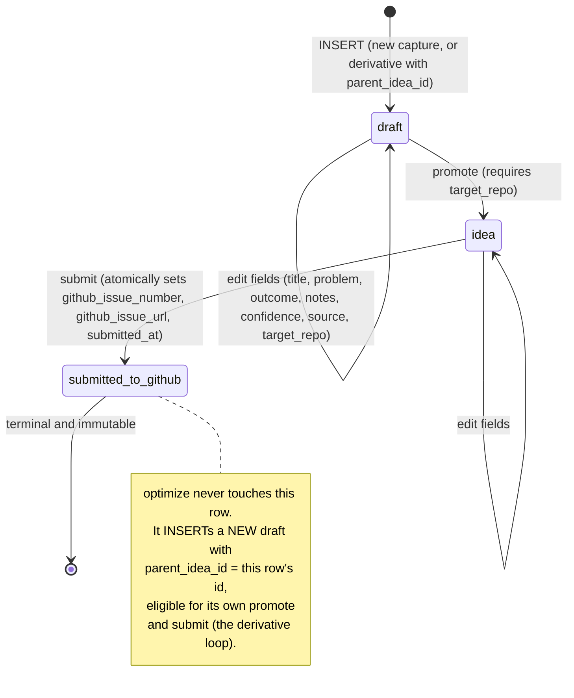

# 05-h. Idea Intake

Component plan for Idea Intake, the new Toolbelt sub-app at `apps/toolbelt/apps/idea-intake/` (ADR-01 topology) and the flagship consumer of the 05-c platform layer. Idea Intake supersedes ACC's Forgepad [VERIFIED: 00-canonical-names.md Idea Intake row]. It realizes II-1 through II-4 of `03-v1-definition.md`. Names per `00-canonical-names.md`.

Product in one sentence: capture rough ideas as drafts, optionally optimize them with LLM help, promote the good ones, and convert each promoted idea into exactly one GitHub Issue that the app can never touch again.

Feature list with value and cost:

| # | Feature | Value statement | Cost estimate |
| --- | --- | --- | --- |
| G1 | `intake` schema + structural immutability | The pipeline from thought to tracked work becomes durable and tamper-proof; the hard rule (submitted means frozen) is a database property, not app discipline | 8-12 h |
| G2 | Submit-to-GitHub with idempotency | One idea becomes exactly one Issue, surviving crashes and retries; GitHub Issues stay the single work system [VERIFIED: 04-adrs.md ADR-04 GitHub row] | 10-14 h |
| G3 | LLM optimize-as-derivative | Ideas improve without ever mutating history; every optimization is a new, separately submittable idea | 8-12 h |
| G4 | Shell UI (list + editor + submit) | Replaces two dead surfaces (Forgepad, root idea client) with one live one | 12-16 h |
| G5 | Forgepad migration + deletion | Recovers any live operator ideas and deletes 611 orphaned lines | 3-5 h |

ROI ranking (highest first): G5, G1, G2, G4, G3. G3 ranks last because it carries the 05-d and 08 dependencies; it is still V1 scope because the derivative loop is what makes the hard rule livable.

## 1. Storage: new `intake` schema (decision)

### 1.1 Reuse `idea` schema, or create `intake`?

The existing `idea.idea` table is a curated portfolio backlog: text slug PK, `category`, `one_liner`, status enum `idea|specced|building|live|parked|killed`, FK to `core.app`, 33 seeded rows, plus `idea.dependency` and append-only `idea.score` [VERIFIED: apps/toolbelt/supabase/migrations/20260806190100_idea_create_schema.sql; 20260806190300_seed_idea.sql].

| Option | Assessment |
| --- | --- |
| A. Reuse `idea` | Requires widening the status check to a second, disjoint lifecycle (`draft|idea|submitted_to_github` vs `idea|...|killed`), retrofitting immutability triggers around 33 live rows and 7 live test suites [VERIFIED: 01-inventory.md toolbelt suite list], and overloading a slug-PK curated registry with a high-churn capture funnel. Two products in one table. |
| B. New `intake` schema | One migration pair, one line of PostgREST schema exposure (the pattern Prompt Organizer already used for `prompt` [VERIFIED: toolbelt inventory, pgrst.db_schemas append]), zero risk to existing suites, and the immutability rules apply to a table born with them. |

**Decision: Option B, a new `intake` schema.** Cost stated plainly: one more schema in the platform database (~200 DDL lines, Section 12), a one-time `pgrst.db_schemas` change, and a deliberate seam between "captured idea" (`intake.idea`) and "portfolio backlog entry" (`idea.idea`). The seam is a feature: promotion from intake into the curated backlog, if ever wanted, is an explicit future tool, not an accidental status collision. No new database system; the toolbelt Supabase project stays the single platform database [VERIFIED: 04-adrs.md complexity budget, zero new database systems].

### 1.2 Full DDL

Paired down migrations are mandatory per toolbelt rules [VERIFIED: apps/toolbelt/AGENTS.md]. Trigger function bodies are specified as RAISE EXCEPTION one-liner rules per the style contract; the implementation engagement transcribes them verbatim.

```sql
-- migration: <ts>_intake_create_schema.sql
create schema if not exists intake;
grant usage on schema intake to authenticated, service_role;
-- deliberately NOT granted to anon: intake is owner-only surface (ADR-03).

create table intake.idea (
  id                  uuid primary key default gen_random_uuid(),
  parent_idea_id      uuid references intake.idea(id),
  title               text not null check (char_length(title) between 1 and 200),
  problem             text not null default '',
  outcome             text not null default '',
  notes               text not null default '',
  confidence          text not null default 'medium'
                      check (confidence in ('low','medium','high')),
  status              text not null default 'draft'
                      check (status in ('draft','idea','submitted_to_github')),
  source              text not null default '',
  target_repo         text
                      check (target_repo ~ '^[A-Za-z0-9_.-]+/[A-Za-z0-9_.-]+$'),
  idempotency_key     uuid not null unique default gen_random_uuid(),
  github_issue_number integer check (github_issue_number > 0),
  github_issue_url    text,
  submitted_at        timestamptz,
  user_id             uuid not null references auth.users(id) default auth.uid(),
  created_at          timestamptz not null default now(),
  updated_at          timestamptz not null default now(),

  -- github fields exist exactly when submitted: one CHECK binds state to payload
  constraint submitted_fields_all_or_none check (
    (status = 'submitted_to_github')
    = (github_issue_number is not null
       and github_issue_url is not null
       and submitted_at is not null)
  ),
  -- an idea cannot be promoted without a destination repo
  constraint repo_required_beyond_draft check (
    status = 'draft' or target_repo is not null
  )
);

create unique index idea_one_issue_per_repo
  on intake.idea (target_repo, github_issue_number)
  where github_issue_number is not null;
create index idea_parent   on intake.idea (parent_idea_id);
create index idea_status   on intake.idea (status, updated_at desc);

create table intake.optimization (
  id              uuid primary key default gen_random_uuid(),
  input_idea_id   uuid not null references intake.idea(id),
  output_idea_id  uuid references intake.idea(id),
  prompt_name     text not null,
  model           text not null,
  handler_run_id  uuid,
  cost_usd        numeric(12,6) not null default 0,
  created_at      timestamptz not null default now()
);

-- RLS: enable + force on both tables; owner policy pinned per ADR-03
-- (auth.uid() = user_id on intake.idea; authenticated single-principal on
-- intake.optimization), matching the platform baseline pattern
-- [VERIFIED: 20260806190200_rls_baseline.sql pattern].
alter table intake.idea enable row level security;
alter table intake.idea force row level security;
alter table intake.optimization enable row level security;
alter table intake.optimization force row level security;
```

## 2. State machine



Every allowed transition:

| From | To | Trigger | Conditions |
| --- | --- | --- | --- |
| (none) | draft | INSERT | status is forced to `draft` (insert guard); derivative INSERTs must reference a `submitted_to_github` parent |
| draft | draft | UPDATE | field edits only |
| draft | idea | UPDATE | `target_repo` non-null (CHECK `repo_required_beyond_draft`) |
| idea | idea | UPDATE | field edits only |
| idea | submitted_to_github | UPDATE | same statement sets all three github fields (CHECK `submitted_fields_all_or_none`) |

Every forbidden transition and why it is structurally impossible:

| Attempt | Blocked by |
| --- | --- |
| draft -> submitted_to_github (skip) | update guard trigger rule 2 (transition not in allowed set) |
| idea -> draft (demote) | update guard trigger rule 2 |
| submitted_to_github -> idea or draft (reopen) | update guard trigger rule 1 (submitted rows reject every UPDATE) |
| any field edit on a submitted row | update guard trigger rule 1 |
| DELETE of a submitted row | delete guard trigger |
| INSERT born as idea or submitted | insert guard trigger rule 1 |
| setting `github_issue_number` while not transitioning to submitted | CHECK `submitted_fields_all_or_none` plus update guard rule 3 |
| changing `github_issue_number` after submit | update guard rule 1 (and no second UPDATE can ever run) |
| changing `id`, `idempotency_key`, `parent_idea_id`, `user_id`, `created_at` at any time | absent from the UPDATE column grant (Section 3.2): PostgREST cannot even name them in an update |
| derivative of an unsubmitted idea | insert guard trigger rule 2 (unsubmitted ideas are edited in place, not forked) |

## 3. The hard rule: submitted rows are structurally immutable (II-1, II-3)

Three independent layers; any one alone blocks the forbidden write, and they fail closed together.

### 3.1 Triggers (DDL exact; bodies are RAISE EXCEPTION one-liner specs)

```sql
create function intake.guard_idea_update() returns trigger
  language plpgsql as $$ ... $$;
-- Body spec, evaluated in order, each a single IF ... THEN RAISE EXCEPTION:
--   rule 1: IF old.status = 'submitted_to_github' THEN
--     RAISE EXCEPTION 'II-3: submitted ideas are immutable; create a derivative (parent_idea_id) instead';
--   rule 2: IF (old.status, new.status) is not one of
--     (draft,draft),(draft,idea),(idea,idea),(idea,submitted_to_github) THEN
--     RAISE EXCEPTION 'II-1: illegal transition % -> %', old.status, new.status;
--   rule 3: IF new.status <> 'submitted_to_github' AND new.github_issue_number IS NOT NULL THEN
--     RAISE EXCEPTION 'II-1: github fields may be set only by the submit transition';
--   otherwise: NEW.updated_at := now(); RETURN NEW;

create trigger idea_guard_update
  before update on intake.idea
  for each row execute function intake.guard_idea_update();

create function intake.guard_idea_delete() returns trigger
  language plpgsql as $$ ... $$;
-- Body spec:
--   IF old.status = 'submitted_to_github' THEN
--     RAISE EXCEPTION 'II-3: submitted ideas cannot be deleted';
--   otherwise RETURN OLD;

create trigger idea_guard_delete
  before delete on intake.idea
  for each row execute function intake.guard_idea_delete();

create function intake.guard_idea_insert() returns trigger
  language plpgsql as $$ ... $$;
-- Body spec:
--   rule 1: IF new.status <> 'draft' THEN
--     RAISE EXCEPTION 'II-1: ideas are born draft';
--   rule 2: IF new.parent_idea_id IS NOT NULL AND
--     (select status from intake.idea where id = new.parent_idea_id) <> 'submitted_to_github' THEN
--     RAISE EXCEPTION 'II-3: derivatives fork submitted ideas only; edit unsubmitted ideas in place';
--   otherwise RETURN NEW;

create trigger idea_guard_insert
  before insert on intake.idea
  for each row execute function intake.guard_idea_insert();
```

### 3.2 Revoked and column-scoped grants

```sql
revoke all on intake.idea from anon, authenticated;
grant select on intake.idea to authenticated;
grant insert (parent_idea_id, title, problem, outcome, notes,
              confidence, source, target_repo)
  on intake.idea to authenticated;
grant update (title, problem, outcome, notes, confidence,
              status, target_repo,
              github_issue_number, github_issue_url, submitted_at, updated_at)
  on intake.idea to authenticated;
grant delete on intake.idea to authenticated;

revoke all on intake.optimization from anon, authenticated;
grant select, insert on intake.optimization to authenticated;   -- append-only log
```

Consequences: `status`, `idempotency_key`, and the github columns are not insertable, so every row is born `draft` with a server-generated idempotency key and empty github fields; `id`, `idempotency_key`, `parent_idea_id`, `user_id`, `created_at` are not updatable by any API caller, ever. `github_issue_number` is settable exactly once because the only grant path that can set it is an UPDATE, every UPDATE passes the guard trigger, and the only transition permitting non-null github fields is `idea -> submitted_to_github`, after which rule 1 rejects all further UPDATEs.

### 3.3 What "the app can never update that Issue" means operationally

Idea Intake's GitHub credential is used for exactly two calls: create issue and the pre-create existence check (Section 6). The client contract exposes no update, comment, close, or label-edit call, and the DB cannot store a second issue number for the same row (unique partial index + immutability). Optimizing a submitted idea is only expressible as an INSERT of a new draft carrying `parent_idea_id`; that derivative earns its own Issue through the same one-way gate.

## 4. LLM access: general-purpose handler only (II-4)

Idea Intake calls LLMs exclusively through the `packages/llm` client against the general-purpose handler (placement per ADR-01 `services/llm-handler`; build-vs-adopt decided in `08-llm-handlers.md`). Mechanism reference, ADR-05 [VERIFIED: 04-adrs.md ADR-05 Brain key isolation]: the Brain key lives at Infisical path `/brain/`, readable by exactly one machine identity, injected only into the Brain's container running as its own OS user. Idea Intake's runtime identity is scoped to `/toolbelt/` and cannot read `/brain/`; no Idea Intake code path accepts the Brain key name. Verification is the ADR-05 isolation check run against the Idea Intake process context (II-4, Section 12).

## 5. Prompt optimization via Prompt Organizer (dependency on 05-d)

Optimization prompts are owned by Prompt Organizer and fetched through its injection API (`05-d` defines the API; PO-5 guarantees name-based serving without schema knowledge [VERIFIED: 03-v1-definition.md PO-5]). Idea Intake depends on one named prompt, `idea-intake/optimize-v1`, seeded by 05-d's starter-prompt requirement (PO-4).

Request/response contract (TypeScript signatures only):

```ts
// packages/llm consumer contract, Idea Intake side
export interface OptimizeIdeaRequest {
  ideaId: string;                       // uuid of the idea being optimized
  promptName: "idea-intake/optimize-v1"; // Prompt Organizer prompt, injected per 05-d
  variables: {
    TITLE: string;
    PROBLEM: string;
    OUTCOME: string;
    NOTES: string;
    TARGET_REPO: string;
  };
}

export interface OptimizedDraft {
  title: string;
  problem: string;
  outcome: string;
  notes: string;
  confidence: "low" | "medium" | "high";
}

export interface OptimizeIdeaResponse {
  draft: OptimizedDraft;    // becomes a NEW intake.idea row; never patches the input
  handlerRunId: string;     // cost attribution key (core.run / core.cost)
  model: string;
  costUsd: number;
}

export type OptimizeIdea = (req: OptimizeIdeaRequest) => Promise<OptimizeIdeaResponse>;
```

Flow rule: when the input idea is `draft` or `idea`, the UI offers "apply in place" (ordinary field UPDATE, guard-permitted) or "save as derivative is not offered" since unsubmitted ideas fork nothing; when the input idea is `submitted_to_github`, the only path is INSERT of a derivative draft, and each call appends one `intake.optimization` row either way.

## 6. GitHub API integration contract (II-2)

### 6.1 Execution placement

The browser never holds the GitHub credential. Submit executes in the platform API surface of the Shell serving unit (the deployable unit ADR-01/ADR-04 already budget for Shell serving; it gains `/api/intake/*` routes verified against the ADR-03 session). A Supabase Edge Function was rejected: it would add a fourth runtime (Deno) against the 3-runtime ceiling [VERIFIED: 04-adrs.md complexity budget]. Gate question 1 covers the alternative placement.

### 6.2 The call

- Endpoint: `POST https://api.github.com/repos/{owner}/{repo}/issues` with `{owner}/{repo}` = `intake.idea.target_repo`.
- Headers: `Authorization: Bearer <PAT>`, `Accept: application/vnd.github+json`, `X-GitHub-Api-Version: 2022-11-28`.
- Request fields used: `title` (idea title), `body` (rendered template below), `labels` (Section 7). No assignees, no milestone.
- Body template (rendered server-side):

```
## Problem
<problem>

## Desired outcome
<outcome>

## Notes
<notes>

Confidence: <confidence>. Source: <source>.
Derived from: <parent github_issue_url, when parent_idea_id is set; line omitted otherwise>

<!-- idea-intake:v1 idea=<idea uuid> key=<idempotency_key uuid> -->
```

### 6.3 Auth

Fine-grained personal access token stored in Infisical at path `/toolbelt/` (key name `TOOLBELT_GITHUB_INTAKE_PAT`), repository access limited to the explicitly selected target repos, permission `Issues: Read and write` and nothing else. Injected into the serving unit's env at deploy time per ADR-05 mechanics; never present in the browser, a commit, or an argument [VERIFIED: 04-adrs.md ADR-05 injection pattern].

### 6.4 Error taxonomy

| Class | HTTP signal | Handling | Row state after |
| --- | --- | --- | --- |
| Auth invalid | 401 | fail, surface "rotate PAT", no retry | `idea` (unchanged) |
| Rate limited | 403/429 with `x-ratelimit-remaining: 0` or `retry-after` | wait per header, retry once, then fail | `idea` |
| Repo unreachable | 404 (missing repo or PAT lacks repo access) | fail, surface repo/PAT scope hint, no retry | `idea` |
| Issues disabled | 410 | fail, surface, no retry | `idea` |
| Validation | 422 | fail, surface field errors, no retry | `idea` |
| Server/network | 5xx, timeout, DNS | retry twice with backoff (1 s, 4 s), then fail | `idea`; next submit re-runs the existence check first |

A failed submit never partially transitions: the row moves to `submitted_to_github` only in the single write-back UPDATE after a confirmed issue number exists.

### 6.5 Idempotency strategy (exact)

1. Row key: `intake.idea.idempotency_key`, a uuid generated by column default at INSERT, unique, and absent from every grant, so it can never be changed (Section 3.2).
2. Marker: the final line of every created issue body is the HTML comment `<!-- idea-intake:v1 idea=<idea uuid> key=<idempotency_key> -->`.
3. Submit algorithm, in order:
   - If the row's `status = 'submitted_to_github'`: return the stored `github_issue_number`; no network call.
   - Existence check (crash recovery for "created but write-back lost"): `GET /repos/{owner}/{repo}/issues?state=all&labels=from-idea-intake&per_page=100` (paginate, max 3 pages), scanning bodies for the exact marker string. The list endpoint is used because it is read-your-writes consistent, unlike the search API, whose indexing lag would reopen the double-create window [INFERRED: GitHub search indexing is asynchronous; the issues list reads the primary store].
   - If a marker match is found: skip creation and proceed to write-back with the found number.
   - Otherwise: POST create (6.2), then write-back.
4. Write-back: one UPDATE setting `status='submitted_to_github'`, `github_issue_number`, `github_issue_url`, `submitted_at` (the only trigger-legal way those fields become non-null).
5. Double-submit race in one process is serialized per idea id; across crashes, step 3's existence check plus the unique index `idea_one_issue_per_repo` bound duplicates: II-2's two-submits test yields exactly one Issue.

## 7. Label and tag scheme

Applied at creation only (the app never edits labels afterward, per the hard rule):

| Label | Values | Rule |
| --- | --- | --- |
| `from-idea-intake` | fixed | always applied; the queryable provenance marker |
| type | exactly one of `FEAT`, `BUG`, `CHORE` | chosen in the editor; default `FEAT` |
| component | zero or one of `component:shell`, `component:acc`, `component:lifeos`, `component:toolbelt`, `component:brain`, `component:guards` | chosen in the editor; omitted when unclear |
| `derived` | fixed | applied only when `parent_idea_id` is set |

Missing labels in a target repo are created implicitly by the issues API when the PAT permits; when creation is refused the submit still proceeds with the labels GitHub accepted, and the discrepancy is surfaced as a non-fatal warning [INFERRED: label auto-creation depends on repo permission; the Issue itself is the durable artifact and must not be blocked by label cosmetics].

## 8. UI specification (wireframe level)

Route in the Shell: `/ideas/*` [VERIFIED: 04-adrs.md ADR-01 target tree names /ideas/* in the Shell route groups]. Declared via `entry.ui.route: "/ideas"` in `tool.json` (05-c contract). All components come from `packages/ui`; none are specified here.

| Route | Page | Contents |
| --- | --- | --- |
| `/ideas` | List | One table: title, status chip (draft/idea/submitted), confidence, target repo, updated. Filter tabs: All, Drafts, Ideas, Submitted. Primary action "New idea". Submitted rows show the issue number as an outbound GitHub link and render visually locked. Derivative rows show a "derived from #n" affordance linking the parent. |
| `/ideas/new` | Editor (create) | Fields: title (required), problem, outcome, notes, confidence (three-way selector), source, target repo (owner/repo combobox validated against the DDL pattern), type + component label pickers. Actions: Save draft, Optimize (Section 5). |
| `/ideas/:id` | Editor (existing) | Same fields. Action set varies by status: draft shows Save / Promote to idea / Delete / Optimize; idea shows Save / Submit to GitHub / Demote is absent by design / Optimize; submitted renders fully read-only with exactly one action, "Optimize as new derivative", plus the issue link. |
| `/ideas/:id` submit flow | Modal | Confirmation shows the rendered issue title, body preview (including the marker line, dimmed), and labels; Confirm triggers Section 6; success swaps the page into its locked submitted rendering; failure surfaces the Section 6.4 class with the row unchanged. |

Simplicity rule: no drag-and-drop, no kanban, no comments, no attachments, no search beyond the filter tabs plus a client-side title filter box. The list is one query; the editor is one row.

## 9. Submit workflow (sequence)

```mermaid
sequenceDiagram
    participant U as Operator (Shell UI /ideas/:id)
    participant A as Platform API (Shell serving unit, /api/intake/submit)
    participant D as Supabase (intake schema)
    participant G as GitHub REST API

    U->>A: POST /api/intake/submit { ideaId } (ADR-03 session JWT)
    A->>D: SELECT row FOR status, target_repo, idempotency_key
    alt already submitted_to_github
        A-->>U: 200 { issueNumber } (no-op)
    else status = idea
        A->>G: GET /repos/{o}/{r}/issues?labels=from-idea-intake (marker scan, <=3 pages)
        alt marker found (crash recovery)
            Note over A,G: skip creation, reuse found issue number
        else no marker
            A->>G: POST /repos/{o}/{r}/issues { title, body(+marker), labels }
            G-->>A: 201 { number, html_url }
        end
        A->>D: UPDATE intake.idea SET status='submitted_to_github', github_issue_number, github_issue_url, submitted_at
        Note over D: guard trigger validates idea -> submitted_to_github; any other row state raises
        D-->>A: 1 row updated
        A-->>U: 200 { issueNumber, issueUrl }
    else status = draft
        A-->>U: 409 II-1 (promote first)
    end
```

## 10. Forgepad supersession and migration (cross-ref 05-b)

Forgepad is ACC's complete but orphaned prior art: JSON files at `<ACC_ROOT>/forgepad/ideas/f-<hex8>.json`, states `draft|definite|research-needed|rejected`, confidence `low|medium|high`, reserved `githubIssue` field always initialized null [VERIFIED: apps/agentic-command-center/forgepad/store.mjs]. The live idea count on the operator machine is [UNKNOWN]; the migration below is count-independent.

Field mapping (forgepad -> intake):

| Forgepad field | Intake column | Mapping rule |
| --- | --- | --- |
| `id` (`f-<hex8>`) | `source` | prefixed provenance: `forgepad:f-xxxxxxxx` (original `source` value appended after `; ` when present) |
| `title` | `title` | direct (both cap at 200 [VERIFIED: store.mjs validateFields; intake CHECK]) |
| `problem` | `problem` | direct |
| `outcome` | `outcome` | direct |
| `notes` | `notes` | direct |
| `confidence` | `confidence` | direct; identical enum |
| `state = draft` | `status = 'draft'` | direct |
| `state = definite` | `status = 'idea'` | promoted; requires `target_repo`, taken from `target` when it matches `owner/repo`, else row lands as `draft` with a `[needs repo]` note prefix |
| `state = research-needed` | `status = 'draft'` | notes prefixed `[research needed] ` |
| `state = rejected` | not migrated | intake has no rejected state by design; the migration prints the skipped count and file ids for the operator's one-time review |
| `target` | `target_repo` or `notes` | `target_repo` when it matches the DDL pattern; otherwise appended to notes |
| `source` | `source` | appended per the id row above |
| `created` / `updated` | `created_at` / `updated_at` | preserved; the migration runs in a service context, bypassing the PostgREST column grants that hide these from API callers |
| `githubIssue` | ignored | reserved and never populated [VERIFIED: store.mjs initializes null; INFERRED: no code path writes it since promote-to-GitHub was never built, per the ACC inventory] |

Migration mechanics (CLI spec, one-shot): `node apps/toolbelt/apps/idea-intake/tools/migrate-forgepad.mjs --acc-root <path> [--dry-run]`; reads `f-*.json`, inserts per the mapping, prints per-state counts, exits non-zero on any unparseable file without partial silence. After the operator confirms counts, the ACC-side deletion executes per `05-b`: `forgepad/store.mjs` (137), `forgepad/store.test.mjs` (161), `gui/forgepad.html` (313), total -611 LOC [VERIFIED: wc -l], satisfying ACC-4 (`grep -rn forgepad apps/agentic-command-center --include='*.mjs' --include='*.html'` returns zero hits [VERIFIED: 03-v1-definition.md ACC-4]).

## 11. Latency budgets (new paths)

| Path | Budget | Measurement |
| --- | --- | --- |
| List page query (`/ideas`, warm session) | p95 <= 300 ms | performance test, 50 calls, PO-suite pattern |
| Editor save (field UPDATE) | p95 <= 400 ms | same harness |
| Submit end to end (existence check + create + write-back, excluding any optimize) | p95 <= 3 s | timed against a scratch repo in the e2e suite |
| Idempotent re-submit of a submitted idea | p95 <= 500 ms | no GitHub call path; timed API test |
| Optimize round trip (LLM handler) | p95 <= 10 s | handler-inclusive timing; budget owned jointly with 08 |

## 12. Acceptance criteria (EARS, realizing II-1..II-4)

| # | Criterion (EARS) | Verification |
| --- | --- | --- |
| II-1a | Ideas shall move only draft to idea to submitted_to_github; the database shall reject every other transition. | psql, each expecting an exception: `update intake.idea set status='submitted_to_github' where id='<draft-fixture>';` then `update intake.idea set status='draft' where id='<idea-fixture>';` then `update intake.idea set status='idea' where id='<submitted-fixture>';` all three raise (P0001 or check violation); the allowed pair `draft->idea` then `idea->submitted...` (with github fields) succeeds |
| II-1b | Ideas shall be born draft. | `insert into intake.idea (title, status) values ('x','idea');` fails on the column grant (status not insertable); a service-context insert with `status='idea'` raises via the insert guard |
| II-2 | When an idea is submitted, the system shall create exactly one GitHub Issue with the Section 7 labels, idempotently. | e2e: call `/api/intake/submit` twice for one idea against a scratch repo; `gh api 'repos/<o>/<r>/issues?labels=from-idea-intake&state=all' --jq '[.[] | select(.body | contains("idea=<uuid>"))] | length'` prints 1 |
| II-3a | Once submitted, no UPDATE shall succeed against that row at any layer. | psql: `update intake.idea set title='x' where id='<submitted-fixture>';` raises; API: PATCH the same row returns 409; `delete from intake.idea where id='<submitted-fixture>';` raises |
| II-3b | Optimization of a submitted idea shall create a new derivative row only. | e2e: optimize a submitted fixture; `select count(*) from intake.idea where parent_idea_id='<submitted-fixture>';` returns 1 and the parent row is byte-identical (`select xmin` unchanged is sufficient evidence of no write) |
| II-3c | Derivatives shall fork submitted parents only. | service-context `insert ... (parent_idea_id) values ('<draft-fixture>')` raises via insert guard rule 2 |
| II-4 | Idea Intake shall use the general-purpose LLM handler and shall be unable to read the Brain key. | ADR-05 isolation check run in the Idea Intake process context exits non-zero on `/brain/` access; `grep -rn "BRAIN" apps/toolbelt/apps/idea-intake packages/llm --include='*.ts' --include='*.mjs'` returns zero key-name hits |
| II-5 | When submit fails per any Section 6.4 class, the row shall remain at status idea with null github fields. | fault-injection test per class; `select status, github_issue_number from intake.idea where id='<fixture>';` returns `idea, null` |

## 13. LOC delta

| Item | Added | Deleted |
| --- | --- | --- |
| `intake` schema migration pair (tables, triggers, grants, RLS, pgrst exposure) | ~260 | |
| Platform API intake routes (submit, optimize proxy) | ~300 | |
| GitHub client (create + existence check + taxonomy) | ~200 | |
| Shell pages under `/ideas/*` (list, editor, submit modal) | ~650 | |
| `tool.json` + generated registration migration | ~50 | |
| Forgepad migration CLI (one-shot, then removable) | ~120 | |
| Tests (DB guards, idempotency e2e, UI contract) | ~500 | |
| Forgepad deletion (executed via 05-b) | | ~611 |
| Total | ~2,080 | ~611 |

Deletion list: `apps/agentic-command-center/forgepad/store.mjs`, `forgepad/store.test.mjs`, `gui/forgepad.html` (post-migration, per Section 10); the one-shot migration CLI itself is deleted in the following cleanup PR once counts are confirmed (-120 of the added lines).

## Gate questions (batched, non-blocking)

1. Section 6.1 places the submit endpoint in the Shell serving unit's platform API. The alternative is co-locating with `services/llm-handler` if 08 decides to build Handler A. Default stands unless the operator prefers the co-location; say so before Phase 11 issues are cut.
2. Rejected forgepad ideas are deliberately not migrated (Section 10). Confirm drop-with-printed-audit is acceptable, or name a preservation target (e.g. import as drafts with a `[rejected in forgepad]` note prefix).
3. The type label set is `FEAT|BUG|CHORE` (Section 7). Confirm casing and completeness against the operator's existing label conventions across target repos, which are [UNKNOWN] from this tree.
4. `intake.optimization` is append-only telemetry. If the operator wants optimize history visible in the UI in V1, it adds one read view (~80 LOC) to Section 8; default is table-only until then.

## Self-check (Section 10)

- Every factual claim labeled: PASS
- No implementation code produced: PASS (DDL, trigger one-liner specs, TS signatures, Mermaid, CLI specs only)
- Canonical names used exclusively: PASS
- Maturity/migration/lock-in/ecosystem costs: PASS (new schema on the incumbent Supabase project; GitHub REST v3 pinned via API version header; no new technology)
- Machine-verifiable acceptance criteria: PASS (Section 12, exact SQL and commands)
- LOC delta reported: PASS (Section 13)
- Deletion list present: PASS (Section 13; forgepad triple plus the one-shot CLI)
- Latency budgets stated for new paths: PASS (Section 11)
- Questions batched at the gate: PASS (4, non-blocking)
- Zero em dashes: PASS
- Complexity budget breaches: none (no new deployable unit, runtime, database system, or auth flow; intake routes ride the budgeted Shell serving unit)
