# 06. Supabase Schema Consolidation (Platform Project)

Evidence date: 2026-08-12. Names per `00-canonical-names.md`. Labels: `[VERIFIED: <path>]`, `[INFERRED]`, `[UNKNOWN]`. SQL DDL in this artifact is the planning contract; the implementation engagement transcribes it into paired migrations per the toolbelt rule that every up migration ships with a `_down.sql` [VERIFIED: apps/toolbelt/supabase/migrations directory listing, 11 up/down pairs; apps/toolbelt/apps/prompt-organizer/supabase/migrations, 7 up/down pairs].

## 1. Scope

This artifact governs exactly one database: the **platform project**, Supabase `woltgcggxaehtuypkxqk` (toolbelt), which ADR-03 promotes to platform IdP and ADR-04 designates the platform database [VERIFIED: docs/planning/04-adrs.md ADR-03 decision; ADR-04 resource table]. It fronts the `core`, `idea`, and `prompt` schemas today [VERIFIED: docs/planning/01-inventory.md section 3] and gains `intake`, `platform`, and `test` in V1.

Out of scope, stated exactly:

- **LifeOS project** (`vhbzblllaohuljtareza` prod, `yueddwuhxflzbjehqufw` test): keeps its own schema (kernel tables `entity`, `event`, `embedding`, and friends) and its own migrations, applied by its own standalone-repo pipeline [VERIFIED: apps/lifeos/backend/supabase/migrations/, 4 files; apps/lifeos/.github/workflows/ci.yml:172-174]. This artifact touches nothing there; the boundary statement lives in Section 10.
- **Network Checker mirror project**: a separate, optional Supabase project whose existence and contents are [UNKNOWN]; per the inventory's gate question 3, Phase 6 treats it as outside the shared-schema design and leaves it untouched [VERIFIED: docs/planning/01-inventory.md gate question 3].
- **The Brain's state store**: Phase 7's decision (`07-brain-architecture.md`). This artifact RESERVES the schema name `brain` in the namespacing strategy (Section 4) and shows forward compatibility for it (Section 9), but designs none of its tables.

## 2. Baseline and delta: every table in the platform project

Baseline is the 18 committed migration pairs, which are the authoritative record of the live schema (live-state parity is [UNKNOWN]: the live database was not queried [VERIFIED: scratchpad toolbelt report, UNKNOWNs]). Full DDL appears below only for NEW or CHANGED objects; unchanged baseline DDL is cited, not re-transcribed.

### 2.1 Baseline summary with V1 delta

| Table | Shape (as it exists) | Baseline citation | V1 DELTA |
| --- | --- | --- | --- |
| `core.app` | text PK `id`, `name`, `schema_name`, `status` check idea/building/live/retired, `created_at` | [VERIFIED: apps/toolbelt/supabase/migrations/20260806190000_core_create_schema.sql:12-19] | EXTENDED per 05-c section 4.1 (kind, route, version, description, manifest, manifest_hash, registered_at); RLS re-pin (Section 5) |
| `core.run` | uuid PK, `app_id` FK core.app, kind, ref, started/ended, status check, `user_id` FK auth.users default auth.uid(); index (app_id, started_at desc) | [VERIFIED: same file:21-32] | RLS re-pin: `owner_all` (auth.uid generic) becomes owner-UUID pinned |
| `core.event` | bigint identity PK, `run_id` FK cascade, self-FK `parent_id`, at, kind, name, payload jsonb; indexes (run_id, at) and gin(payload) | [VERIFIED: same file:34-44] | RLS re-pin; new index on (at) for the purge scan (Section 6) |
| `core.cost` | PK `run_id` FK cascade; token/call/wall-clock/usd counters | [VERIFIED: same file:46-56] | RLS re-pin only |
| `core.outcome` | uuid PK, `app_id` FK, kind, ref, shipped_at, value_note | [VERIFIED: same file:58-65] | RLS re-pin only |
| `core.run_outcome` | composite PK (run_id, outcome_id), both FK cascade | [VERIFIED: same file:67-71] | RLS re-pin only |
| `core.metric_def` | text PK, name, formula, unit, is_proxy, gaming_risk, self-FK supersedes; min/max bounds added later | [VERIFIED: same file:73-82; 20260807050000_score_bounds_and_effectiveness_metric.sql:10-16] | RLS re-pin only |
| `core.metric_value` | composite PK (metric_id, app_id, at), FKs to metric_def and app | [VERIFIED: 20260806190000:84-91] | RLS re-pin only |
| `core.assumption` | uuid PK, run_id FK set-null, app_id FK, statement/why/verify, blast_radius check, status check, timestamps | [VERIFIED: same file:93-105] | RLS re-pin only |
| `core.intervention` | uuid PK, run_id FK cascade, decision_type, was_halt, was_correction, note | [VERIFIED: same file:107-115] | RLS re-pin only |
| `core.event_monthly_agg` | date PK month, event_count; written by `core.purge_old_events()` | [VERIFIED: 20260808120000_core_event_retention.sql:16-19] | RLS re-pin only |
| `idea.idea` | text PK, name, category, one_liner, problem, status check (6 states), `app_id` FK core.app, project, schema_name, timestamps; 33 seeded rows | [VERIFIED: 20260806190100_idea_create_schema.sql:11-24; 20260806190300_seed_idea.sql] | RLS re-pin only |
| `idea.dependency` | composite PK (idea_id, depends_on), both FK cascade, reason | [VERIFIED: 20260806190100:26-31] | RLS re-pin only |
| `idea.score` | uuid PK, idea_id FK cascade, `metric_id` FK core.metric_def, value, scored_at/by; bounds trigger `score_bounds_check` | [VERIFIED: 20260806190100:33-40; 20260807050000:18-44] | RLS re-pin; new index (idea_id, scored_at desc) (Section 6) |
| `prompt.prompt` | uuid PK, user_id FK auth.users default auth.uid(), title check 1-200 + unique lower(title), body check 1-100000, created_at, is_active | [VERIFIED: apps/toolbelt/apps/prompt-organizer/supabase/migrations/20260807020000_prompt_create_prompt.sql:7-13; 20260807040000:17; 20260808000000:3] | RLS re-pin per 05-d section 2; new index (user_id, created_at desc) |
| `prompt.prompt_version` | composite PK (prompt_id, version_no), FK cascade, body, user_id, created_at; select+insert grants only (immutability by absent grants); `record_version` trigger | [VERIFIED: 20260807040000_prompt_versions_and_unique_title.sql:29-43,49-72] | RLS re-pin only; PK already covers the history query |
| `prompt.tag` | composite PK (prompt_id, tag), tag check 1-100, add-and-filter grants; EXISTS-based ownership policies | [VERIFIED: 20260807050000_prompt_create_tag.sql] | RLS re-pin only |
| `prompt.usage` | uuid PK, composite FK (prompt_id, version_no) to prompt_version cascade, config_name, user_id default auth.uid(), created_at; append-only grants | [VERIFIED: 20260807070000_prompt_create_usage.sql:29-50] | RLS re-pin; new index (prompt_id); new retention policy (Section 8) |
| `prompt.configuration` | composite PK (prompt_id, name), values jsonb, sections text[], EXISTS-based ownership | [VERIFIED: 20260808100000_prompt_create_configuration.sql] | RLS re-pin only |

Baseline functions and jobs, unchanged unless noted: `core.log_run` (security definer RPC, the only sanctioned cross-schema run writer) [VERIFIED: 20260807080000_core_log_run_rpc.sql]; `core.purge_old_events` plus pg_cron job `core-purge-old-events` at 03:00 UTC daily [VERIFIED: 20260808120000_core_event_retention.sql:25-60]; `prompt.render_prompt` (security invoker, PT404/PT422) [VERIFIED: 20260808120000_prompt_create_render_function.sql]; triggers `record_version` and `score_bounds_check` [VERIFIED: citations above]. V1 gates the two security definer functions to the owner (Section 5.4) and adds `prompt.get_prompt` (owned by 05-d section 1.2, cited not re-specified).

### 2.2 New objects (full DDL location)

| Object | Status | Normative DDL |
| --- | --- | --- |
| `platform.config`, `platform.owner()` | NEW | Section 5.2 (this artifact) |
| `test` schema fence (`test.scratch`) | NEW | Section 5.3 (this artifact) |
| Owner-pinned policies, all 19 baseline tables | CHANGED | Section 5.5 pattern + enumeration |
| `core.app` extension columns | CHANGED | 05-c section 4.1 DDL, adopted verbatim [VERIFIED: docs/planning/05-c-toolbelt.md] |
| `intake.idea`, `intake.optimization` + guard triggers + grants | NEW | 05-h section 1.2 and 3.1-3.2 DDL, adopted verbatim [VERIFIED: docs/planning/05-h-idea-intake.md]; RLS policies instantiated from the Section 5.5 pattern here |
| `prompt.get_prompt` RPC | NEW | 05-d sections 1.2 and 6 [VERIFIED: docs/planning/05-d-prompt-organizer.md] |
| Index additions | NEW | Section 6 (this artifact) |
| `prompt.usage_monthly_agg` + purge + cron | NEW | Section 8 (this artifact) |
| `brain` schema | RESERVED | none; Phase 7 decides (Section 9.3) |

PostgREST exposure: `pgrst.db_schemas` is `'public, core, idea, prompt'` today [VERIFIED: 20260807020000_prompt_create_prompt.sql:29]. V1 target value: `'public, core, idea, prompt, intake, test'`. The `platform` schema is deliberately NOT exposed (no API surface; only SQL policies call it), and `brain` is not exposed until Phase 7 ships something.

## 3. ERD (all platform schemas)

Cross-schema FKs shown as relationships; `AUTH_USERS` is Supabase-managed `auth.users`. `BRAIN` appears as a reserved placeholder only.

```mermaid
erDiagram
    CORE_APP ||--o{ CORE_RUN : "run.app_id"
    CORE_APP ||--o{ CORE_OUTCOME : "outcome.app_id"
    CORE_APP ||--o{ CORE_METRIC_VALUE : "metric_value.app_id"
    CORE_APP ||--o{ CORE_ASSUMPTION : "assumption.app_id"
    CORE_APP ||--o{ IDEA_IDEA : "idea.app_id (cross-schema)"
    CORE_RUN ||--o{ CORE_EVENT : "event.run_id cascade"
    CORE_RUN ||--|| CORE_COST : "cost.run_id cascade"
    CORE_RUN ||--o{ CORE_RUN_OUTCOME : "cascade"
    CORE_OUTCOME ||--o{ CORE_RUN_OUTCOME : "cascade"
    CORE_RUN ||--o{ CORE_INTERVENTION : "cascade"
    CORE_RUN o|--o{ CORE_ASSUMPTION : "set null"
    CORE_EVENT o|--o{ CORE_EVENT : "parent_id (unused)"
    CORE_METRIC_DEF ||--o{ CORE_METRIC_VALUE : "metric_id"
    CORE_METRIC_DEF o|--o{ CORE_METRIC_DEF : "supersedes"
    CORE_METRIC_DEF ||--o{ IDEA_SCORE : "score.metric_id (cross-schema)"
    IDEA_IDEA ||--o{ IDEA_DEPENDENCY : "cascade, both edges"
    IDEA_IDEA ||--o{ IDEA_SCORE : "cascade"
    PROMPT_PROMPT ||--o{ PROMPT_VERSION : "cascade"
    PROMPT_PROMPT ||--o{ PROMPT_TAG : "cascade"
    PROMPT_PROMPT ||--o{ PROMPT_CONFIGURATION : "cascade"
    PROMPT_VERSION ||--o{ PROMPT_USAGE : "composite FK cascade"
    PROMPT_PROMPT ||--o{ PROMPT_USAGE_MONTHLY_AGG : "aggregation (no FK)"
    INTAKE_IDEA o|--o{ INTAKE_IDEA : "parent_idea_id"
    INTAKE_IDEA ||--o{ INTAKE_OPTIMIZATION : "input/output idea"
    AUTH_USERS ||--o{ CORE_RUN : "user_id"
    AUTH_USERS ||--o{ PROMPT_PROMPT : "user_id"
    AUTH_USERS ||--o{ INTAKE_IDEA : "user_id"
    AUTH_USERS ||--o{ TEST_SCRATCH : "user_id"

    CORE_APP {
        text id PK
        text schema_name
        text status
        text kind "V1 ext"
        jsonb manifest "V1 ext"
    }
    CORE_RUN {
        uuid id PK
        text app_id FK
        uuid user_id FK
        text status
    }
    CORE_EVENT {
        bigint id PK
        uuid run_id FK
        jsonb payload
        timestamptz at
    }
    CORE_COST {
        uuid run_id PK
        numeric usd
    }
    CORE_OUTCOME {
        uuid id PK
        text app_id FK
    }
    CORE_RUN_OUTCOME {
        uuid run_id PK
        uuid outcome_id PK
    }
    CORE_METRIC_DEF {
        text id PK
        numeric min_value
        numeric max_value
    }
    CORE_METRIC_VALUE {
        text metric_id PK
        text app_id PK
        timestamptz at PK
    }
    CORE_ASSUMPTION {
        uuid id PK
        uuid run_id FK
        text status
    }
    CORE_INTERVENTION {
        uuid id PK
        uuid run_id FK
    }
    CORE_EVENT_MONTHLY_AGG {
        date month PK
        bigint event_count
    }
    IDEA_IDEA {
        text id PK
        text app_id FK
        text status
    }
    IDEA_DEPENDENCY {
        text idea_id PK
        text depends_on PK
    }
    IDEA_SCORE {
        uuid id PK
        text idea_id FK
        text metric_id FK
    }
    PROMPT_PROMPT {
        uuid id PK
        uuid user_id FK
        text title "unique lower"
        boolean is_active
    }
    PROMPT_VERSION {
        uuid prompt_id PK
        integer version_no PK
    }
    PROMPT_TAG {
        uuid prompt_id PK
        text tag PK
    }
    PROMPT_USAGE {
        uuid id PK
        uuid prompt_id FK
        integer version_no FK
    }
    PROMPT_CONFIGURATION {
        uuid prompt_id PK
        text name PK
    }
    PROMPT_USAGE_MONTHLY_AGG {
        uuid prompt_id PK
        date month PK
        bigint copy_count
    }
    INTAKE_IDEA {
        uuid id PK
        uuid parent_idea_id FK
        text status
        uuid idempotency_key
        integer github_issue_number
    }
    INTAKE_OPTIMIZATION {
        uuid id PK
        uuid input_idea_id FK
        uuid output_idea_id FK
    }
    PLATFORM_CONFIG {
        boolean singleton PK
        uuid owner_uuid
    }
    TEST_SCRATCH {
        uuid id PK
        uuid user_id
    }
    BRAIN {
        text reserved "Phase 7 decision"
    }
```



## 4. Naming conventions and schema namespacing

### 4.1 The namespacing rule (proposal, binding for V1)

**The shared `core` schema holds cross-tool telemetry and registry only. Each tool owns exactly one schema, named after itself. `brain` is reserved.** One writer of DDL per schema, enforced by the 05-c manifest validator's global-uniqueness check [VERIFIED: docs/planning/05-c-toolbelt.md section 3.2 `schemas` description].

| Schema | Owner (DDL writer) | Contents rule | Status |
| --- | --- | --- | --- |
| `core` | Toolbelt root spine | Registry (`app`) and cross-tool telemetry (`run`, `event`, `cost`, `outcome`, `run_outcome`, `metric_def`, `metric_value`, `assumption`, `intervention`, `event_monthly_agg`). Nothing app-specific, ever. Tools write runs through `core.log_run`, never direct inserts [VERIFIED: 20260807080000 RPC comment] | live |
| `idea` | Toolbelt root spine | The curated portfolio backlog (33-row registry, dependencies, scores). Deliberately distinct from `intake` (the capture funnel) per 05-h's decision [VERIFIED: docs/planning/05-h-idea-intake.md section 1.1] | live |
| `prompt` | Prompt Organizer | The system prompt store | live |
| `intake` | Idea Intake | Capture funnel + optimization log | NEW (05-h) |
| `platform` | Toolbelt root spine | Single-principal machinery only: `config`, `owner()`. Never PostgREST-exposed | NEW (Section 5.2) |
| `test` | Toolbelt root spine | Fixture-user fence; scratch tables holding nothing real | NEW (Section 5.3) |
| `brain` | The Brain (future) | RESERVED. No migration may `create schema brain` before `07-brain-architecture.md` decides the Brain's state store; a CI lint over migration files enforces the reservation | reserved |
| `public`, `auth`, `storage`, `extensions`, `cron` | Supabase/Postgres managed | not application surface | managed |

Note on the seed's `schema_name` column: several seeded ideas share planned schema names (`agentic`, `optimize`, `idea`, `healing`, `core`) [VERIFIED: 20260806190300_seed_idea.sql]. Those are aspirational labels predating this rule. When a seeded idea is actually built, its manifest either names a fresh schema named after the tool or declares read/write permissions on an existing schema it does not own (05-c `permissions.db`); the seed rows are not renamed retroactively.

### 4.2 Naming conventions (codifying the existing practice)

All observed in the baseline and adopted as the standard [VERIFIED: the 18 migration pairs]:

- Tables: singular nouns, snake_case (`core.run`, `prompt.prompt_version`).
- Status fields: `text` + CHECK constraint, never a Postgres enum type (cheap to extend via one CHECK swap).
- Keys: `uuid default gen_random_uuid()` for row data; natural text slugs for registry tables (`core.app.id`, `idea.idea.id`); composite natural PKs for pure association or versioned tables.
- Timestamps: `timestamptz`, `created_at not null default now()`.
- Ownership column: `user_id uuid references auth.users(id) default auth.uid()` on tables an API principal writes directly.
- Migrations: `<utc-ts>_<schema>_<verb-phrase>.sql` plus `_down.sql` pair; RLS is enabled AND forced in the same migration that creates a table [VERIFIED: 20260807020000 comment lines 1-3]; append-only tables get their immutability from absent UPDATE/DELETE grants, not from triggers [VERIFIED: 20260807040000:26-28 posture].
- Cross-schema writes: forbidden for tools; the only sanctioned path is a security definer RPC owned by the schema owner (`core.log_run` precedent).

## 5. RLS: single-principal policies (ADR-03) and the fixture-user fence (SEC-03)

### 5.1 Decision: a `platform.owner()` helper function, not a literal UUID

Options considered:

| Option | Assessment |
| --- | --- |
| A. Literal owner UUID stamped into every policy | 20+ policies across 5 schemas each embed an environment-specific value; the UUID does not exist until IdP setup, so migrations could not be authored now, and re-provisioning (fresh project, staging clone, owner re-creation) means rewriting every policy migration |
| B. `platform.owner()` reading a single-row `platform.config` table | Migrations stay environment-free and authorable today; the UUID is injected exactly once at IdP setup; fail-closed by construction (empty config means `owner()` returns null and every comparison is false, so zero access); one extra schema and one function call per statement |
| C. Postgres custom GUC (`app.owner_uuid`) set on the authenticator role | No table, but the value hides in role settings invisible to migrations and backups, and a typo fails open to null-vs-null comparisons being false anyway; harder to audit than a row |

**Decision: Option B.** Cost stated plainly: one function call per statement on every policied query (mitigated to an InitPlan, Section 5.6) and one more schema in the project. Injection answer: the owner UUID is created at IdP setup (ADR-03 owner-user creation [VERIFIED: docs/planning/04-adrs.md ADR-03]) and inserted by a documented one-time operator step (SQL editor or psql as the table owner), never by a committed migration and never through PostgREST. Migrations contain no UUID anywhere.

### 5.2 DDL: `platform` schema

```sql
-- migration: <ts>_platform_owner_bootstrap.sql
create schema platform;
grant usage on schema platform to anon, authenticated, service_role;

create table platform.config (
  singleton   boolean primary key default true check (singleton),
  owner_uuid  uuid not null,
  created_at  timestamptz not null default now()
);

-- enable WITHOUT force: the table owner (the migration/SQL-editor role)
-- performs the one-time bootstrap insert; API roles have no policy and
-- no grant, so PostgREST can neither read nor write this table.
alter table platform.config enable row level security;
revoke all on platform.config from anon, authenticated;

create function platform.owner() returns uuid
language sql
stable
security definer
set search_path = platform, pg_temp
as $$ select owner_uuid from platform.config $$;

revoke all on function platform.owner() from public;
grant execute on function platform.owner() to anon, authenticated, service_role;

-- One-time operator step at IdP setup, NOT part of any migration:
--   insert into platform.config (owner_uuid) values ('<uuid from auth.users>');
-- Until that row exists, every owner-pinned policy evaluates false: fail closed.
```

### 5.3 DDL: the `test` schema fence (SEC-03)

Fixture users (`kylegsmith19+toolbelt-test-a/b@gmail.com`, passwords committed as fixtures [VERIFIED: apps/toolbelt/tests/helpers.mjs per 01-inventory.md secrets table]) lose all write access to production schemas via the re-pin below. They keep write access ONLY here:

```sql
-- migration: <ts>_test_create_fence.sql
create schema test;
grant usage on schema test to authenticated;

create table test.scratch (
  id          uuid primary key default gen_random_uuid(),
  user_id     uuid not null references auth.users(id) default auth.uid(),
  label       text not null default '',
  payload     jsonb not null default '{}'::jsonb,
  created_at  timestamptz not null default now()
);
grant select, insert, update, delete on test.scratch to authenticated;

alter table test.scratch enable row level security;
alter table test.scratch force row level security;
-- Any authenticated principal may write here; the schema holds nothing real.
-- The fence is one-directional: fixtures write test.*, never core/idea/prompt/intake.
create policy authenticated_all on test.scratch
  for all to authenticated using (true) with check (true);

alter role authenticator set pgrst.db_schemas = 'public, core, idea, prompt, intake, test';
notify pgrst, 'reload config';
```

Purpose of `test.scratch`: (a) auth-flow tests prove a fixture token is live by writing a row here; (b) RLS denial tests then prove that the SAME token gets zero rows and 4xx on production schemas, so a denial is demonstrably policy, not an expired token. This is the fence SEC-03's remediation requires [VERIFIED: docs/planning/02-health-audit.md SEC-03; ADR-03 fixture-fence sentence].

### 5.4 The CI transition, resolved hard

The problem, stated honestly: CI's suites write to live `core`, `idea`, and `prompt` today using fixture tokens [VERIFIED: docs/planning/01-inventory.md section 6, toolbelt-ci token minting; scratchpad toolbelt report, tests all live-Supabase]. The moment policies pin to the owner UUID, every fixture-token write fails and CI breaks.

| Option | Assessment |
| --- | --- |
| 1. CI switches to owner credentials (pre-minted owner refresh token from Infisical/GitHub secret, exchanged in CI per the ADR-03 CLI pattern) | Positive-path suites keep testing the REAL production schemas, triggers, and RPCs, which is what they exist to verify. Cost: CI writes live rows as the owner (bounded by the 05-d per-run namespacing pattern plus cleanup) and CI gains a managed-secret dependency where today the fixture passwords are committed |
| 2. Tests move wholesale to the `test` schema | Requires cloning 19 tables, 5 triggers, and 3 RPCs into `test` and keeping the clones in lockstep forever; the suites would then verify the clones, not the schemas that serve production. Divergence is guaranteed and silent |
| 3. Transitional policies allowing owner + fixture subjects | Keeps SEC-03 alive for the whole transition window and creates a policy state that someone must remember to remove; the window becomes the permanent state |

**Decision: Option 1.** CI switches its positive-path suites to an owner credential injected per ADR-05 mechanics; fixture tokens are retained for exactly two jobs: negative-path assertions against production schemas (must see zero rows, PO-1b pattern [VERIFIED: docs/planning/05-d-prompt-organizer.md section 11]) and `test.scratch` liveness writes. Cost accepted and stated: owner-credential management in CI (one Infisical machine identity scoped to `/toolbelt/`, per ADR-05 [VERIFIED: docs/planning/04-adrs.md ADR-05]) and owner-namespaced test debris in live tables, cleaned per run.

Refinement this forces on 05-d: its D-12 layer-2 sentence gives e2e "a dedicated account whose data set is empty at run start". Under Option 1 the e2e account IS the owner (the Shell session the real UI uses), and the empty-dataset property comes from per-run namespacing (05-d layer 1), not from a separate account. Flagged as gate question 1.

Migration sequence that never breaks CI:

| Step | Change | CI state |
| --- | --- | --- |
| S1 | Apply `platform` bootstrap (5.2) and `test` fence (5.3) migrations. Pure additions | green (no policy changed) |
| S2 | Operator: create the owner user in platform Auth, insert `platform.config`, mint the owner refresh token into the secrets backend | green |
| S3 | CI PR: suites read an owner token env var; positive-path suites switch to it; fixture tokens re-scoped to negative tests + `test.scratch`. Merged and observed green BEFORE any re-pin | green, because the owner is also `authenticated` under today's policies: the token switch is backward-compatible |
| S4 | Apply the core/idea re-pin migration (5.5) including the RPC gates | green (owner token satisfies pinned policies; fixture negative tests now assert their true target) |
| S5 | Apply the prompt re-pin migration (5.5); owner behavior is identical per 05-d section 2 | green |
| S6 | Apply extension/intake/index/retention migrations (Sections 2.2, 6, 8) in any order after S4 | green |

### 5.5 Policy DDL pattern and enumeration

The exact pattern, in ADR-03's terms (`user_id = '<owner>' and auth.uid() = '<owner>'` [VERIFIED: docs/planning/04-adrs.md ADR-03 single-principal simplification]), with both sides wrapped in scalar subqueries for InitPlan caching (Section 5.6):

```sql
-- Pattern A: tables carrying a user_id column
--   (core.run, prompt.prompt, prompt.prompt_version, prompt.usage,
--    intake.idea, and any future table with user_id)
drop policy owner_all on core.run;
create policy owner_rw on core.run
  for all to authenticated
  using (
    user_id = (select platform.owner())
    and (select auth.uid()) = (select platform.owner())
  )
  with check (
    user_id = (select platform.owner())
    and (select auth.uid()) = (select platform.owner())
  );

-- Pattern B: tables without a user_id column
--   (single-owner reference/telemetry data)
drop policy authenticated_all on core.app;
create policy owner_rw on core.app
  for all to authenticated
  using ((select auth.uid()) = (select platform.owner()))
  with check ((select auth.uid()) = (select platform.owner()));

-- Pattern C: child tables owned via the parent (prompt.tag, prompt.configuration):
--   keep the existing EXISTS clause, add the subject pin
drop policy owner_select on prompt.tag;
drop policy owner_insert on prompt.tag;
create policy owner_select on prompt.tag
  for select to authenticated
  using (
    (select auth.uid()) = (select platform.owner())
    and exists (select 1 from prompt.prompt p
                where p.id = prompt_id
                  and p.user_id = (select platform.owner()))
  );
create policy owner_insert on prompt.tag
  for insert to authenticated
  with check (
    (select auth.uid()) = (select platform.owner())
    and exists (select 1 from prompt.prompt p
                where p.id = prompt_id
                  and p.user_id = (select platform.owner()))
  );
```

Full enumeration of replaced policies (one migration pair for core/idea, one for prompt, matching 05-d's budgeted pair [VERIFIED: docs/planning/05-d-prompt-organizer.md section 12]):

| Table | Today | V1 policy | Pattern |
| --- | --- | --- | --- |
| `core.run` | `owner_all` (generic auth.uid) [VERIFIED: 20260806190200_rls_baseline.sql:11-14] | `owner_rw` | A |
| `core.app`, `core.event`, `core.cost`, `core.outcome`, `core.run_outcome`, `core.metric_def`, `core.metric_value`, `core.assumption`, `core.intervention` | `authenticated_all` [VERIFIED: same file:16-50] | `owner_rw` | B |
| `core.event_monthly_agg` | `authenticated_all` [VERIFIED: 20260808120000_core_event_retention.sql:23] | `owner_rw` | B |
| `idea.idea`, `idea.dependency`, `idea.score` | `authenticated_all` [VERIFIED: 20260806190200:52-62] | `owner_rw` | B |
| `prompt.prompt` | `owner_all` [VERIFIED: 20260807020000:22-25] | `owner_rw` | A |
| `prompt.prompt_version` | `owner_select` + `owner_insert` [VERIFIED: 20260807040000:40-43] | pinned `owner_select` + `owner_insert` (immutability grants untouched) | A, split by verb |
| `prompt.usage` | `owner_select` + `owner_insert` [VERIFIED: 20260807070000:47-50] | pinned pair | A, split by verb |
| `prompt.tag` | EXISTS pair [VERIFIED: 20260807050000:19-26] | pinned EXISTS pair | C |
| `prompt.configuration` | EXISTS pair [VERIFIED: 20260808100000:14-19] | pinned EXISTS pair | C |
| `intake.idea`, `intake.optimization` | (new tables) | born pinned: Pattern A for `intake.idea`, Pattern B for `intake.optimization`, layered on 05-h's grants and guard triggers | A / B |
| `test.scratch` | (new) | `authenticated_all`, deliberately (Section 5.3) | fence |

**Security definer gates (required for correctness, easy to miss):** RLS does not constrain `security definer` functions. Two exist and both are EXECUTE-granted to `authenticated` [VERIFIED: 20260807080000:41; 20260808120000:52], so after the re-pin a fixture token could still write `core.run`/`core.cost` through `core.log_run`. The re-pin migration therefore also:

```sql
-- inside <ts>_core_idea_owner_pin.sql
-- 1. core.log_run: prepend an owner gate as the function's first statement:
--      if (select auth.uid()) is distinct from (select platform.owner()) then
--        raise exception 'owner only' using errcode = '42501';
--      end if;
--    (create or replace with the body otherwise unchanged)
-- 2. core.purge_old_events: callable by pg_cron only; API callers lose it:
revoke execute on function core.purge_old_events() from authenticated;
--    The cron job runs as the scheduling role, unaffected by this revoke
--    [VERIFIED: 20260808120000:56-59 schedules it server-side].
```

`prompt.render_prompt` and the new `prompt.get_prompt` are security invoker, so the pinned table policies constrain them with no further change [VERIFIED: 20260808120000_prompt_create_render_function.sql "security invoker" header; docs/planning/05-d section 1.2].

### 5.6 Latency note: RLS function-call overhead on the hot render path

The hot path is prompt injection: `rpc/get_prompt` budgeted at 60 ms p50 / 150 ms p95 [VERIFIED: docs/planning/05-d section 4]. Every policied statement now evaluates `platform.owner()`. Budget and mitigation:

- Mitigation mechanism: `platform.owner()` is declared `stable`, and every policy references it as `(select platform.owner())`. Postgres evaluates such scalar subqueries in policies as an InitPlan, once per statement, instead of once per row; the same wrapping is applied to `auth.uid()` (the documented Supabase RLS-performance pattern) [INFERRED: Postgres planner behavior for stable functions in scalar subqueries; per-row SubPlan is the failure mode when the call is written bare].
- Budget: <= 1 ms added p95 per statement (one single-row PK lookup on `platform.config` per statement, then cached). The 05-d budgets absorb this without change.
- Verification: the contract suite gains one `explain (format json)` assertion that a policied `prompt.prompt` select shows the owner lookup as an InitPlan, not a SubPlan; and a migration lint fails any policy file containing `platform.owner()` un-wrapped (bare call outside `(select ...)`).

## 6. Indexing plan (driven by observed queries)

Observed query patterns and their coverage:

| # | Query (observed) | Evidence | Covered today by | Gap action |
| --- | --- | --- | --- | --- |
| Q1 | Prompt list: `GET /rest/v1/prompt?select=...&order=created_at.desc` with embedded tag/version/configuration | [VERIFIED: apps/toolbelt/apps/prompt-organizer/web/index.html:171-173] | nothing (PK uuid, unique lower(title) only) | ADD `prompt_created_at` below |
| Q2 | Version history: `prompt_version?prompt_id=eq.X&order=version_no.desc` | [VERIFIED: web/index.html:89] | PK `(prompt_id, version_no)` backward scan | none needed |
| Q3 | Usage inserts on every copy, and the 05-d usage-count badge (count grouped by prompt) | [VERIFIED: web/panel.mjs usage POST per 05-d section 1.1 row 9; 05-d section 9 rank 1] | uuid PK only; composite FK has no child-side index | ADD `usage_prompt` below |
| Q4 | Idea backlog: four full-table selects (`idea`, `score`, `metric_def` embed, `dependency`) joined client-side | [VERIFIED: apps/toolbelt/web/index.html:50,66,74,105] | PKs; `idea.score` has no idea_id index | ADD `score_idea` below (survives the root client's deletion: Golden Goose reads scores per idea [VERIFIED: docs/planning/05-c section 8 rank 1]) |
| Q5 | Registry lookup: Shell lists `core.app` where `status in ('building','live')` | [VERIFIED: docs/planning/05-c section 4.3] | none; table is O(10) rows | none: a seq scan over the registry is optimal at this cardinality; revisit at 200+ tools |
| Q6 | Intake list by status: `(status, updated_at desc)` | [VERIFIED: docs/planning/05-h section 1.2 `idea_status` index] | shipped in the intake DDL itself | none needed |
| Q7 | `get_prompt` / `render_prompt` resolve by `lower(title)` | [VERIFIED: 20260808120000_prompt_create_render_function.sql lookup; 05-d section 1.2] | unique index `prompt_title_unique` on lower(title) [VERIFIED: 20260807040000:17] | none needed |
| Q8 | Run telemetry reads: `core.run` by `(app_id, started_at desc)`; events by `(run_id, at)`; payload probes | [VERIFIED: 20260806190000:32,43-44] | existing indexes | none needed |
| Q9 | Retention purge scan: `core.event where at < now() - interval '90 days'` daily | [VERIFIED: 20260808120000_core_event_retention.sql:36,43] | nothing on `(at)`; full scan today | ADD `event_at` below |

Index migration DDL:

```sql
-- migration: <ts>_platform_observed_query_indexes.sql
create index prompt_created_at on prompt.prompt (user_id, created_at desc); -- Q1; leads with the RLS predicate column
create index usage_prompt      on prompt.usage (prompt_id);                 -- Q3; badge counts + FK child side
create index score_idea        on idea.score (idea_id, scored_at desc);     -- Q4; per-idea score reads
create index event_at          on core.event (at);                          -- Q9; purge scan
```

Deliberately not indexed, with reasons: `core.event.parent_id` (never written; RISK-010 noted in the retention migration header [VERIFIED: 20260808120000:11-15]); `core.outcome.app_id`, `core.assumption.run_id`, `core.intervention.run_id` (tables have approximately zero writers until the Brain era; index when a reader exists); `idea.dependency` reverse edge (1 row seeded [VERIFIED: 20260807060000]); any text-search index on `prompt.body` (search stays lexical and client-side in V1, Section 10).

## 7. Migration strategy and tooling

### 7.1 Today

Migrations are applied by hand via the Supabase API [VERIFIED: apps/toolbelt/project.yaml:25 `apply_migration: "use the Supabase API for project woltgcggxaehtuypkxqk"`]. Two migration directories exist (toolbelt root: 11 pairs; Prompt Organizer: 7 pairs) [VERIFIED: directory listings]. Every up has a paired `_down.sql` [VERIFIED: 18/18 pairs present].

### 7.2 V1 target: migrations applied in CI

The pattern already exists in LifeOS's standalone pipeline, in both flavors: a psql loop over `supabase/migrations/*.sql` in the test job [VERIFIED: apps/lifeos/.github/workflows/ci.yml:52-56] and `supabase db push --db-url "$DATABASE_URL" --include-all --yes` in deploy [VERIFIED: same file:172-174].

**Directory decision: keep per-app migration directories; reject a merged root `supabase/` dir.** Reasons: (a) schema ownership follows tool ownership (Section 4.1), and the 05-c scaffold generates per-tool `supabase/migrations/` [VERIFIED: docs/planning/05-c section 5.1 layout]; (b) merging would rewrite subtree history for zero mechanical gain; (c) the merge would immediately collide anyway, see the version-collision note below.

**Mechanism decision: `supabase db push` per directory, in a fixed order, from one new root workflow.** The psql-loop flavor is rejected because it re-executes every file on every run and the toolbelt migrations are not idempotent (bare `create table`, `create policy`) [VERIFIED: 20260806190000 et al.], unlike whatever the LifeOS loop assumes about its own files. Concrete design:

- New root workflow `.github/workflows/toolbelt-db.yml` (root because nested `apps/*/.github/workflows/` are inert by design [VERIFIED: root AGENTS.md workflow safety invariant]).
- Trigger: push to `main`, paths `apps/toolbelt/**/supabase/migrations/**`; `concurrency: toolbelt-db` serializes applies. The PR Gate side runs validation only: every up has a `_down.sql`, no file creates the reserved `brain` schema, policy lint per Section 5.6.
- Auth: GitHub OIDC to an Infisical machine identity scoped to `/toolbelt/` (ADR-05 pattern [VERIFIED: docs/planning/04-adrs.md ADR-05; apps/lifeos/.github/workflows/ci.yml:162-168 precedent]), yielding `SUPABASE_DB_URL` (session-pooler connection string) and never echoing it.
- Apply loop, fixed order matching dependency order: `apps/toolbelt/supabase/migrations` (owns core/idea/platform/test), then `apps/toolbelt/apps/prompt-organizer/supabase/migrations`, then `apps/toolbelt/apps/idea-intake/supabase/migrations`, each via `supabase db push --db-url "$SUPABASE_DB_URL" --include-all --yes` with the directory as workdir. New tool directories are appended by the 05-c scaffold's registration step.
- One-time adoption: (a) baseline the ledger by marking all 18 already-applied versions as applied (`supabase migration repair`-class operation) so push never re-runs them; (b) resolve the one real version collision: `20260808120000_core_event_retention.sql` and `20260808120000_prompt_create_render_function.sql` share a version key, and the CLI's shared `schema_migrations` ledger keys by version, so the Prompt Organizer file is renamed to `20260808130000_prompt_create_render_function.sql` (file rename only, content untouched, safe because the SQL is already applied live and the ledger is being seeded fresh) [VERIFIED: both filenames in the directory listings; INFERRED: version-keyed ledger per supabase CLI migration model]. Gate question 3.
- `project.yaml` `apply_migration` line updates to point at the workflow, retiring the by-hand procedure.

**Down-migration policy:** the repo keeps pairing every up with `_down.sql` (existing rule, now CI-enforced). Downs are never applied automatically: rollback is a deliberate operator action (`psql "$SUPABASE_DB_URL" -f <file>_down.sql` plus a ledger repair), documented in the runbook. Forward-fix is the default posture; downs exist to make rollback exact, not routine.

## 8. Retention and archival policy (high-volume tables)

The pattern exists: `core.event` rows older than 90 days are aggregated into `core.event_monthly_agg` then purged, daily at 03:00 UTC via pg_cron [VERIFIED: 20260808120000_core_event_retention.sql:25-60]. V1 extends the policy as a table:

| Table | Volume class | Hot retention | Archive form | Mechanism |
| --- | --- | --- | --- | --- |
| `core.event` | highest (agent telemetry) | 90 days | `core.event_monthly_agg`, forever | existing purge + cron 03:00 [VERIFIED] |
| `prompt.usage` | grows with every copy and every injection | 365 days | `prompt.usage_monthly_agg` (per prompt per month), forever | NEW, DDL below; cron 03:10 |
| `intake.idea` | low (human-rate) | forever | n/a: submitted rows are the durable record and structurally immutable [VERIFIED: docs/planning/05-h section 3] | none |
| `intake.optimization` | low-moderate (one row per optimize call) | forever in V1; revisit at 100k rows | n/a | none in V1; the purge pattern is ready if volume appears |
| `core.run` / `core.cost` | moderate | forever | n/a: the ROI denominator; deleting cost history destroys the cost-per-outcome question [VERIFIED: docs/planning/05-c section 8 rank 2 rationale] | none |
| `test.scratch` | CI-rate | 7 days | none (nothing real) | NEW cron 03:20, plain delete |
| `brain.*` (reserved) | expected high (orchestration logs) | RESERVED: 90 days + monthly aggregate, adopting this exact pattern, is the default the Phase 7 design inherits unless it argues otherwise | aggregate table in `brain` | pg_cron, same shape |

```sql
-- migration: <ts>_prompt_usage_retention.sql
create table prompt.usage_monthly_agg (
  prompt_id   uuid not null,
  month       date not null,
  copy_count  bigint not null default 0,
  primary key (prompt_id, month)
);
-- no FK to prompt.prompt: the aggregate must survive a prompt row's deletion,
-- same reasoning as core.event_monthly_agg's standalone shape.
alter table prompt.usage_monthly_agg enable row level security;
alter table prompt.usage_monthly_agg force row level security;
create policy owner_rw on prompt.usage_monthly_agg
  for all to authenticated
  using ((select auth.uid()) = (select platform.owner()))
  with check ((select auth.uid()) = (select platform.owner()));

create function prompt.purge_old_usage() returns bigint
language plpgsql
security definer
set search_path = prompt, pg_temp
as $$
declare
  v_purged bigint;
begin
  insert into prompt.usage_monthly_agg (prompt_id, month, copy_count)
  select prompt_id, date_trunc('month', created_at)::date, count(*)
  from prompt.usage
  where created_at < now() - interval '365 days'
  group by 1, 2
  on conflict (prompt_id, month) do update
    set copy_count = prompt.usage_monthly_agg.copy_count + excluded.copy_count;

  with deleted as (
    delete from prompt.usage
    where created_at < now() - interval '365 days'
    returning 1
  )
  select count(*) into v_purged from deleted;
  return v_purged;
end;
$$;
-- cron-only, like core.purge_old_events post-re-pin: no EXECUTE grant to API roles.

select cron.schedule('prompt-purge-old-usage', '10 3 * * *',
  $$select prompt.purge_old_usage();$$);

select cron.schedule('test-purge-scratch', '20 3 * * *',
  $$delete from test.scratch where created_at < now() - interval '7 days';$$);
```

pg_cron is already installed [VERIFIED: 20260808120000_core_event_retention.sql:54], so no new extension.

## 9. Forward-compatibility analysis

Three plausible future sub-apps, taken from the real seeded backlog [VERIFIED: 20260806190300_seed_idea.sql ids `golden-goose`, `cost-per-outcome-tracker`, `assumption-ledger`], each absorbed with zero changes to existing migrations:

### 9.1 The per-app absorption checklist (uniform)

1. `tool.json` manifest, scaffolded (05-c F1/F3); declares owned schema(s) and `permissions.db` read/write.
2. New schema ONLY if the tool stores new data; name = tool name (Section 4.1 rule); created with RLS enable + force + Pattern A/B pinned policies in its first migration.
3. Generated `core.app` registration migration (05-c section 4.2); one upsert, no hand SQL.
4. Telemetry: every execution writes `core.run` via `core.log_run` (or a widened successor RPC), never direct inserts.
5. Migration directory appended to the `toolbelt-db.yml` apply loop.
6. Retention row added to the Section 8 table if any table is event-class.

### 9.2 The three worked cases

| App (seed id) | New schema? | What it touches | Why nothing breaks |
| --- | --- | --- | --- |
| Golden Goose (`golden-goose`) | none | reads `idea.idea`, writes `idea.score` (declared `permissions.db.write: ["idea"]`, owner stays the root spine); reads `core.metric_def` | the tables and the bounds trigger already exist [VERIFIED: 20260807050000]; the Q4 index (Section 6) already serves its read pattern; it is a registry row + UI |
| Cost-Per-Outcome Tracker (`cost-per-outcome-tracker`) | none | read-only over `core.cost`, `core.outcome`, `core.run_outcome` | pure reader under the owner session; zero DDL; renders fuller as more writers emit cost rows [VERIFIED: docs/planning/05-c section 8 rank 2] |
| Assumption Ledger (`assumption-ledger`) | none | read/write `core.assumption` (exists, empty, policied) | the table shipped in the first core migration [VERIFIED: 20260806190000:93-105]; the tool is a write path + review UI over an already-pinned table |

All three are additive: registry row, manifest, optional indexes. None alters an existing table, policy, or migration file, which is the definition of absorbed.

### 9.3 The `brain` reservation, concretely

If Phase 7 places the Brain's state in the platform project, the absorption is the same checklist: `create schema brain` (first migration to legally do so, lifting the CI lint), pinned policies from Section 5.5, a `core.app` row (`kind: headless`), `core.run`/`core.cost` telemetry per dispatch, and the Section 8 reserved retention row. If Phase 7 instead picks a store outside this project, the name simply stays reserved so no tool squats on it. Either way, no table designed here changes, and the complexity budget's zero-new-database ceiling constrains Phase 7's choice [VERIFIED: docs/planning/04-adrs.md complexity budget].

## 10. Boundary position: relational vs object vs vector

Where each storage class lives today:

| Class | Today | Evidence |
| --- | --- | --- |
| Relational | everything in both live projects: platform schemas here; LifeOS kernel tables in its own project | [VERIFIED: migration trees both sides] |
| Object (blobs) | LifeOS only: document blobs on the VPS at `/app/var/blobs` inside the api container, backed up nightly as an encrypted tar | [VERIFIED: apps/lifeos/.github/workflows/backup.yml:79-93] |
| Vector | LifeOS only: `public.embedding` with a pgvector `extensions.vector` column, present and deliberately unused until an embedding job exists | [VERIFIED: apps/lifeos/backend/supabase/migrations/20260724000000_kernel.sql:4,79-87] |

**V1 rule for the platform project: relational only.** No storage buckets, no pgvector, no blob tables. Vector or object needs arrive WITH the future sub-app that needs them, as part of that app's absorption checklist and its own justification, never speculatively. Prompt search stays lexical in V1: the store is O(100s) of prompts with a unique lower(title) index and client-side ranked search already shipped and tested [VERIFIED: scratchpad toolbelt report, search suite 9 tests]; embedding-based search would add an embedding job, a model dependency, and a vector column for a corpus small enough that lexical retrieval is effectively exhaustive. Revisit trigger: prompt count exceeding roughly 2,000 or a consumer that needs semantic retrieval across bodies.

LifeOS boundary statement: its project keeps its kernel schema, its blobs, and its dormant pgvector column untouched by this artifact; the only LifeOS change in the whole Phase 6 area is identity re-pointing, owned by ADR-03, which touches env vars, not schema [VERIFIED: docs/planning/04-adrs.md ADR-03 cost paragraph].

## 11. DDL/LOC delta, deletion list, and budget check

| Migration pair (new) | ~LOC |
| --- | --- |
| `platform` bootstrap (5.2) | +50 |
| `test` fence + pgrst exposure (5.3) | +40 |
| core/idea owner re-pin + RPC gates (5.5) | +130 |
| prompt owner re-pin, 5 tables (5.5; matches 05-d's +90 budget) | +90 |
| Observed-query indexes (6) | +25 |
| `prompt.usage` retention + scratch purge (8) | +75 |
| `core.app` extension (05-c, counted there: ~60) | 0 here |
| `intake` schema (05-h, counted there: ~260) | 0 here |
| `toolbelt-db.yml` workflow + validation script | +90 YAML/JS |
| Migration-pairing + brain-reservation + policy lint in PR Gate | +60 |
| Total this artifact | ~ +560 |

Deletion list (replaced or retired, with down migrations restoring each):

- 13 `authenticated_all` policies (10 core-schema tables including `event_monthly_agg`, 3 idea-schema tables) [VERIFIED: 20260806190200; 20260808120000:23]: dropped, replaced by `owner_rw`.
- `owner_all` on `core.run` and `prompt.prompt`; `owner_select`/`owner_insert` pairs on `prompt.prompt_version`, `prompt.usage`, `prompt.tag`, `prompt.configuration`: dropped, replaced pinned.
- `grant execute on core.purge_old_events to authenticated` [VERIFIED: 20260808120000:52]: revoked (cron-only).
- Fixture-user write access to `core`/`idea`/`prompt`: retired (the SEC-03 closure).
- The by-hand `apply_migration` procedure in `apps/toolbelt/project.yaml:25`: superseded by the CI workflow.
- One filename: `20260808120000_prompt_create_render_function.sql` renamed to a unique version (content unchanged).

Complexity budget: zero new database systems (all additions are schemas in the incumbent project), zero new deployable units, zero new runtimes, zero new auth flows; the owner credential in CI is the ADR-03 flow, not a new one [VERIFIED: docs/planning/04-adrs.md budget table]. Lock-in and maturity: everything here is stock Postgres (RLS, pg_cron, plpgsql) on the already-committed Supabase project; the only new tooling is the supabase CLI in CI, which LifeOS already runs in production [VERIFIED: apps/lifeos/.github/workflows/ci.yml:174].

## Gate questions (batched, non-blocking)

1. Section 5.4 refines 05-d's D-12 layer 2: the e2e suite runs as the owner with per-run namespacing, rather than as a fixture account in the test schema. Confirm, or the test fence grows prompt-shaped clone tables at the lockstep-maintenance cost Section 5.4 option 2 describes.
2. The owner refresh token for CI can live as a GitHub Actions secret immediately or wait for the ADR-05 Infisical machine-identity rollout. Default: GitHub secret first, migrated to Infisical with the rest of ADR-05; object if the interim secret is unacceptable.
3. The one-time rename of the Prompt Organizer render-function migration to a unique version key (Section 7.2) rewrites a committed filename. Confirm before the ledger baseline is cut; the alternative is separate per-directory ledgers via schema-qualified migration tables, which the supabase CLI does not support cleanly [INFERRED: single schema_migrations ledger per database in the CLI model].
4. `prompt.usage` hot retention is set at 365 days (Section 8); any value from 180 days to forever is defensible at current volume. Objection window closes at the gate.
5. Live-database parity with the committed migrations was not verified ([UNKNOWN]: no live query run [VERIFIED: scratchpad toolbelt report UNKNOWNs]). The S1 step of the migration sequence should begin with a one-time `supabase db diff` against the live project; a non-empty diff becomes its own issue before the ledger baseline.

## Self-check (Section 10)

- Every factual claim labeled: PASS
- No implementation code produced: PASS (SQL DDL is this artifact's permitted planning contract; no application code)
- Canonical names used exclusively: PASS
- Maturity/migration/lock-in/ecosystem costs: PASS (Section 11: stock Postgres on the incumbent project; supabase CLI already proven in LifeOS CI)
- Machine-verifiable acceptance criteria: PASS (Sections 5.4/5.6: CI-green sequence, EXPLAIN InitPlan assertion, policy lint; Section 7.2 PR Gate checks)
- LOC delta reported: PASS (Section 11, ~ +560 net here; 05-c/05-h DDL counted in their own artifacts)
- Deletion list present: PASS (Section 11)
- Latency budgets stated: PASS (Section 5.6: <= 1 ms RLS overhead inside the 05-d 150 ms p95 budget)
- Questions batched at the gate: PASS (5, non-blocking)
- Zero em dashes: PASS
- Complexity budget breaches: none (schemas, not systems; the zero-new-database ceiling holds)
