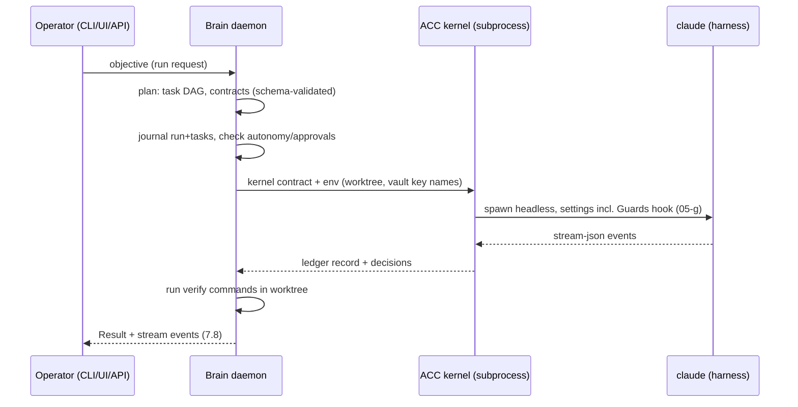

# 07. The Brain (ACC Meta-Harness)

The Brain is specified here to the standard the brief demands: two independent engineers building from this artifact produce the same system. Names per `00-canonical-names.md`. Dependencies: ADR-01 (location `services/brain/`), ADR-03 (auth), ADR-05 (key isolation), ADR-06/07 (network), `05-b` (ACC boundary), `05-d` (prompt injection API), `05-e` (LifeOS surface), `05-g` (Guards registration contract), `08-llm-handlers.md` (Handler B verdict). Evidence labels as usual.

## 7.1 Definition and boundary

The Brain is a long-lived meta-harness service that orchestrates coding harnesses. It plans work, issues task contracts, supervises execution, verifies outcomes with its own commands, accounts cost, and reports. It is not a coding harness: it never edits repositories directly, never runs repo tools itself, and holds no general shell surface. Everything that touches a repository happens inside a harness process running under a task contract.

| The Brain does | The Brain delegates |
| --- | --- |
| Decompose an objective into a task DAG | All file edits, builds, and test runs (to harnesses) |
| Select harness and model per task (routing rule, 7.4) | Repo-domain judgment during execution (harness's job within contract limits) |
| Assemble prompts (Prompt Organizer refs + context refs) | Long-form code reasoning |
| Run acceptance verify commands itself and record verdicts | Nothing: verification is never delegated to the harness that did the work |
| Enforce autonomy levels and approval gates | |
| Account tokens and dollars per invocation | |

Reuse decision (binding): the Brain's execution substrate for Claude Code tasks is ACC's existing kernel, spawned as a subprocess (`node kernel/run.mjs <contract.json>` with env-scoped `ACC_ROOT`/`ACC_POLICY`/`ACC_VAULT`), exactly the one-contract-in, one-ledger-record-out boundary the kernel already implements and tests [VERIFIED: kernel/README.md:1-8; 549-test suite]. The Brain adds what the kernel lacks: planning, the task graph, multi-harness routing, persistent run state, interfaces, and evals. The kernel stays owned by ACC; its contract becomes versioned (7.5 wraps it). This cuts several thousand LOC of re-implementation and is the single largest complexity saving in this artifact.

## 7.2 Provider decision (forced decision 4)

**Anthropic.** One dedicated key, used by nothing else (ADR-05 isolation).

| Criterion | Assessment |
| --- | --- |
| Orchestration and long-horizon agentic performance | The Claude 5 family is the strongest available for long-horizon agentic work at this date; the entire existing stack is already Claude-centric (LifeOS defaults to `claude-opus-5` [VERIFIED: chat.py:111-112]; the harness fleet is Claude Code first) |
| Tool-use reliability and structured output | Tool use with strict schemas and structured outputs are first-class; the Brain's planner output is schema-validated (7.5) |
| Context window and cache economics | Long context plus prompt caching fits the Brain's repeated-context planning loop (repo context re-sent per planning turn benefits directly from cache TTL) |
| Streaming | SSE streaming mature; the UI transport (7.8) maps 1:1 |
| Rate-limit headroom | Single operator; well within tier limits |
| SDK maturity | Official TypeScript SDK; the Python SDK is already in production in LifeOS [VERIFIED: pyproject anthropic>=0.60] |
| Cost at expected volume | Planning traffic is small next to harness traffic, which rides the operator's existing Claude Code subscription, not this key |
| Provider-conflict risk | Real and accepted: an Anthropic incident degrades both the Brain and the primary harness simultaneously. Mitigation: the routing rule (7.4) can dispatch queued tasks to Codex or Gemini CLI (their own credentials), and the Brain daemon itself degrades to queue-and-hold, never data loss |

Models: planner/synthesis `claude-opus-5`; cheap classification and routing steps `claude-sonnet-5`; set in config, never hardcoded.

**Reversal trigger:** two consecutive eval-suite regressions attributable to model quality against a quarterly OpenAI-baseline benchmark run, or deprecation of tool-use/streaming features the Brain depends on, or rate limits blocking single-operator throughput. Switching cost is contained by Handler B's provider abstraction (08): the Brain speaks the abstraction, not the SDK.

## 7.3 Runtime model

- Form: one long-lived daemon, Node 22, TypeScript, in `services/brain/`, deployed as one container on the VPS (the budgeted fourth-unit slot minus one: units become LifeOS, Shell, Brain = 3 of 4).
- Process model: single process; harness invocations are child processes (kernel subprocess per 7.1) capped at N=2 concurrent in V1.
- Supervision: container `restart: unless-stopped` plus a `/healthz` endpoint; health = event loop responsive, state store writable, provider reachable (cached probe, 60 s).
- Startup: load config, open state store, reconcile (7.6), begin serving.
- Shutdown: SIGTERM drains: running harness children get contract-completion grace up to 120 s, then are killed process-group style (killTree pattern [VERIFIED: runner/runner.mjs:119-127]) and their tasks marked `interrupted` (resumable).
- Crash recovery: state transitions are journaled before side effects; on boot, any task in `running` is probed (kernel run dir + session liveness) and either re-attached, resumed via harness session resume, or marked `interrupted`.
- Placement: VPS container, tailnet-only surfaces (ADR-06); repos live in a `/workspaces` volume owned by the `brain` user; the operator's Windows ACC installation is unaffected.

## 7.4 Harness orchestration

Adapter interface (frozen in V1, stubs allowed):

```ts
interface HarnessAdapter {
  id: "claude-code" | "codex" | "gemini";
  probe(): Promise<{ok: boolean; version: string}>;
  start(inv: Invocation): Promise<HarnessSession>;   // spawn, headless
  resume(sessionId: string, inv: Invocation): Promise<HarnessSession>;
  cancel(sessionId: string, deadlineMs: number): Promise<void>; // TERM then KILL
}
```

| Aspect | Claude Code (ships complete) | Codex CLI (stub) | Gemini CLI (stub) |
| --- | --- | --- | --- |
| Invocation | via ACC kernel subprocess; kernel runs `claude -p --output-format stream-json --verbose --settings <generated> --session-id <id>` [VERIFIED: kernel/adapters/claude-code.mjs:65] | `codex exec` non-interactive with JSON output [INFERRED from CLI docs; exact flags verified at implementation] | `gemini` headless prompt mode with JSON output [INFERRED; verified at implementation] |
| Session create/resume/terminate | kernel `--session-id` / `--resume` [VERIFIED]; terminate = killTree | exec resume equivalent [UNKNOWN until verified] | stateless per-invocation assumed [UNKNOWN] |
| Worktree isolation | one git worktree per task: `/workspaces/<repo>/wt-<task_id>`; created before dispatch, removed after result persistence; concurrent tasks never share a worktree | same | same |
| Input contract | the task contract (7.5) rendered to: kernel contract JSON + prompt over stdin | prompt + flags | prompt + flags |
| Output contract | kernel ledger record + decisions JSONL [VERIFIED: kernel/ledger.mjs] parsed into the Result (7.5) | adapter-normalized to Result | adapter-normalized to Result |
| Timeout/cancel/kill | contract `wall_clock_min`; kernel hardCap 240 min [VERIFIED: policy.json kernel block]; cancel = SIGTERM, 10 s, SIGKILL process group | same semantics via adapter | same |
| Failure classification | `transport` (ECONNRESET/429/5xx/overloaded: retry, full-jitter backoff, max 2, lane discipline [VERIFIED: lane.mjs policy]), `logic` (non-zero verdicts: never auto-retried), `timeout`, `orphaned` | same taxonomy | same |
| Cost accounting | usage fields from stream-json result + transcript audit (usage.mjs pattern [VERIFIED]) recorded per invocation | adapter-reported or [UNKNOWN: mark unaccounted] | same |
| Capability profile | default for all coding tasks; only harness allowed to push | second-opinion reviews, OpenAI-strength reasoning checks | bulk large-context sweeps and summarization |

Routing rule (deterministic): `task.harness.preferred` if set and its probe passes; otherwise `claude-code`. On two consecutive `transport` failures of the selected harness, requeue against the first fallback whose probe passes; never silently change harness mid-task.

## 7.5 Task contract (the keystone)

JSON Schema `brain.task.v1` (normative field list; full schema file lands with implementation):

```jsonc
{
  "task_id": "uuid",              // Brain-assigned
  "run_id": "uuid",               // owning run (DAG)
  "title": "string <= 120",
  "repo": { "url": "string", "ref": "string" },
  "harness": { "preferred": "claude-code|codex|gemini|null", "fallback": ["..."] },
  "autonomy": 0,                   // 0..3, see 7.7; execution requires >= 1
  "prompt": {
    "objective": "string",                 // imperative outcome
    "context_refs": ["path-or-doc refs"],  // assembled by 7.6 selector
    "prompt_org_refs": ["name@version"]    // resolved via 05-d get_prompt, pinned
  },
  "constraints": {
    "allowed_paths": ["glob"], "denied_paths": ["glob"],
    "vault_keys": ["NAME"],                // names only, kernel injects (ADR-05)
    "max_turns": 40, "wall_clock_min": 60, "token_budget": 500000,
    "network": "provider-only"             // none | provider-only | open (open requires approval)
  },
  "acceptance": [{
    "id": "AC-1",
    "statement": "EARS sentence",
    "verify": { "command": "string", "cwd": "worktree", "expect_exit": 0, "timeout_s": 300 }
  }],
  "deliverable": {
    "type": "commit|patch|report",
    "branch": "brain/<task_id>",           // never a default branch
    "push": true, "draft_pr": true         // push/PR at autonomy >= 2
  }
}
```

Completed means, exactly: (1) every `acceptance[].verify` command, executed by the Brain in the worktree after the harness exits, returns its `expect_exit`; (2) the worktree is clean or committed per `deliverable`; (3) the harness session terminated without `orphaned`. Anything else is `failed`, `timeout`, `cancelled`, or `interrupted`.

Result `brain.result.v1`: `{ task_id, status, verdicts: [{id, pass, exit, output_tail}], commits: [sha], branch, pr_url|null, cost: {input_tokens, output_tokens, cache_read_tokens, usd_estimate}, duration_s, transcript_ref, ledger_ref }`.

Dispatch sequence:



## 7.6 State and memory

- Run state store: SQLite (WAL) in the Brain container volume `/data/brain.db`. Boring, zero new services, mirrors the netcheck precedent [VERIFIED: store.py pattern]. Tables: `run`, `task`, `task_edge` (DAG), `invocation`, `approval`, `cost`, `eval_case`, `eval_result`. Telemetry mirror: run/cost summaries are also written to the platform project's `core` schema (the spine that exists for exactly this [VERIFIED: core.run/core.cost migrations]) via the existing RPC pattern; SQLite remains the source of truth.
- Task graph: `task_edge(parent_task_id, child_task_id, kind: sequence|verify|derived)`; the scheduler dispatches tasks whose parents reached a terminal success state.
- Conversation history: per-run append-only event journal (ndjson file per run under `/data/runs/<run_id>.events.ndjson`); the UI replays it; nothing is stored only in memory.
- Persists across restarts: everything above. Lost on crash: at most the current in-flight stream deltas since the last journal flush (flush per event).
- What the Brain knows about hyperbolic-core: a context index built from the repo's own guidance chain: root `AGENTS.md`, per-app `AGENTS.md`/`CLAUDE.md`, `docs/planning/*`, and `TEST_LEDGER.md` files. Assembly: on `brain refresh-context` and on daemon start; stored as an index of (path, headings, mtime); selection is lexical and path-scoped in V1 (no vector store, consistent with 06's boundary position).
- Context selection per task: the target repo's AGENTS.md chain (nearest-first), the planning artifact naming the component, plus `prompt_org_refs` pinned by version. Hard cap: context assembly never exceeds 30 percent of the model context window; overflow drops planning artifacts first, never the AGENTS.md chain.

## 7.7 Autonomy and approval

| Level | May do without confirmation | May never do at this level |
| --- | --- | --- |
| A0 plan | produce plans, contracts, dry-runs; zero harness dispatch | any execution |
| A1 read | dispatch tasks whose contracts contain no write deliverable (reports, reviews) | writes, pushes |
| A2 execute (default) | full task execution: worktree writes, branch push, draft PR | push to a default branch, remote branch deletion, `network: open`, exceeding token_budget |
| A3 chain | multi-task DAGs end-to-end incl. arming auto-merge on green | everything in the always-approve list |

Always requires an explicit approval regardless of level: default-branch pushes, remote deletions, repository settings changes, `network: open`, any task whose cumulative cost estimate exceeds the per-run budget, and any target repo not in the configured allowlist.

Approval mechanism, reconciled with the operator's standing preference against agents blocking on humans: approvals are asynchronous. A task needing approval parks in `awaiting_approval`, the run continues any independent branches of the DAG, and the request surfaces in the UI (approval card, 09), the CLI (`brain approve <task>`), and a notification. Nothing polls; nothing deadlocks; an unapproved task expires to `cancelled` after a configurable TTL (default 7 days) with its rationale journaled.

Blast-radius controls: N=2 concurrency cap; per-task token budget enforced by the kernel [VERIFIED: kernel budget dials]; per-run dollar ceiling enforced by the Brain before each dispatch; Guards registered fail-closed in every generated settings file (05-g contract); worktree isolation; branch-only deliverables.

## 7.8 Interfaces (three surfaces, one core)

All three surfaces call the same internal service layer; none has private capabilities.

### CLI (`brain`)

| Command | Args/flags | Exit codes | stdout |
| --- | --- | --- | --- |
| `brain run <objective>` | `--repo <url>` `--ref <ref>` `--autonomy 0..3` `--harness <id>` `--budget-tokens N` `--dry-run` `--json` | 0 ok, 1 error, 2 policy-refused, 4 awaiting-approval | run id + summary; `--dry-run` prints contracts and exits 0 |
| `brain status [run_id]` | `--json` `--watch` | 0/3 not-found | run/task table or JSON |
| `brain tasks <run_id>` | `--json` | 0/3 | task list with verdicts |
| `brain approve <task_id>` / `brain reject <task_id> [--reason]` | `--json` | 0/3/2 | new task state |
| `brain cancel <run_id|task_id>` | `--json` | 0/3 | terminal state |
| `brain resume <run_id>` | `--json` | 0/3/1 | reconciliation report |
| `brain logs <run_id>` | `--follow` `--task <id>` | 0/3 | ndjson events |
| `brain cost [--since <ts>] [--run <id>]` | `--json` | 0 | cost table |
| `brain refresh-context` | `--json` | 0/1 | index summary |
| `brain eval [capture <run_id> | run]` | `--json` | 0/1, eval run: 0 pass, 1 regression | corpus/result summary |
| `brain config [get|set <key> <value>]` | `--json` | 0/1/2 | effective config |

Global behavior: `--json` makes stdout a single JSON document and stderr the only human text; no interactive prompts ever when stdin is not a TTY; exit codes are the contract (4 = parked awaiting approval, never an error).

### UI (chat-style surface in the ACC area of the Shell)

- Transport: SSE per run: `GET /api/brain/runs/{id}/events` emitting typed events `run.status`, `task.status`, `harness.delta`, `verify.result`, `approval.request`, `cost.tick`; heartbeat every 15 s.
- Reconnect: `Last-Event-ID` resumes from the journal (7.6); the journal is the source, so reconnect after any gap replays losslessly.
- Visualization: run list, task DAG tree with status badges, streaming transcript with collapsible tool blocks, verdict table per task (interaction anatomy in 09 section 6).
- Approval interaction: inline card showing the exact contract diff, evidence (dry-run output), Approve/Reject with reason; keyboard-first.

### Programmatic

`POST /api/brain/runs` (body: objective, repo, autonomy, budget), `GET /api/brain/runs/{id}`, `GET /api/brain/runs/{id}/events` (SSE), `POST /api/brain/tasks/{id}/approve|reject`, `GET /api/brain/health`. Auth per ADR-03: operator session JWT, or a scoped agent token (LifeOS forwarding uses `brain:run:propose` scope which forces `autonomy<=1` and parks anything higher for approval). TypeScript client ships in `packages/platform-client`. Latency budgets: control-plane calls 200 ms p95; event delivery 500 ms p95 from journal write.

## 7.9 Observability

- Log schema (ndjson, every line): `{ts, level, run_id?, task_id?, invocation_id?, event, fields}`; secrets structurally impossible in logs because values never enter the Brain process (names-only contracts, kernel-side injection [VERIFIED: credentials.mjs]).
- Trace model: `run_id -> task_id -> invocation_id` propagate into kernel env and back through ledger refs; one id join key across Brain journal, kernel ledger, and harness transcript.
- Cost dashboard: UI panel reading the `cost` table joined to the platform `core` mirror; per run, per task, per harness, per day.
- Audit: the event journal is append-only and includes every approval, refusal, dispatch, kill, and config change with actor (operator vs policy).
- Queryable: `brain logs/cost/status --json` plus direct SQLite for ad hoc queries.

## 7.10 Security

- Key isolation: ADR-05 mechanism (own Infisical path, own OS user/container, no other identity can read `/brain/`); BR-3 acceptance verifies it.
- Filesystem scope: the container mounts only `/data` and `/workspaces`; the kernel's always-deny write roots stay active inside harness sessions [VERIFIED: kernel/policy.mjs:62].
- Egress: Brain process needs exactly the Anthropic endpoint; documented, not yet firewalled (ADR-06 deferral, risk-registered).
- Redaction: prompt assembly and log emission pass a scrubber (vault key names to placeholders, token-shaped strings masked); belt-and-suspenders on top of the names-only design.
- Prompt injection: repository content is treated as untrusted data: system/planner prompts fence repo excerpts as data blocks; harness tool allowlists come from the contract, not from model output; Guards fail-closed hook on every session; verification commands are Brain-executed, so a compromised harness cannot self-certify; anything outside contract paths dies at the kernel guardhook (deny-by-default [VERIFIED: kernel/guardhook.mjs]).
- Destructive operations: the always-approve list (7.7) plus kernel `extraDenyWriteRoots` for repo-critical paths.

## 7.11 Evaluation

- Corpus: `services/brain/evals/cases/*.case.json`: `{case_id, description, contract: brain.task.v1, fixture: {repo_tar or git ref}, expected: {status, verdicts, max_cost_usd}}`.
- Capture: `brain eval capture <run_id>` freezes a real run (contract + repo state before dispatch + expected-from-actual outcome, operator-edited) into a case; every S1/S2 Brain failure must produce a case before its fix merges (process rule for Phase 11 issues).
- Graders: primary deterministic (run the case, compare status + verdicts + cost ceiling); secondary LLM rubric grader only for `report`-type deliverables, using Handler B with a pinned prompt (`brain/eval-rubric@1`).
- CI gate: `brain-ci` runs the corpus on every PR touching `services/brain/**`; nightly full run; any regression fails the gate. Seed corpus: 5 cases minimum before V1 ships (plan-only, single-task success, verify-failure, approval-park, transport-retry).

## 7.12 LifeOS integration

The Brain consumes the `05-e` surface exactly: read lane (scoped queries: search, entity, history, types) and proposal lane (draft action-proposals only; the operator approves in LifeOS). Unlocked capability: LifeOS chat can hand an operator request that requires code or ops work to the Brain programmatically (`brain:run:propose` scope), receive the run link, and surface completion; the weekly-review feature (05-e) can include Brain cost and outcome summaries from the `core` mirror. Invariant 8 holds: the Brain gets scoped reads plus proposal-only writes, and its external comms are the provider endpoint, not LifeOS data exfiltration paths.

## 7.13 V1 cut line

| Ships in V1 | Stubbed behind a stable interface | Deliberately absent |
| --- | --- | --- |
| Daemon, SQLite state, journal, reconcile | Codex adapter (`HarnessAdapter`, probe returns not-available) | A3 autonomy |
| Claude Code execution via ACC kernel | Gemini adapter (same interface) | Fleets / N>2 concurrency |
| Task contract v1 + Brain-side verification | Context indexer beyond lexical (interface: `select(taskRef): ContextSet`) | Vector memory |
| CLI core verbs (run/status/tasks/approve/reject/cancel/resume/logs/cost) | LifeOS forwarding client (API live, LifeOS-side wiring minimal) | Egress firewalling (risk-registered) |
| SSE stream + ACC chat surface (09 anatomy) | Rubric grader (deterministic grader ships) | UI polish beyond the chat/run surface |
| Approvals, cost accounting, Guards registration | | Cross-provider planner fallback |
| Eval harness + 5 seed cases | | |

Each stub names its interface above; none requires rework to fill, only implementation behind the frozen signature.

## 7.14 Complexity check

| Measure | Estimate | Budget check |
| --- | --- | --- |
| New LOC | ~6,300 (daemon core 2,200; adapters 700; CLI 900; API/SSE 700; Shell chat surface 1,200 in `apps/shell`+`packages/ui`; evals 600) versus ~4,000 avoided by kernel reuse | acceptable; largest single addition in V1 |
| New deployable units | 1 (Brain container) | total 3 of 4: PASS |
| New runtimes | 0 (Node 22 exists) | PASS |
| New databases | 0 systems (SQLite already precedented; platform mirror uses existing schema) | PASS |
| New dependencies | 4: `@anthropic-ai/sdk`, `better-sqlite3`, a JSON-schema validator, an SSE helper (or hand-rolled, decided at implementation) | small; ACC itself stays zero-dep |
| New auth flows | 0 (ADR-03 session + agent tokens) | PASS |

No Section 4 breach. If the Shell chat surface pushes past budget in implementation, the cut order is: rubric grader, then chat-surface polish, never the contract/verification core.

## Gate questions (batched, non-blocking)

1. The Brain runs harnesses on the VPS against clones in `/workspaces`. Claude Code there consumes API-key auth (the Brain key) rather than the operator's subscription session, which moves harness token spend onto the metered key. Confirm this economic tradeoff, or V1 constrains harness dispatch to the operator machine via a remote-worker follow-up (risk-registered as the alternative).
2. Codex and Gemini exact headless flags are [INFERRED/UNKNOWN]; adapters are stubs in V1, so verification lands with their implementation issues. Flagging so the roadmap orders them honestly.
3. The kernel-reuse decision couples Brain releases to ACC kernel contract stability; acceptable while both are operator-owned. Confirm no objection to versioning the kernel contract (`kernel.contract.v1`) as part of the first Brain issue set.

## Self-check (Section 10)

- Every factual claim labeled: PASS
- No implementation code produced: PASS (schemas, interfaces, tables, sequence diagram only)
- Canonical names used exclusively: PASS
- Recommendation costs named (provider: maturity/migration/lock-in/ecosystem via 7.2 + Handler B abstraction; SQLite/deps in 7.14): PASS
- Acceptance criteria machine-verifiable: PASS (7.5 completion definition; BR-1..BR-6 realized across 7.3-7.11)
- LOC delta reported: PASS (7.14, additions and avoided)
- Deletion list: none in this artifact (Forgepad deletion owned by 05-b; kernel unchanged)
- Latency budgets stated: PASS (7.8 control plane and event delivery)
- Questions batched at the gate: PASS (3)
- Zero em dashes: PASS
- Complexity budget breaches flagged: none (7.14)
