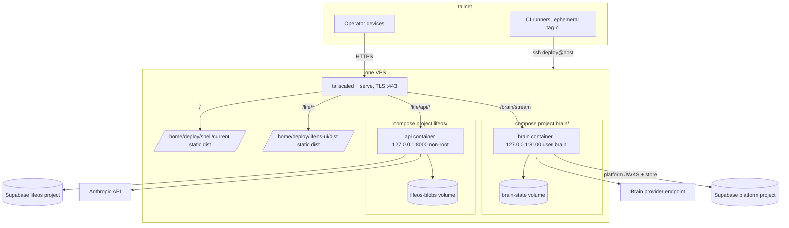

# 10. CI/CD and Deployment

Planning artifact, Phase 10. No runnable workflow YAML appears here: workflows are expressed as structured specs (name, trigger, jobs, step descriptions) and config skeletons carry keys only. Names per `00-canonical-names.md`. Evidence labels: `[VERIFIED: <path or command>]`, `[INFERRED: <reasoning>]`, `[UNKNOWN]`. The lifeos standalone-repo deploy pattern is the template for every new deploy job [VERIFIED: 04-adrs.md ADR-04 shared-resources table, "Deployment pipeline pattern" row]. `06-supabase-schema.md` is not on disk at drafting time [VERIFIED: docs/planning directory listing 2026-08-12], so section 5 specifies the migrations interface this artifact expects Phase 6 to satisfy.

## 1. Target CI workflow set

All workflows below live in the repo root `.github/workflows/` of hyperbolic-core, except where marked out of scope. The root AGENTS.md workflow safety invariant stands: nothing is ever copied from `apps/*/.github/workflows/` to the root [VERIFIED: root AGENTS.md, "Workflow safety invariant"].

| Workflow file | Name | Status | Trigger | Path filters | Jobs | Required check | Est. runtime |
| --- | --- | --- | --- | --- | --- | --- | --- |
| `toolbelt-ci.yml` | Toolbelt PR Gate | modify | PR + merge_group (as today [VERIFIED: toolbelt-ci.yml:3-8]) | `apps/toolbelt/**` (unchanged) | one `pr-gate` job; gains three steps, see 1.1 | `Toolbelt PR Gate` | 6m14s today [VERIFIED: 01-inventory.md section 6]; budget <= 10 min after additions |
| `acc-ci.yml` | ACC PR Gate | modify | PR + merge_group (as today [VERIFIED: acc-ci.yml:3-9]) | `apps/agentic-command-center/**`, `apps/toolbelt/guards/**` (unchanged) | `portable`, `windows-integration`, `ui`, terminal `pr-gate` (all unchanged [VERIFIED: acc-ci.yml jobs]); `portable` gains the secret-scan step only | `ACC PR Gate` | [INFERRED: bounded by the Windows runner; no verified wall-clock in inventory] budget <= 15 min |
| `shell-ci.yml` | Shell PR Gate | NEW | PR + merge_group | `apps/shell/**`, `packages/**` | see 1.2 | `Shell PR Gate` | budget <= 8 min |
| `brain-ci.yml` | Brain PR Gate | NEW | PR + merge_group | `services/brain/**` | see 1.3 | `Brain PR Gate` | budget <= 6 min |
| `platform-migrations.yml` | Platform Migrations | NEW | `workflow_call` + `workflow_dispatch` | n/a (invoked, not path-triggered) | one `migrate` job, see section 5 | not a PR check; deploy dependency | budget <= 3 min |
| `deploy.yml` | Platform Deploy | NEW | push to `main` + `workflow_dispatch` | `apps/shell/**`, `packages/**`, `services/brain/**`, `apps/toolbelt/supabase/migrations/**` | `changes`, `migrate-platform`, `build-shell`, `deploy-shell`, `build-brain`, `deploy-brain`, see section 2 | n/a (post-merge) | budget <= 10 min per unit |
| `toolbelt-network-checker-release.yml` | Toolbelt Network Checker Release | keep unchanged | manual dispatch [VERIFIED: workflow file] | n/a | test, build-and-verify-image, publish-draft (unchanged) | n/a | as today |
| `apps/lifeos/.github/workflows/{ci,ops,backup,release-smoke}.yml` | (inert copies) | keep untouched | n/a here | n/a | inert by design; live only in standalone `kgsmith19/lifeos` [VERIFIED: apps/lifeos/AGENTS.md location note] | n/a | n/a |
| standalone `kgsmith19/lifeos` pipelines | PR Gate, ops, backup, Release Smoke | out of scope | (in that repo) | n/a | untouched by this plan except the release-smoke recommendation in section 9.1, which is an Out-of-Brief Register item | `PR Gate` (there) | n/a |

Branch protection: the four PR Gate checks are the required checks on `main`. Live branch-protection settings are [UNKNOWN: scratchpad inventory, "Live GitHub repo settings"]; gate question 1. Path-filtered required checks mean a PR touching only docs reports no check; this is today's accepted behavior for the two existing gates [INFERRED: both existing workflows are path-filtered and merges have proceeded].

### 1.1 toolbelt-ci gains (three steps, same single job)

| New step | Description | Source of requirement |
| --- | --- | --- |
| Idea Intake tests | `node --test` over the new `apps/toolbelt/apps/idea-intake/tests/` suites (DB guard suites, idempotency e2e per II-1..II-5) | [VERIFIED: 05-h-idea-intake.md section 12 verification column] |
| Secret scan | gitleaks-style content scan of the PR diff, roughly 12 workflow lines; covers the Guards blind spot where a Bash-written secret lands in a commit unseen by the tool-call hook | [VERIFIED: 05-g-guards.md section 2c DECIDE] |
| Network Checker dashboard smoke | hermetic Playwright smoke serving the fixture DB on 127.0.0.1:8787 | [VERIFIED: 05-f-network-checker.md D-04, "per the CI step added to toolbelt-ci.yml"] |

The same gitleaks-style step is added to `acc-ci.yml` (in `portable`), for the 05-g total of roughly 24 lines across both gates [VERIFIED: 05-g-guards.md LOC table]. Tool pick for the step: gitleaks via its maintained GitHub Action, pinned by SHA like every other action in these workflows [VERIFIED: all current workflows pin actions by SHA]. Maturity: widely used standard scanner. Migration cost: none, additive step. Lock-in: none, replaceable with any content scanner. Ecosystem gap: baseline false positives on the two deliberately committed public anon keys [VERIFIED: 01-inventory.md section 4]; handled with a committed allowlist config file, not by weakening the step.

Deferred move, not a V1 change: when the Shell absorbs the Prompt Organizer UI (ADR-02 convergence), the Prompt Organizer Playwright journey and its server/wait/evidence steps (roughly 45 lines [VERIFIED: toolbelt-ci.yml:41-75]) move from `toolbelt-ci.yml` into `shell-ci.yml`. Listed in section 10 as a deferred deletion.

### 1.2 shell-ci.yml (NEW) job spec

One `pr-gate` job, ubuntu-latest, Node 22:

- checkout, setup-node with npm cache keyed on `apps/shell/package-lock.json`
- `npm ci` at the workspace root (ADR-01 introduces npm workspaces [VERIFIED: 04-adrs.md ADR-01 cost statement])
- lint (`apps/shell` + `packages/*`)
- `tsc -b` type-check
- unit tests (vitest) for `apps/shell` and `packages/platform-client`, `packages/ui`, `packages/llm`
- Playwright e2e: the 05-a suites `e2e/chrome.spec.ts`, `e2e/auth-gate.spec.ts`, `e2e/single-session.spec.ts`, `e2e/idp-down.spec.ts` [VERIFIED: 05-a-hyperbolic-core.md acceptance table verification commands], with Chromium cached by lockfile hash (same pattern as acc-ci [VERIFIED: acc-ci.yml:87-91])
- production build; upload Playwright evidence on failure (existing artifact pattern)

`packages/**` is in the path filter because a shared-package change must re-verify the Shell that consumes it. The LifeOS zone consumes `packages/ui` too, but LifeOS CI lives in the standalone repo; drift there is caught by the weekly smoke, accepted for V1 [INFERRED: ADR-02 accepts zone drift risk explicitly].

### 1.3 brain-ci.yml (NEW) job spec

One `pr-gate` job, ubuntu-latest, Node 22 (runtime per the complexity budget's three-runtime ceiling [VERIFIED: 04-adrs.md budget table]; if `07-brain-architecture.md` picks otherwise, the toolchain steps swap with no pipeline-shape change, gate question 3):

- checkout, setup-node, `npm ci`
- lint, type-check
- unit + integration tests (`node --test` or vitest per 07), covering the BR-1/BR-2 contract behaviors testable without a live harness [VERIFIED: 03-v1-definition.md BR table]
- Docker build of the section 3 image and a `--version`/`brain status --offline` smoke run inside it (the netcheck release workflow's build-and-smoke pattern [VERIFIED: toolbelt-network-checker-release.yml:31-38]); image is built for verification only, never pushed from CI

### 1.4 EARS verification coverage map

Every 05-artifact verification command must be runnable by exactly one gate:

| 05 artifact commands | Gate |
| --- | --- |
| Toolbelt root, Guards, Prompt Organizer, Network Checker, Idea Intake suites (05-c, 05-d, 05-f, 05-g, 05-h) | Toolbelt PR Gate |
| ACC suites, covgate, contract e2e (05-b, 05-g GU-2.x ACC-side) | ACC PR Gate |
| Shell Playwright suites, packages tests (05-a, 05-d PO-5b cache test in `packages/llm`) | Shell PR Gate |
| Brain suites (07, 03 BR criteria) | Brain PR Gate |
| LifeOS pytest/vitest/Playwright (05-e) | standalone repo `PR Gate`, out of scope here |
| Deployed-system criteria (SH-4 latency, BR-4 reconnect against prod) | smoke suite, section 7, never a merge gate |

## 2. Deployable units and per-unit pipelines (forced decision 9)

**Decision: exactly 4 deployable units in V1.**

1. LifeOS stack (exists; VPS `api` container + static frontend dist)
2. Shell static bundle (new; static files, no server process)
3. The Brain daemon container (new)
4. Handler A container (`services/llm-handler`, new; per `08-llm-handlers.md` forced decision 7)

Defense against the complexity budget: the ADR ceiling is 5 units [VERIFIED: 04-adrs.md budget table]. The five deployable units are: (1) LifeOS stack, (2) Shell static, (3) Brain daemon, (4) Handler A service, (5) hyperbolic-core platform container for shared services, migrations, and platform-layer updates. Handler A takes slot 4, displacing the ADR-07 Caddy reserve; that displacement is decided and recorded in `08-llm-handlers.md` section 3 (the owning artifact for handler decisions), whose gate question 1 offers the operator the reversal (defer Handler A to an Edge Function, breaching the runtime ceiling instead). hyperbolic-core as the platform container provides structural value by decoupling infrastructure updates from individual application deployments. A sixth deployable unit must displace one of the five per the budget rule. Not units, and why:

- The two Supabase projects are managed services; nothing is built, shipped, or restarted by this repo's pipelines except their migrations (section 5). A managed database is an external dependency, not a deployable.
- `tailscale serve` is configuration on an existing daemon, zero units by ADR-07's explicit accounting [VERIFIED: 04-adrs.md ADR-07 option A "zero new units"].
- The Network Checker image is a draft-release artifact only, never pushed to a registry or deployed [VERIFIED: 01-inventory.md section 5].
- ACC remains operator-machine software with no deployment [VERIFIED: 01-inventory.md section 5].

Alternative considered and rejected: counting the Shell inside the LifeOS stack (2 units) because both are static dists on the same VPS. Rejected because the Shell has its own build, its own rollback history (section 8), and its own owning workflow; collapsing them would couple Shell deploys to the standalone lifeos repo's pipeline, which ADR-02 chose Option B specifically to avoid [VERIFIED: 04-adrs.md ADR-02 tiebreaker].

### 2.1 Unit 1: LifeOS stack

Unchanged in V1. Owner workflow: standalone `kgsmith19/lifeos` `ci.yml` deploy jobs.

| Stage | Mechanism (all [VERIFIED: apps/lifeos/.github/workflows/ci.yml]) |
| --- | --- |
| Build | backend: docker buildx push to `ghcr.io/kgsmith19/lifeos` with `:main` and `:sha-<sha>` tags (lines 134-142); frontend: `npm run build` with public `vars.VITE_*` (lines 220-231) |
| Artifact | sha-tagged backend image; frontend `dist/` |
| Transport | backend: `docker pull` on runner, `docker save \| gzip \| ssh ... docker load` (line 190); frontend: `scp -r dist` then atomic `mv` swap (lines 242-244) |
| Config | `.env` rendered on the runner from Infisical values, `scp`, `chmod 600` (lines 187-194) |
| Health | `docker compose up -d --wait` then `curl -fsS http://127.0.0.1:8000/healthz` over ssh (line 194) |
| Gate | `vars.DEPLOY_ENABLED == 'true'` (lines 145, 197) |

The only V1-adjacent change to this unit is the env re-point for platform auth (ADR-03), which is a secrets-value change in Infisical plus a redeploy, not a pipeline change [VERIFIED: 05-e-lifeos.md section 4 "env re-point rather than a code change"].

### 2.2 Unit 2: Shell static bundle

Owner workflow: `deploy.yml` jobs `build-shell` + `deploy-shell`. Pattern copied from the lifeos `deploy-frontend` job [VERIFIED: apps/lifeos/.github/workflows/ci.yml:196-244], with one improvement (versioned dirs for rollback, section 8).

| Stage | Spec |
| --- | --- |
| Build | `npm ci` + `npm run build` in `apps/shell` with public `VITE_` values from repo vars, each asserted non-empty before build (the lifeos guard pattern [VERIFIED: ci.yml:227-229]) |
| Artifact | `apps/shell/dist/` |
| Transport | Infisical OIDC (platform identity), tailnet join (`tag:ci`), `scp -r dist deploy@host:shell-incoming` |
| Activation | ssh: `mv shell-incoming shell/dist-<sha>` then `ln -sfn dist-<sha> shell/current`; prune to the newest 3 `dist-*` dirs |
| Health | `curl -fsS` the origin root over the tailnet from the joined runner, assert 200 and the built asset hash present in `index.html` |
| Gate | `vars.DEPLOY_ENABLED == 'true'`; `needs: migrate-platform` with result success-or-skipped |

### 2.3 Unit 3: The Brain daemon

Owner workflow: `deploy.yml` jobs `build-brain` + `deploy-brain`. Pattern copied from the lifeos `build-backend` + `deploy-backend` jobs [VERIFIED: apps/lifeos/.github/workflows/ci.yml:119-194].

| Stage | Spec |
| --- | --- |
| Build | docker buildx of `services/brain/Dockerfile`, push `ghcr.io/kgsmith19/hyperbolic-core/brain:sha-<sha>` (and `:main`). This is the one deliberate, gated activation of image publishing from the monorepo root; it is a new image name, not the accidental `ghcr.io/kgsmith19/hyperbolic-core` hazard the root AGENTS.md warns about, and it runs only inside `deploy.yml`, never from an app-copied workflow |
| Artifact | sha-tagged Brain image |
| Transport | Infisical OIDC (brain identity, path `/brain/` per ADR-05), tailnet join, `docker save \| gzip \| ssh ... docker load` |
| Config | `.env` rendered on the runner (keys: section 6), `scp` to `deploy@host:brain/.env`, `chmod 600`; `scp` the brain `compose.yaml` skeleton (section 3) to `deploy@host:brain/compose.yaml`; separate compose project directory from `lifeos/` so neither unit's deploy touches the other |
| Health | `docker compose up -d --wait` then `curl -fsS http://127.0.0.1:8100/healthz` over ssh, satisfying BR-6 [VERIFIED: 03-v1-definition.md BR-6] |
| Gate | `vars.DEPLOY_ENABLED == 'true'`; `needs: migrate-platform` success-or-skipped |

### 2.4 Unit 4: Handler A container

Owner workflow: `deploy.yml` jobs `build-llm-handler` + `deploy-llm-handler`. Identical pattern to the Brain unit (2.3) with these substitutions: image `ghcr.io/kgsmith19/hyperbolic-core/llm-handler:sha-<sha>`; Infisical identity and path `/platform/llm/` (never `/brain/`, ADR-05); compose project directory `llm-handler/`; health `curl -fsS http://127.0.0.1:8200/healthz`. CI for the service itself rides shell-ci's workspace job matrix (it is a small Node service in `services/llm-handler` sharing `packages/llm` tests) rather than a fifth workflow; if its suite outgrows that, it earns its own `llm-handler-ci.yml` then, not now.

`deploy.yml` orchestration: a first `changes` job computes per-unit booleans from the pushed paths (paths-filter action, SHA-pinned; maturity: standard, cost: one small third-party action, replaceable by a `git diff --name-only` script step at zero lock-in). `migrate-platform` runs when migration paths changed (section 5). Unit jobs run only for their changed paths, each under its own `concurrency` group (`deploy-shell-production`, `deploy-brain-production`, `deploy-llm-handler-production`, cancel-in-progress false, mirroring lifeos [VERIFIED: ci.yml:152-154, 203-205]).

### 2.5 Unit 5: hyperbolic-core platform container

hyperbolic-core is the platform container for shared services, migrations, and platform-layer updates. Unlike the individual application units (LifeOS, Shell, Brain, Handler A), hyperbolic-core has no dedicated deploy job; its deployment is implicit when:

- Supabase migrations in `apps/toolbelt/supabase/migrations/**` change (handled by `migrate-platform` job in section 5)
- Shared packages in `packages/**` are updated (re-verification happens in shell-ci and brain-ci; no separate build needed)
- Shared infrastructure or configuration in `services/` or the repo root is updated

hyperbolic-core's primary deployable artifact is the schema state reflected in the Supabase project after migrations run. This separation provides structural value: the platform migrations and shared contracts can be versioned and tracked independently from individual application releases, enabling schema updates without necessarily redeploying applications, and allowing applications to coordinate through a known platform contract.

Versioning: commit SHAs and GitHub tags on main track the full platform state; release tags of the form `v1.x.y` tag the combined state of all five units plus their migration baseline. Rollback strategy: per unit (section 8); platform rollback re-applies the previous migration baseline.

## 3. Docker strategy

### 3.1 Image layout

| Image | Base | Built where | Pushed where | Runs where | Notes |
| --- | --- | --- | --- | --- | --- |
| LifeOS `api` | `python:3.14-slim` [VERIFIED: scratchpad report, backend Dockerfile summary] | standalone lifeos repo | `ghcr.io/kgsmith19/lifeos` | VPS, compose project `lifeos/` | unchanged; non-root, loopback-only port [VERIFIED: compose.yaml:14-15; scratchpad "uvicorn, non-root"] |
| Brain | `node:22-slim`, multi-stage | `deploy.yml` (verification build also in `brain-ci.yml`) | `ghcr.io/kgsmith19/hyperbolic-core/brain` | VPS, compose project `brain/` | NEW; spec in 3.2 |
| netcheck | `python:3.12-slim` [INFERRED: stdlib-only app, 3.12 floor per its AGENTS.md] | release workflow only | never pushed; draft-release tar.gz artifact [VERIFIED: toolbelt-network-checker-release.yml:39-50] | operator machines, optionally | unchanged, release artifact only |
| Shell | none | n/a | n/a | n/a | static files; a container would add a unit for zero gain |

No other component is containerized. ACC and Guards are operator-machine Node processes; Toolbelt clients are static pages reached through the Shell.

### 3.2 Brain multi-stage build spec (contract, not code)

- Stage `build`: `node:22-slim`; `npm ci` including dev deps; compile/type-check; prune to production deps.
- Stage `runtime`: `node:22-slim`; create system user `brain` (uid fixed); copy app + production `node_modules` from `build`; `USER brain`; `EXPOSE 8100`; `HEALTHCHECK` hitting `127.0.0.1:8100/healthz` (the lifeos in-container healthcheck pattern [VERIFIED: apps/lifeos/backend/compose.yaml:20-29]); entrypoint runs the daemon, no shell wrapper.
- Non-root `brain` user is part of the ADR-05 key-isolation mechanism (dedicated OS user + container boundary) [VERIFIED: 04-adrs.md ADR-05 isolation point 2].
- No secrets in any layer; config is runtime env only (section 6).

### 3.3 VPS compose skeleton (keys only)

Two independent compose projects on the one VPS. `lifeos/compose.yaml` exists and is unchanged [VERIFIED: apps/lifeos/backend/compose.yaml]. New `brain/compose.yaml` mirrors its key set:

```
# /home/deploy/brain/compose.yaml (skeleton, keys only)
services:
  brain:
    image:          # ${BRAIN_IMAGE:?} sha tag recorded in ./.env by every deploy
    restart:
    env_file:       # ./.env rendered at deploy time
    user:
    ports:          # 127.0.0.1:8100:8100, loopback only
    volumes:        # brain-state:/app/var/state
    healthcheck:    # test, interval, timeout, retries, start_period
    logging:        # json-file, max-size, max-file
volumes:
  brain-state:
```

The `image: ${...:?}` fail-loud interpolation copies the lifeos convention exactly (sha tag recorded in the project `.env` by each deploy, so redeploys, crons, and manual runs resolve the same image) [VERIFIED: apps/lifeos/backend/compose.yaml:4-11].

Local dev parity: `infisical run -- docker compose up` against the same skeletons with dev-path secrets (section 6); the Shell in dev is `vite dev`, no serve layer, with the zone routes proxied by Vite dev-server config (keys only: `server.proxy` entries for `/life/api` and `/brain/stream`).

### 3.4 VPS topology



## 4. Tailscale integration

- CI runners join the tailnet per deploy/ops/backup run via the OAuth client + `tag:ci` pattern, unchanged [VERIFIED: apps/lifeos/.github/workflows/ci.yml:175-180; ops.yml:93-99; backup.yml:48-53]. The new `deploy-shell` and `deploy-brain` jobs reuse the identical action, SHA-pinned, with `TS_OAUTH_CLIENT_ID`/`TS_OAUTH_SECRET` sourced from Infisical exactly as lifeos does.
- One origin (ADR-07): `tailscale serve` on the VPS terminates TLS and path-routes:

| Route | Upstream | Notes |
| --- | --- | --- |
| `/` | Shell dist at `/home/deploy/shell/current` | static file serving |
| `/life/*` | LifeOS frontend dist | static; zone base path via Vite `base` [VERIFIED: 04-adrs.md ADR-07 base-path note] |
| `/life/api/*` | `http://127.0.0.1:8000` | LifeOS API; FastAPI `root_path` handles the prefix |
| `/brain/stream` | `http://127.0.0.1:8100` | the Brain's UI stream endpoint [VERIFIED: 04-adrs.md ADR-07 route list] |

- Serve config is applied by an idempotent operator step (the ops-workflow pattern, one dispatchable task), not hand-typed on the box; the config is documented in the runbook as the list above, keys only.
- Device approval: the VPS and operator devices are approved tailnet members; CI nodes are ephemeral and enter via the OAuth client's pre-approved `tag:ci`, so device approval never blocks a deploy; the ACL edge `tag:ci -> tag:prod` already exists [VERIFIED: ops.yml comment "the ACL already allows tag:ci -> tag:prod"].
- Serve enforces network-level access only; app auth stays server-side per ADR-03 [VERIFIED: 04-adrs.md ADR-07 decision paragraph].

## 5. Migration application in the pipeline

`06-supabase-schema.md` section 7.2 is the authoritative migration-ledger contract; this section describes its deployment integration.

- Migration source of truth: the Toolbelt root and every schema-owning tool's manifest-adjacent `supabase/migrations/` directory, with globally unique up/down pairs (`<utc-ts>_<name>.sql` + `_down.sql`). CI discovers those directories from manifests and stages only forward files into one temporary ledger tree. The LifeOS project's migrations stay in the standalone repo's pipeline, untouched.
- Owner workflow: `platform-migrations.yml` (NEW), `workflow_call` + `workflow_dispatch`.

Job `migrate` spec:

| Step | Description |
| --- | --- |
| checkout | pinned action |
| Infisical OIDC | machine identity `platform-migrations`, project env `prod`, scoped to path `/platform/` only (ADR-05 one-identity-per-pipeline rule [VERIFIED: 04-adrs.md ADR-05 CI mechanics]) |
| setup supabase CLI | pinned action, same as lifeos [VERIFIED: ci.yml:169-171] |
| apply | validate manifest ownership and global versions; stage every forward migration (never `_down.sql`) in one version-sorted temporary `supabase/migrations/`; require remote-ledger prefix, owner preflight, and live-drift checks; run dry-run, one SHA-bound `supabase db push --include-all --yes`, then a final dry-run proof |

- Gating: inside `deploy.yml`, `migrate-platform` (a `uses:` call to this workflow) runs when migration paths changed and both `deploy-shell` and `deploy-brain` declare `needs: migrate-platform`, so schema always lands before code that expects it. Migration-only pushes still trigger `deploy.yml` (the path filter includes migrations) and run only the migrate job.
- Destructive-migration rule: section 8.4.

## 6. Secret injection by stage

Per ADR-05, Infisical paths: `/platform/*`, `/lifeos/*`, `/brain/*` (isolated), `/toolbelt/*` [VERIFIED: 04-adrs.md ADR-05 path convention].

| Stage | Mechanism | Who can read what |
| --- | --- | --- |
| Local dev | `infisical run -- <dev command>`; no committed `.env` files [VERIFIED: 04-adrs.md ADR-05 local dev] | operator identity; dev-env values |
| CI (PR gates) | no production secrets at all; toolbelt suites use the committed public anon key and fixture accounts [VERIFIED: 01-inventory.md section 4]; lifeos-style dummy `VITE_` values for shell-ci unit/e2e [VERIFIED: ci.yml:67-73 pattern] | none |
| CI (deploy/migrate jobs) | GitHub OIDC to Infisical, one machine identity per pipeline: `platform-migrations` reads `/platform/`, `shell-deploy` reads `/platform/` (tailnet OAuth values), `brain-deploy` reads `/brain/` + the tailnet OAuth values | identity-scoped ACLs; no GitHub-stored secrets beyond `GITHUB_TOKEN` (the lifeos posture [VERIFIED: 01-inventory.md secrets table]) |
| Deploy time | runner renders `.env` with `umask 077`, `scp`, `chmod 600` on the host (the lifeos render pattern [VERIFIED: ci.yml:186-194]) | the `deploy` user on the VPS |
| Runtime | container env via `env_file` only; no secrets in images, compose files, or logs | the owning container only |
| Brain key | lives only at `/brain/`; readable only by the `brain-deploy` identity; injected only into the brain container's env; the container runs as OS user `brain`; no other unit's identity or container can obtain it, verified by the BR-3/II-4 isolation checks [VERIFIED: 04-adrs.md ADR-05 isolation points 1-5; 03-v1-definition.md BR-3] | the Brain alone |

The Shell ships only public-by-design `VITE_` values baked at build time [VERIFIED: apps/lifeos frontend convention, "Every VITE_ value is public by design"]. The ACC vault holds no API keys after ADR-05's demotion [VERIFIED: 04-adrs.md ADR-05 vault demotion].

## 7. Environment model

**Decision: exactly one production environment plus local dev. No staging.**

Defense against the boring-standard alternative (a staging environment), stated explicitly:

- Staging exists to protect other users from bad deploys and to rehearse coordination between teams. There is exactly one user, who is also the deployer [VERIFIED: planning README statement of understanding point 3]. Every failure staging would catch lands on the same person at the same cost either way; staging only adds the delay of noticing it twice.
- Cost of staging here is concrete: a second VPS or compose namespace, a second tailnet serve config, second Infisical env with duplicated machine identities, second Supabase projects or schema copies, and a promotion step in every workflow. That is roughly a fifth deployable surface and a permanent doubling of secret-rotation rows, spent to protect no second principal.
- What replaces staging, mechanism by mechanism:
  - Pre-merge: the four PR Gates run the real suites, including live-Supabase integration for toolbelt [VERIFIED: 01-inventory.md section 6] and hermetic Playwright for Shell and ACC.
  - Deploy-time canary: `compose up --wait` health gating plus the post-deploy health curl; a failed health check fails the deploy job loudly [VERIFIED: ci.yml:194 pattern].
  - Post-deploy: the smoke suite (weekly scheduled + manually dispatchable after any deploy) exercises real auth against the real deployment [VERIFIED: release-smoke.yml], extended per section 9.1.
  - Recovery: per-unit rollback in minutes (section 8) plus nightly encrypted backups [VERIFIED: backup.yml].
- Reversal trigger: a second human principal, or any integration whose failure cannot be tolerated in prod for the minutes a rollback takes; that day, a staging compose project on the same VPS is the cheapest first step.

## 8. Rollback procedure per unit

### 8.1 LifeOS stack

Today implicit, made explicit here. Every deploy records the sha-tagged image in `~/lifeos/.env` as `LIFEOS_IMAGE`, and the box retains previously loaded sha-tagged images [INFERRED: images arrive via docker load and nothing prunes them in any workflow; the compose comment confirms sha-only resolution [VERIFIED: apps/lifeos/backend/compose.yaml:4-11]]. Procedure (becomes a documented ops task in the standalone repo's runbook, out-of-brief note):

1. `docker image ls` on the host to pick the prior `sha-` tag.
2. Edit `~/lifeos/.env` `LIFEOS_IMAGE` to that tag.
3. `docker compose up -d --wait && curl -fsS http://127.0.0.1:8000/healthz`.
4. Retention rule: keep the 3 newest loaded images, prune older (new, prevents unbounded disk growth).

Frontend: today's swap deletes the prior dist [VERIFIED: ci.yml:244 `rm -rf lifeos-ui/dist`]; rollback there is re-running the deploy job from the prior commit. Accepted for V1; the Shell pattern below is the better one and lifeos-frontend adopting it is an out-of-brief suggestion.

### 8.2 Shell static bundle

Versioned dirs by construction (section 2.2): `shell/dist-<sha>` kept for the newest 3, `shell/current` a symlink. Rollback: `ln -sfn dist-<prior-sha> shell/current`; no rebuild, no network, seconds of exposure. Verification: curl the origin, assert the prior asset hash.

### 8.3 The Brain

Identical to 8.1: `BRAIN_IMAGE` in `~/brain/.env` repointed to the prior sha tag, `docker compose up -d --wait`, healthz curl; keep newest 3 images. Brain state lives in the `brain-state` volume and is never inside the image, so image rollback does not touch run history.

### 8.3b Handler A

Identical mechanism to 8.3 with `LLM_HANDLER_IMAGE` in `~/llm-handler/.env`; the service is stateless (logs live in the platform project), so rollback is image repoint only.

### 8.4 Migrations

- Every migration ships with its `_down.sql` pair, but downs never enter the Supabase CLI's forward directory and are never run automatically. An operator follows the reviewed runbook to apply the exact down file with `psql -X --no-psqlrc --set=ON_ERROR_STOP=1`, reconcile the ledger deliberately, and immediately verify the contract; a forward fix remains the default [VERIFIED: paired-down convention and 06-supabase-schema.md section 7.2].
- Destructive migrations (drop, irreversible rewrite, PII erasure) require a backup-first step: the deploy is blocked until a fresh backup artifact exists, i.e. run the backup workflow and record its run id in the PR before merge. Platform-project data currently has no backup pipeline of its own; extending the age-encrypted backup pattern to the platform project is a Phase 11 issue (section 9), and until it lands, destructive platform migrations are forbidden by rule.
- Down migrations that cannot restore data (dropped rows) must say so in a header comment; for those, the real rollback is restore-from-backup, and the runbook row must point at it.

## 9. Delta from today to target, file by file

| File | Action | Owning Phase 11 issue theme |
| --- | --- | --- |
| `.github/workflows/toolbelt-ci.yml` | modify: + Idea Intake tests, + secret scan, + netcheck dashboard smoke | CI gates hardening |
| `.github/workflows/acc-ci.yml` | modify: + secret scan step in `portable` | CI gates hardening |
| `.github/workflows/shell-ci.yml` | add | Shell scaffold |
| `.github/workflows/brain-ci.yml` | add | Brain daemon |
| `.github/workflows/platform-migrations.yml` | add | Platform schema (06) |
| `.github/workflows/deploy.yml` | add | Deployment pipeline |
| `.github/workflows/toolbelt-network-checker-release.yml` | keep unchanged | none |
| `services/brain/Dockerfile` | add (spec 3.2) | Brain daemon |
| VPS `brain/compose.yaml` (shipped by deploy job from `services/brain/`) | add (skeleton 3.3) | Brain daemon |
| Tailscale serve route config (VPS, applied by ops task) | modify: + `/`, `/life/*` re-path, `/brain/stream` | Gateway/origin cutover |
| Runbook: rotation rows, rollback procedures, serve routes | add rows (ADR-05 requirement [VERIFIED: 04-adrs.md rotation note]) | Ops documentation |
| `apps/lifeos/.github/workflows/*` (inert copies) | keep untouched, never relocated | none (safety invariant) |
| standalone `kgsmith19/lifeos` workflows | keep; two recommendations recorded for the Out-of-Brief Register: release-smoke fix (9.1), backend-image retention rule (8.1) | Out-of-Brief Register |
| Platform-project backup workflow (extend the age-encrypted pattern [VERIFIED: backup.yml]) | add (root workflow, platform scope) | Backup coverage; prerequisite for destructive migrations (8.4) |

### 9.1 Resolving the release-smoke tailnet UNKNOWN

The weekly Release Smoke job reaches the tailnet-only UI without a tailnet-join step; the mechanism is [UNKNOWN], possibly Tailscale Funnel [VERIFIED: release-smoke.yml has no join step; 01-inventory.md gate question 4]. ADR-06 requires this resolved either by documenting Funnel or converting the job [VERIFIED: 04-adrs.md ADR-06 topology list, final bullet].

**Recommendation: convert to a tailnet-joining job.** Add the same SHA-pinned tailscale action + OAuth `tag:ci` join step that ci.yml, ops.yml, and backup.yml already use [VERIFIED: three sibling workflows], roughly 6 lines, and then, if Funnel is in fact enabled on port 8443, disable it. Rationale: ADR-06's decision is tailnet-only with nothing public; a standing Funnel exposure kept alive solely so a weekly test can skip a 6-line step inverts the priority. Documenting Funnel would leave a permanent public ingress as load-bearing test infrastructure. The change lands in the standalone lifeos repo, so it is out of this brief's scope and is recorded as an Out-of-Brief Register item with the exact step named. If investigation instead shows the runner reaches the host some third way, that finding replaces this paragraph before implementation.

## 10. LOC estimate, deletion list, runtime budgets

### 10.1 LOC estimate (workflow specs land as 4 new + 2 modified YAML files, plus two non-YAML files)

| File | Est. lines |
| --- | --- |
| `shell-ci.yml` (new) | ~95 |
| `brain-ci.yml` (new) | ~70 |
| `platform-migrations.yml` (new) | ~55 |
| `deploy.yml` (new) | ~230 |
| `toolbelt-ci.yml` (modified) | +~55 |
| `acc-ci.yml` (modified) | +~12 |
| `services/brain/Dockerfile` | ~35 |
| brain `compose.yaml` | ~40 |
| platform backup workflow (new, 9 table) | ~90 |
| Total | ~680 added |

### 10.2 Deletion list

- Immediate: none. All steps in the three live root workflows are load-bearing [VERIFIED: full read of toolbelt-ci.yml, acc-ci.yml, toolbelt-network-checker-release.yml; no dead steps found].
- Deferred (executes when the Shell absorbs the Prompt Organizer UI): the Prompt Organizer Playwright serve/wait/test/evidence block in `toolbelt-ci.yml`, roughly 45 lines, moves to `shell-ci.yml` [VERIFIED: toolbelt-ci.yml:41-75].
- Superseded by rule, not by file deletion: hand-run prod psql for platform migrations (never existed as a committed artifact; forbidden going forward by section 5).

### 10.3 CI and deploy wall-clock budgets

| Pipeline | Budget | Basis |
| --- | --- | --- |
| Toolbelt PR Gate | <= 10 min | 6m14s today [VERIFIED: 01-inventory.md] + intake suites + one Playwright smoke + scan |
| ACC PR Gate | <= 15 min | Windows job dominates [INFERRED: three PowerShell suites + native run on windows-latest] |
| Shell PR Gate | <= 8 min | one build + 4 Playwright specs with cached Chromium |
| Brain PR Gate | <= 6 min | unit tests + one docker build with layer cache |
| Platform Migrations | <= 3 min | CLI push of a small migration set |
| Deploy, per unit | <= 10 min | lifeos deploy shape [INFERRED: same steps, similar artifact sizes] |
| Rollback, per unit | <= 5 min manual | sections 8.1-8.3, no rebuild required |

Budgets are enforced socially, not by workflow timeouts, except each job carries a `timeout-minutes` at roughly 2x its budget so a hung runner cannot burn hours (the lifeos jobs already do this [VERIFIED: ci.yml:21,66]).

## Gate questions (batched, non-blocking)

1. Branch-protection settings on hyperbolic-core `main` are [UNKNOWN]; confirm the four PR Gate checks (`Toolbelt PR Gate`, `ACC PR Gate`, `Shell PR Gate`, `Brain PR Gate`) are configured as required checks once the new workflows exist.
2. The release-smoke conversion (9.1) and the lifeos image-retention/rollback runbook rows (8.1) land in the standalone `kgsmith19/lifeos` repo, outside this brief; confirm they go to the Out-of-Brief Register for the operator to apply there.
3. Section 1.3 assumes the Brain is Node 22 per the complexity budget's runtime ceiling; if `07-brain-architecture.md` selects Python instead, `brain-ci.yml` and the Dockerfile spec swap toolchains (setup-python, `python:3.12-slim`) with no change to pipeline shape or unit count.
4. Destructive platform migrations are forbidden until the platform backup workflow exists (8.4); if Phase 6 needs a destructive migration in its first batch, the backup workflow's issue must be sequenced ahead of it in `11-roadmap.md`.

## Self-check (Section 10)

- Every factual claim labeled: PASS
- No implementation code produced: PASS (workflows as structured specs; compose and Dockerfile as key-only skeletons and contracts)
- Canonical names used exclusively: PASS (Agentic Command Center named once, ACC thereafter)
- Maturity/migration/lock-in/ecosystem costs: PASS (gitleaks step and paths-filter action costed in sections 1.1 and 2.3; all other technology reuses proven in-house patterns)
- Machine-verifiable acceptance criteria: PASS (required check names, health curls, rollback verification steps, EARS coverage map in 1.4)
- LOC delta reported: PASS (10.1, ~680 added)
- Deletion list present: PASS (10.2)
- Latency budgets: PASS (10.3)
- Questions batched: PASS (4, non-blocking)
- Zero em dashes: PASS
- Complexity budget breaches: none (4 of 4 deployable units used; the ADR-07 Caddy reserve displacement is recorded here and in 08-llm-handlers.md section 3)
