# 11. Roadmap and Issue Set

Phase 11 deliverable: the complete V1 work breakdown as 64 GitHub issue drafts under `docs/planning/issues/`, one file per issue in the brief's Section 7 format, plus this roadmap. Names per `00-canonical-names.md`. Every issue traces to `02-health-audit.md` defects, `03-v1-definition.md` EARS rows, the ADRs, and the owning per-component artifact; the coverage assertion in Section 5 proves the EARS mapping has no gaps. Per `13-dissent.md` C1, once implementation starts this planning set freezes and the Issues become the durable work source (closed out by `m6-04-docs-planning-freeze.md`).

## 1. Dependency graph

Issue clusters by milestone; arrows are hard dependencies declared in the issue files. Bold-bordered nodes mark the critical path (Section 2).

```mermaid
flowchart TD
  subgraph M1 [M1 Platform foundations]
    m1_01[m1-01 workspace]
    m1_02[m1-02 platform-client]
    m1_03[m1-03 ui tokens]
    m1_04[m1-04 ui primitives]
    m1_05[m1-05 migrations workflow]
    m1_06[m1-06 platform bootstrap]
    m1_07[m1-07 IdP owner + CI switch]
    m1_08[m1-08 RLS owner re-pin]
    m1_09[m1-09 indexes + retention]
    m1_10[m1-10 secret scan]
    m1_11[m1-11 ACC defect sweep]
    m1_12[m1-12 Guards overlay + audit]
    m1_13[m1-13 production bootstrap]
  end
  subgraph M2 [M2 Shell and auth]
    m2_01[m2-01 chrome + palette]
    m2_02[m2-02 shell scaffold]
    m2_03[m2-03 login gate]
    m2_04[m2-04 serve routes]
    m2_05[m2-05 notifications]
    m2_06[m2-06 shell-ci]
    m2_07[m2-07 deploy.yml shell unit]
    m2_08[m2-08 LifeOS integration]
    m2_09[m2-09 ACC loopback token]
  end
  subgraph M3 [M3 Toolbelt platform and Idea Intake]
    m3_01[m3-01 manifest schema]
    m3_02[m3-02 registry extension]
    m3_03[m3-03 scaffold CLI]
    m3_04[m3-04 tools discovery]
    m3_05[m3-05 intake schema]
    m3_06[m3-06 intake submit API]
    m3_07[m3-07 intake UI]
    m3_08[m3-08 forgepad supersession]
    m3_09[m3-09 root client deletion]
  end
  subgraph M4 [M4 The Brain]
    m4_01[m4-01 llm core]
    m4_02[m4-02 llm alt drivers]
    m4_03[m4-03 get_prompt + seed]
    m4_04[m4-04 prompt client]
    m4_05[m4-05 Handler A]
    m4_06[m4-06 intake optimize]
    m4_07[m4-07 Guards registration]
    m4_08[m4-08 daemon + state]
    m4_09[m4-09 task contract]
    m4_10[m4-10 kernel adapter]
    m4_11[m4-11 verification runner]
    m4_12[m4-12 autonomy + approvals]
    m4_13[m4-13 CLI]
    m4_14[m4-14 API + SSE]
    m4_15[m4-15 chat primitives]
    m4_16[m4-16 Brain surface]
    m4_17[m4-17 observability + cost]
    m4_18[m4-18 security + redaction]
    m4_19[m4-19 eval harness]
    m4_20[m4-20 LifeOS forwarding]
    m4_21[m4-21 deploy services]
  end
  subgraph M5 [M5 Component upgrades]
    m5_01[m5-01 PO shell + contract]
    m5_02[m5-02 PO edit + usage]
    m5_03[m5-03 NC inventory]
    m5_04[m5-04 NC change lifecycle]
    m5_05[m5-05 NC test debt]
    m5_06[m5-06 NC cleanup]
    m5_07[m5-07 LifeOS review]
    m5_08[m5-08 LifeOS planner]
    m5_09[m5-09 kernel deny-roots]
  end
  subgraph M6 [M6 Hardening]
    m6_01[m6-01 eval seed corpus]
    m6_02[m6-02 cost dashboard]
    m6_03[m6-03 platform backup]
    m6_04[m6-04 docs freeze]
  end

  m1_01 --> m1_02
  m1_01 --> m1_03 --> m1_04
  m1_05 --> m1_06 --> m1_07 --> m1_08 --> m1_09
  m1_05 --> m1_13
  m2_07 --> m1_13
  m1_02 --> m2_02
  m1_03 --> m2_01
  m1_04 --> m2_01
  m2_01 --> m2_02 --> m2_03
  m1_07 --> m2_03
  m2_02 --> m2_04 --> m2_07
  m1_05 --> m2_07
  m2_01 --> m2_05
  m2_02 --> m2_06
  m2_03 --> m2_08
  m2_01 --> m2_08
  m3_01 --> m3_02
  m1_08 --> m3_02
  m3_01 --> m3_03
  m3_02 --> m3_03
  m1_01 --> m3_03
  m3_02 --> m3_04
  m2_02 --> m3_04
  m1_02 --> m3_04
  m3_03 --> m3_05
  m1_08 --> m3_05
  m3_05 --> m3_06
  m2_07 --> m3_06
  m3_05 --> m3_07
  m3_06 --> m3_07
  m2_02 --> m3_07
  m3_05 --> m3_08
  m3_04 --> m3_09
  m3_07 --> m3_09
  m1_01 --> m4_01 --> m4_02
  m1_08 --> m4_03
  m4_01 --> m4_04
  m4_03 --> m4_04
  m4_01 --> m4_05
  m4_02 --> m4_05
  m3_02 --> m4_05
  m4_04 --> m4_06
  m4_05 --> m4_06
  m3_07 --> m4_06
  m1_12 --> m4_07
  m1_01 --> m4_08
  m1_11 --> m4_08
  m4_08 --> m4_09
  m4_04 --> m4_09
  m4_09 --> m4_10
  m4_07 --> m4_10
  m4_10 --> m4_11
  m4_09 --> m4_12
  m4_08 --> m4_13
  m4_09 --> m4_13
  m4_12 --> m4_13
  m4_08 --> m4_14
  m4_12 --> m4_14
  m1_04 --> m4_15
  m4_14 --> m4_16
  m4_15 --> m4_16
  m2_02 --> m4_16
  m2_05 --> m4_16
  m4_10 --> m4_17
  m4_08 --> m4_18
  m4_11 --> m4_19
  m4_14 --> m4_20
  m2_08 --> m4_20
  m4_08 --> m4_21
  m4_05 --> m4_21
  m4_18 --> m4_21
  m2_07 --> m4_21
  m2_03 --> m5_01
  m1_08 --> m5_01
  m5_01 --> m5_02
  m5_03 --> m5_04
  m2_08 --> m5_07
  m2_08 --> m5_08
  m1_12 --> m5_09
  m4_19 --> m6_01
  m4_17 --> m6_02
  m4_05 --> m6_02
  m1_05 --> m6_03
  m6_01 --> m6_04
  m6_02 --> m6_04
  m6_03 --> m6_04

  classDef crit stroke-width:3px
  class m1_05,m1_06,m1_07,m1_08,m4_03,m4_04,m4_09,m4_10,m4_11,m4_19,m6_01,m6_04 crit
```

## 2. Critical path to V1

The longest serialized chain runs through the platform database sequence and then the Brain's contract-execution-verification spine:

1. `m1-05` migrations workflow and ledger baseline (nothing else may apply platform DDL)
2. `m1-06` platform bootstrap (owner() helper and test fence, sequence S1)
3. `m1-07` IdP owner setup and CI credential switch (S2 and S3; must be observed green before any re-pin)
4. `m1-08` RLS owner re-pin (S4 and S5; unblocks every new platform table and RPC)
5. `m4-03` get_prompt RPC and starter seed (the Brain and Idea Intake both consume pinned prompts)
6. `m4-04` prompt client and cache (with `m4-08` daemon and state proceeding in parallel from `m1-01`)
7. `m4-09` task contract v1 (needs the daemon and the prompt client)
8. `m4-10` kernel adapter (needs the contract and `m4-07` Guards registration, itself gated only by `m1-12`)
9. `m4-11` verification runner
10. `m4-19` eval harness
11. `m6-01` eval seed corpus, then `m6-04` freeze and sign-off

What serializes and what parallelizes:

- Strictly serial: the M1 database chain (m1-05 through m1-09, the 06 S1-S6 sequence) and the Brain spine (m4-08/09 into m4-10 into m4-11 into m4-19).
- Parallel track A (Shell): m1-01 into m1-02/03/04, then m2-01 into m2-02 into m2-03, with m2-04 through m2-07 fanning out. Joins the critical path only at m2-08 (needs m1-07's IdP) and at m4-16.
- Parallel track B (Toolbelt/Intake): m3-01 through m3-09, gated on m1-08 and m2-02/m2-07 but independent of the Brain spine until m4-06.
- Parallel track C (fully independent, start day one): m1-10, m1-11, m1-12, m2-09, m5-03 through m5-06.
- M5 component upgrades parallelize almost entirely; only m5-01/m5-02 (Shell session) and m5-07/m5-08 (LifeOS zone) wait on M2.

## 3. Milestone breakdown and ordering rationale

| Milestone | Issues | Theme | Why this order |
| --- | --- | --- | --- |
| M1 Platform foundations | 13 | workspace, packages/platform-client and ui tokens/primitives, migrations workflow, IdP owner setup, RLS re-pin sequence, secret scan, ACC defect sweep, Guards config hardening, production bootstrap (m1-13, added post-M1) | Everything else consumes these. The 06 migration sequence is order-mandated (S1-S6) and closes SEC-03; the workspace unlocks every package; tokens/primitives unlock every UI issue. |
| M2 Shell and auth | 9 | shell app, single session, zones, serve routes, shell-ci, deploy.yml Shell unit, LifeOS login migration, ACC loopback token | SH rows are the product's front door and ADR-03's session is a precondition for PO/LifeOS/Intake surfaces. ACC-5 lands here because it is auth work, not a component upgrade. |
| M3 Toolbelt platform and Idea Intake | 9 | manifests, registry, scaffold, intake schema/API/UI, Forgepad supersession, root client deletion | The platform layer must exist before Idea Intake proves it (05-c conclusion: contract + registry first, then tools are cheap). Deletions land last in the milestone so one idea view is always live. |
| M4 The Brain | 21 | packages/llm, Handler A, prompt injection path, 16 granular Brain FEAT issues in dependency order, Guards registration, service deploys | Largest addition, deliberately after the platform (DB, auth, deploy pipeline) exists so every Brain issue lands on running rails. The Brain is split per the 07 section map so each slice is one reviewable PR. |
| M5 Component upgrades | 9 | Prompt Organizer V1 items, LifeOS two features, Network Checker inventory + lifecycle, ACC/Guards alignment | Feature work rides the finished foundation; nothing here blocks the Brain. NC issues have no upstream deps and may be pulled earlier if capacity allows. |
| M6 Hardening | 4 | evals seed corpus, cost dashboard, platform backup, docs freeze and risk sign-offs | Closure work that requires everything else observable and deployed; the freeze (13-dissent C1) is the last commit of V1. |

Decision on the brief's open ordering question (ACC defect fixes and doc drift in M1 vs M5): **M1, decided.** D-02, D-06..D-09, and SEC-01 are cheap, dependency-free, and mostly net-negative LOC, and the Brain reuses the ACC kernel in M4; entering that milestone with honest covgate floors and truthful docs de-risks the single largest V1 addition. The two ACC items that stay later do so because of real dependencies: the Forgepad deletion (M3) needs Idea Intake to exist, and the loopback token (M2) is auth-milestone work. D-10's trivial label edits travel with the other Network Checker cleanup in m5-06 to keep that component's changes in one review lane.

Reconciliation note: `10-cicd-deployment.md` section 5 (written before Phase 6) names the migrations workflow `platform-migrations.yml`; `06-supabase-schema.md` section 7.2 specifies the per-directory ordered apply, PR-side validation, ledger baseline, and rename trap. `m1-05` adopts the 10 filename with the 06 mechanics, satisfying both contracts.

## 4. Issue index (all 64)

LOC is the estimated net delta from each issue file. Depends/Blocks list issue ids; full filenames are in the issue files.

| # | Filename | Title | Milestone | Depends on | Blocks | LOC net |
| --- | --- | --- | --- | --- | --- | --- |
| 1 | m1-01-chore-platform-workspace-setup.md | CHORE(platform): add root npm workspace tooling | M1 | none | m1-02, m1-03, m3-03, m4-01, m4-08 | +30 |
| 2 | m1-02-feat-platform-client-session.md | FEAT(platform-client): session and authed fetch package | M1 | m1-01 | m2-02, m2-03, m3-04 | +250 |
| 3 | m1-03-feat-ui-tokens.md | FEAT(ui): design tokens, theme cascade, and contrast gate | M1 | m1-01 | m1-04, m2-01 | +400 |
| 4 | m1-04-feat-ui-primitives.md | FEAT(ui): promote ACC primitives and state components into packages/ui | M1 | m1-03 | m2-01, m4-15 | +700 |
| 5 | m1-05-chore-ci-platform-migrations-workflow.md | CHORE(ci): platform migrations workflow, validation lint, and ledger baseline | M1 | none | m1-06, m2-07, m6-03 | +148 |
| 6 | m1-06-feat-db-platform-bootstrap.md | FEAT(db): platform schema, owner() helper, and test fence | M1 | m1-05 | m1-07 | +90 |
| 7 | m1-07-chore-platform-idp-owner-setup.md | CHORE(platform): IdP owner setup and CI owner-credential switch | M1 | m1-06 | m1-08, m2-03 | +30 |
| 8 | m1-08-feat-db-rls-owner-repin.md | FEAT(db): re-pin all platform RLS policies to the owner UUID | M1 | m1-07 | m1-09, m3-02, m3-05, m4-03, m5-01 | +160 |
| 9 | m1-09-feat-db-indexes-retention.md | FEAT(db): observed-query indexes and usage retention | M1 | m1-08 | none | +100 |
| 10 | m1-10-chore-ci-secret-scan.md | CHORE(ci): gitleaks secret-scan step in both PR gates | M1 | none | none | +30 |
| 11 | m1-11-fix-acc-defect-sweep.md | FIX(acc): close D-02, D-06..D-09, and SEC-01 | M1 | none | m4-08 | +270 |
| 12 | m1-12-feat-guards-config-hardening.md | FEAT(guards): machine-profile overlay and decision audit trail | M1 | none | m4-07, m5-09 | +135 |
| 13 | m2-01-feat-ui-chrome-palette.md | FEAT(ui): shared chrome, theme switch, and command palette | M2 | m1-03, m1-04 | m2-02, m2-08 | +500 |
| 14 | m2-02-feat-shell-scaffold.md | FEAT(shell): scaffold, route groups, home, settings, ACC status card | M2 | m2-01, m1-02 | m2-03, m2-04, m2-06, m3-04, m3-07, m4-16 | +900 |
| 15 | m2-03-feat-shell-login-gate.md | FEAT(shell): login gate, single session, fail-closed auth paths | M2 | m2-02, m1-07 | m2-08, m5-01 | +350 |
| 16 | m2-04-feat-shell-serve-routes.md | FEAT(shell): one-origin tailscale serve routing | M2 | m2-02 | m2-07 | +40 |
| 17 | m2-05-feat-shell-notifications.md | FEAT(shell): notification surface and toast stack | M2 | m2-01 | m4-16 | +400 |
| 18 | m2-06-chore-ci-shell-ci.md | CHORE(ci): shell-ci.yml PR gate | M2 | m2-02 | none | +95 |
| 19 | m2-07-chore-ci-deploy-shell.md | CHORE(ci): deploy.yml with the Shell unit and migration gating | M2 | m2-04, m1-05 | m3-06, m4-21 | +180 |
| 20 | m2-08-feat-lifeos-shell-integration.md | FEAT(lifeos): zone base path, shared chrome, Shell-session login migration | M2 | m2-03, m2-01 | m4-20, m5-07, m5-08 | +0 |
| 21 | m2-09-feat-acc-loopback-token.md | FEAT(acc): loopback API session credential | M2 | none | none | +140 |
| 22 | m3-01-feat-toolbelt-manifest-schema.md | FEAT(toolbelt): tool.json contract schema and manifest validator | M3 | none | m3-02, m3-03 | +380 |
| 23 | m3-02-feat-toolbelt-registry-extension.md | FEAT(toolbelt): extend core.app registry and register existing tools | M3 | m3-01, m1-08 | m3-03, m3-04, m4-05 | +220 |
| 24 | m3-03-feat-toolbelt-scaffold-cli.md | FEAT(toolbelt): scaffold CLI for the 3-step tool lifecycle | M3 | m3-01, m3-02, m1-01 | m3-05 | +350 |
| 25 | m3-04-feat-shell-tools-discovery.md | FEAT(shell): registry client and registry-driven tool discovery | M3 | m3-02, m2-02, m1-02 | m3-09 | +350 |
| 26 | m3-05-feat-intake-schema.md | FEAT(intake): intake schema with structural immutability | M3 | m3-03, m1-08 | m3-06, m3-07, m3-08 | +310 |
| 27 | m3-06-feat-intake-submit-api.md | FEAT(intake): submit API with idempotent GitHub Issue creation | M3 | m3-05, m2-07 | m3-07, m4-06 | +500 |
| 28 | m3-07-feat-intake-ui.md | FEAT(intake): /ideas list, editor, and submit flow in the Shell | M3 | m3-05, m3-06, m2-02 | m3-09, m4-06 | +650 |
| 29 | m3-08-chore-acc-forgepad-supersession.md | CHORE(acc): migrate Forgepad ideas to Idea Intake and delete Forgepad | M3 | m3-05 | none | -491 |
| 30 | m3-09-chore-toolbelt-root-client-deletion.md | CHORE(toolbelt): delete the root idea client | M3 | m3-04, m3-07 | none | -171 |
| 31 | m4-01-feat-llm-core.md | FEAT(llm): provider abstraction core with the Anthropic driver | M4 | m1-01 | m4-02, m4-04, m4-05 | +700 |
| 32 | m4-02-feat-llm-alt-drivers.md | FEAT(llm): OpenAI and Gemini drivers with explicit fallback rules | M4 | m4-01 | m4-05 | +400 |
| 33 | m4-03-feat-po-injection-rpc.md | FEAT(prompt-organizer): get_prompt injection RPC and starter seed | M4 | m1-08 | m4-04, m4-09 | +270 |
| 34 | m4-04-feat-llm-prompt-client.md | FEAT(llm): getPrompt client with pinned-version cache | M4 | m4-01, m4-03 | m4-06, m4-09 | +280 |
| 35 | m4-05-feat-llm-handler-service.md | FEAT(llm-handler): Handler A service with call logging | M4 | m4-01, m4-02, m3-02 | m4-06, m4-21, m6-02 | +760 |
| 36 | m4-06-feat-intake-optimize.md | FEAT(intake): LLM optimize flow as derivative-only writes | M4 | m4-04, m4-05, m3-07 | none | +350 |
| 37 | m4-07-feat-guards-harness-registration.md | FEAT(guards): automatic registration in every generated harness session | M4 | m1-12 | m4-10 | +60 |
| 38 | m4-08-feat-brain-daemon-state.md | FEAT(brain): daemon, state store, scheduler, and brain-ci | M4 | m1-01, m1-11 | m4-09, m4-13, m4-14, m4-18, m4-21 | +870 |
| 39 | m4-09-feat-brain-task-contract.md | FEAT(brain): task contract v1, result schema, journaled run rows | M4 | m4-08, m4-04 | m4-10, m4-12, m4-13 | +400 |
| 40 | m4-10-feat-brain-kernel-adapter.md | FEAT(brain): harness adapters with kernel subprocess execution | M4 | m4-09, m4-07 | m4-11, m4-17 | +700 |
| 41 | m4-11-feat-brain-verification-runner.md | FEAT(brain): independent verification runner and verdict persistence | M4 | m4-10 | m4-19 | +300 |
| 42 | m4-12-feat-brain-autonomy-approvals.md | FEAT(brain): autonomy levels and asynchronous approvals | M4 | m4-09 | m4-13, m4-14 | +400 |
| 43 | m4-13-feat-brain-cli.md | FEAT(brain): CLI verbs and exit-code contract | M4 | m4-08, m4-09, m4-12 | none | +900 |
| 44 | m4-14-feat-brain-api-sse.md | FEAT(brain): programmatic API, SSE stream, lossless replay | M4 | m4-08, m4-12 | m4-16, m4-20 | +700 |
| 45 | m4-15-feat-ui-chat-primitives.md | FEAT(ui): run/chat surface primitives | M4 | m1-04 | m4-16 | +900 |
| 46 | m4-16-feat-shell-brain-surface.md | FEAT(shell): the Brain run/chat surface in the ACC area | M4 | m4-14, m4-15, m2-02, m2-05 | none | +700 |
| 47 | m4-17-feat-brain-observability-cost.md | FEAT(brain): cost accounting, telemetry mirror, trace joins | M4 | m4-10 | m6-02 | +400 |
| 48 | m4-18-feat-brain-security-redaction.md | FEAT(brain): key isolation checks, redaction, injection fencing | M4 | m4-08 | m4-21 | +250 |
| 49 | m4-19-feat-brain-eval-harness.md | FEAT(brain): eval harness with deterministic grading | M4 | m4-11 | m6-01 | +600 |
| 50 | m4-20-feat-brain-lifeos-forwarding.md | FEAT(brain): scoped LifeOS surface and proposal lane | M4 | m4-14, m2-08 | none | +250 |
| 51 | m4-21-chore-ci-deploy-services.md | CHORE(ci): Brain and Handler A deploy units | M4 | m4-08, m4-05, m4-18, m2-07 | none | +350 |
| 52 | m5-01-feat-po-shell-contract.md | FEAT(prompt-organizer): Shell session, contract suite, e2e namespacing | M5 | m2-03, m1-08 | m5-02 | +260 |
| 53 | m5-02-feat-po-edit-usage-ui.md | FEAT(prompt-organizer): body edit, rename refusal, usage surfacing | M5 | m5-01 | none | +210 |
| 54 | m5-03-feat-nc-inventory.md | FEAT(network-checker): device and configuration inventory | M5 | none | m5-04 | +455 |
| 55 | m5-04-feat-nc-change-lifecycle.md | FEAT(network-checker): consent-gated change lifecycle | M5 | m5-03 | none | +649 |
| 56 | m5-05-fix-nc-test-debt.md | FIX(network-checker): watch loop test and dashboard smoke | M5 | none | none | +235 |
| 57 | m5-06-chore-nc-cleanup.md | CHORE(network-checker): delete synthesis stub, fix labels, refresh docs | M5 | none | none | -70 |
| 58 | m5-07-feat-lifeos-review-surface.md | FEAT(lifeos): weekly review and briefing surface | M5 | m2-08 | none | +500 |
| 59 | m5-08-feat-lifeos-tomorrow-planner.md | FEAT(lifeos): intentions daily planner on the Tomorrow page | M5 | m2-08 | none | +350 |
| 60 | m5-09-feat-acc-kernel-deny-roots.md | FEAT(acc): kernel deny-roots alignment with Guards protected paths | M5 | m1-12 | none | +40 |
| 61 | m6-01-feat-brain-eval-seed-corpus.md | FEAT(brain): eval seed corpus and nightly run | M6 | m4-19 | none | +300 |
| 62 | m6-02-feat-shell-cost-dashboard.md | FEAT(shell): platform cost dashboard | M6 | m4-17, m4-05 | none | +300 |
| 63 | m6-03-chore-ci-platform-backup.md | CHORE(ci): platform-project backup workflow | M6 | m1-05 | none | +90 |
| 64 | m6-04-docs-planning-freeze.md | DOCS(planning): freeze docs/planning and record risk sign-offs | M6 | m6-01, m6-02, m6-03 | none | +80 |
| 65 | m1-13-chore-platform-production-bootstrap.md | CHORE(platform): production bootstrap -- Infisical, VPS, branch protection | M1 | m1-05, m2-07 | none | +60 |

Totals: 65 issues (M1: 13, M2: 9, M3: 9, M4: 21 of which 16 are Brain-specific FEAT slices, M5: 9, M6: 4). Estimated LOC across the set: roughly +22,260 added, -1,700 deleted, net about +20,560, dominated by the Brain (07 section 7.14) and the llm/handler stack (08 section 8); the ACC, Forgepad, root-client, and Network Checker deletions carry the negative side, consistent with the per-artifact LOC tables.

Issue 65 (m1-13) is a late addition, discovered post-M1 by an implementation-time audit rather than during the original planning phase: `deploy.yml` and `platform-migrations.yml` both landed as real, complete pipelines (per m2-07 and m1-05) but neither had ever been allowed to run to a real outcome, and the concrete Infisical/VPS/branch-protection checklist to change that had never been consolidated into one owned, acceptance-criteria-bearing issue -- only scattered across this file's own gate question 4, `12-risk-register.md`'s Out-of-Brief Register, and (after the PR #9 stabilization pass) `docs/ops/runbook.md`. Numbered 65 rather than resequenced into the M1 block to avoid renumbering every issue after it in this table; its dependency edges in the graph above place it correctly regardless of row position.

## 5. Coverage assertion: every 03-v1-definition EARS row to its delivering issues

Every row maps to at least one issue; no FAIL rows remain.

| EARS row | Delivered by |
| --- | --- |
| SH-1 | m2-01, m2-02, m2-04, m2-08 |
| SH-2 | m2-03 |
| SH-3 | m2-03, m2-08 |
| SH-4 | m2-03 (curl checks), m2-08 (LifeOS API), m3-06 (intake API), m4-14 (Brain API) |
| SH-5 | m2-07 |
| ACC-1 | m1-11 (and re-verified by every ACC-touching issue) |
| ACC-2 | m1-11 |
| ACC-3 | m1-11 |
| ACC-4 | m3-08 |
| ACC-5 | m2-09 |
| BR-1 | m4-09, m4-13 |
| BR-2 | m4-11 |
| BR-3 | m4-18, m4-21 |
| BR-4 | m4-14, m4-16 |
| BR-5 | m4-17 |
| BR-6 | m4-08 (local), m4-21 (deployed) |
| TB-1 | m3-01, m3-02 |
| TB-2 | m3-04 |
| TB-3 | m3-03 |
| TB-4 | m3-05, m3-06, m3-07 (the II rows below) |
| PO-1 | m5-01 |
| PO-2 | m4-03 (RPC budget), m5-01 (suite enforcement) |
| PO-3 | m5-01 |
| PO-4 | m4-03 |
| PO-5 | m4-04 |
| LO-1 | m2-08 (ledger link), re-verified by m5-07 and m5-08 |
| LO-2 | m2-08 |
| LO-3 | m5-07 (a-c), m5-08 (d-e) |
| LO-4 | m4-20 |
| NC-1 | m5-05 (and every NC issue keeps check.sh green) |
| NC-2 | m5-05 |
| NC-3 | m5-03 |
| NC-4 | m5-04 |
| GU-1 | m1-12 (and every Guards issue keeps the suite green) |
| GU-2 | m4-07 (with m1-12 as prerequisite) |
| GU-3 | m1-12 |
| II-1 | m3-05 |
| II-2 | m3-06 |
| II-3 | m3-05 (DB), m3-06 (API), m3-07 (UI), m4-06 (derivative-only optimize) |
| II-4 | m4-06 |

Rows that required issues beyond the per-component 05 plans: none required a new capability, but three EARS rows forced cross-cutting issues that no single 05 artifact owned end to end: SH-4 spans four API issues, GU-2 required splitting the Guards prerequisite (m1-12) from the launcher registration (m4-07) across milestones, and PO-2/PO-4 pulled the injection RPC and seed (m4-03) forward out of the M5 Prompt Organizer cluster into M4 because the Brain and Idea Intake consume them.

## Gate questions (batched, non-blocking)

1. Command palette (inside m2-01) remains the named cuttable item (05-a gate question 1); confirm keep or cut before M2 starts, it changes only m2-01's scope.
2. Golden Goose stays out of V1 with the pre-approved conditional slot (05-c section 8.1); if Idea Intake lands under estimate, the addition would enter as a new M5 issue, not an edit to this set.
3. The Brain harness-economics question (07 gate question 1, 13-dissent C5) does not block the M4 issue order, but its recorded decision is a hard exit criterion of m6-04; answering it before m4-10 avoids rework if operator-machine workers are chosen.
4. Branch protection for the four required checks (10 gate question 1) is a settings change; the first three checks (Toolbelt, ACC, Shell) now have an owning issue, m1-13, added post-M1 once an implementation-time audit found this was still open; confirm it is applied there, and add `Brain PR Gate` as a fourth required check when m4-08 lands that workflow.
5. The freeze rule itself (13 gate question 1) is executed by m6-04; a no from the operator converts that issue to a documentation-update issue instead of a freeze.

## Self-check (Section 10)

- Every factual claim labeled: PASS (issues cite defect IDs, EARS rows, and artifact sections; no new factual claims introduced)
- No implementation code produced: PASS (issues reference planning-artifact sections for contracts and DDL instead of restating them)
- Canonical names used exclusively: PASS (Agentic Command Center appears in full in issue components; short codes only in filenames)
- Maturity/migration/lock-in/ecosystem costs: N/A (no new technology selected here; selections live in the cited artifacts)
- Machine-verifiable acceptance criteria: PASS (every issue carries EARS lines each backed by an exact command in Verification)
- LOC delta reported: PASS (per issue and totaled in Section 4)
- Deletion list: PASS (m3-08, m3-09, m5-06, and the deletion-carrying sweeps net roughly -1,700)
- Latency budgets: PASS (inherited budgets restated as acceptance criteria in the owning issues)
- Questions batched: PASS (5, non-blocking)
- Zero em dashes: PASS (grep across this file and all 64 issue files returns 0)
- Complexity budget breaches: none (4 of 4 deployable units after m4-21; no new runtimes, databases, or auth flows anywhere in the set)
