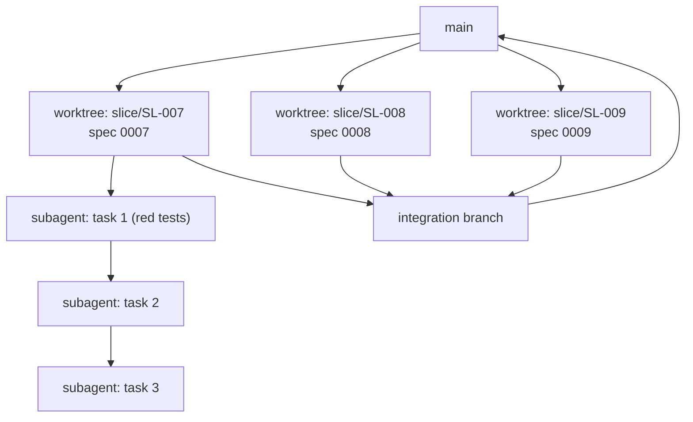

# RULE 07: SKILLS, WORKTREES, SUBAGENTS

## Precedence

**These rules outrank skill defaults.** Superpowers is the engine; this pack is the specification it runs against. When a skill's built-in guidance conflicts with a rule card, the rule card wins, and the conflict gets noted in the run report.

Concretely: `superpowers:test-driven-development` enforces generic RED-GREEN-REFACTOR. It knows nothing about specs, properties, budgets, or the test ledger. **Invoke it, then hold it to `rules/02-GATES.md` and `rules/06-TESTS.md`.**

## Routing table

Invoke the skill at the named step. Every invocation carries the "must be told" column, or the skill will do the generic thing.

| Step | Skill | Must be told |
|---|---|---|
| Explore a problem before requirements exist | `superpowers:brainstorming` | Output feeds `docs/PRD.md`, it is not a separate artifact. Do not save a competing design doc. |
| Turn findings into requirements | none (use `prompts/11-prd-create.md`) | |
| Research an unknown before deciding | none (use `prompts/10-research.md`) | |
| Isolate work for a spec | `superpowers:using-git-worktrees` | One worktree per spec. Branch `slice/SL-NNN-<kebab>`. Must reach a clean green baseline before any task starts. |
| Break a spec into executable tasks | `superpowers:writing-plans` | **The spec is the contract; the plan is only its breakdown.** Add no behavior the spec does not require. Tasks under `{{MAX_TASK_MINUTES}}` minutes. Task 1 is always "write the red tests". |
| Execute tasks inside a worktree | `superpowers:subagent-driven-development` | One subagent per task, fresh context, two-stage review. Give each subagent the spec, `rules/02-GATES.md`, `rules/06-TESTS.md`, and its single task. Nothing else. |
| Execute several independent tasks at once | `superpowers:dispatching-parallel-agents` | Only when the tasks touch disjoint files. Cap `{{MAX_SUBAGENTS_PER_WORKTREE}}`. |
| The red-green loop | `superpowers:test-driven-development` | Red is not red until GATE-RED R1-R7 pass, especially **R2 (assertion failure, not import error)**. Green is not green until GATE-GREEN G1-G10 pass. |
| Between tasks | `superpowers:requesting-code-review` | Review against the spec's acceptance criteria and GATE-MINIMAL, not against taste. |
| Responding to review findings | `superpowers:receiving-code-review` | A finding that widens scope becomes a new spec entry, never more code in this slice. |
| A red test will not go green | `superpowers:systematic-debugging` | After `{{MAX_RED_GREEN_CYCLES}}` cycles, stop debugging and halt: the spec or the test is wrong. |
| Before declaring a slice done | `superpowers:verification-before-completion` | Verify against the spec's Definition of Done, with command output. |
| Merge or PR | `superpowers:finishing-a-development-branch` | GATE-SHIP must pass first. Auto-merge to `main` is permitted only when every SH check passes. |

**Skills not used by this pack:** `executing-plans` (batch mode with human checkpoints) is the fallback when subagent-driven development is unavailable or the work is too small to justify subagent overhead, roughly under three tasks. `writing-skills` and `using-superpowers` are meta and not part of the build loop.

## Two levels of parallelism

Keep these separate in your head. Conflating them is the main way parallel work goes wrong.

### Level 1: worktree per spec

The **isolation boundary**. One worktree owns one spec, one branch, and its own database (a Supabase branch, a separate schema, or a container) so migrations do not collide.

| Rule | |
|---|---|
| Precondition | The specs' "files expected to change" lists are **disjoint**. Any overlap means serialize those two. |
| Cap | `{{MAX_CONCURRENT_WORKTREES}}` |
| Baseline | Each worktree reaches a clean green suite before task 1 |
| Migrations | One slice owns a schema change. Others depend on that slice; they never add their own. |
| Lockfiles | Serialize. Two worktrees editing a lockfile is a guaranteed conflict. |
| Ledger conflicts | Expected and trivial. Resolve by keeping both rows. |

**Do not parallelize** when fewer than three specs are ready, when the codebase is under about 2000 LOC (everything still touches everything), or when the data model is still changing shape. Sequential is genuinely faster there, and saying so plainly is the right call.

### Level 2: subagents inside one worktree

The **execution units**. They share the worktree's filesystem, so they are sequential by default.

| Rule | |
|---|---|
| Default | Sequential, one subagent per plan task, fresh context each |
| Context given | The spec, its single task, `rules/02-GATES.md`, `rules/06-TESTS.md`. **Nothing else.** A subagent handed the whole repo history loses the task. |
| Task 1 is always | Write the red tests for this slice and prove GATE-RED |
| Parallel allowed | Only for tasks touching disjoint files, cap `{{MAX_SUBAGENTS_PER_WORKTREE}}` |
| Review | Two-stage after each task: spec compliance, then code quality |
| Failure | A failed task stops that worktree. Other worktrees continue. |
| Never | A subagent must never edit the spec, the PRD, or another task's files |

## Integration barrier

Individual green does not imply integrated green. This barrier is the entire reason parallel work is safe.

1. All worktrees reach GATE-GREEN in isolation. Nothing merges before that.
2. Merge into the integration branch **in slice-number order**.
3. After each merge, run the **full** suite including every other slice's tests. Red means that slice owns the fix; the others wait.
4. After the last merge, run GATE-GREEN again on the integrated branch.
5. Docs update **once**, on the integration branch, covering all merged slices.
6. Run GATE-SHIP. Then `superpowers:finishing-a-development-branch`.

## Fallbacks

If superpowers is unavailable, substitute and note it in the run report:

| Superpowers skill | Fallback |
|---|---|
| `brainstorming` | `product-management:brainstorm` |
| `writing-plans` | The spec's test plan plus section 7.3 file list, used directly as the task list |
| `subagent-driven-development` | Sequential execution by the main agent, one task at a time |
| `using-git-worktrees` | `git worktree add` by hand |
| `requesting-code-review` | `engineering:code-review` |
| `systematic-debugging` | `engineering:debug` |
| `test-driven-development` | `rules/02-GATES.md` GATE-RED and GATE-GREEN directly. The gates are the substance; the skill is the ergonomics. |
